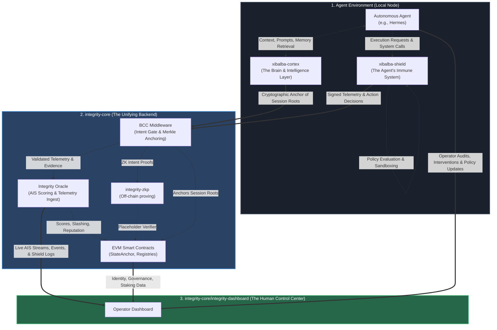
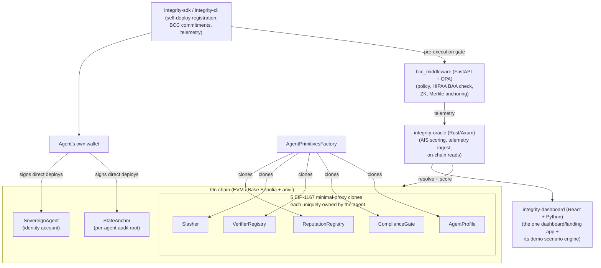
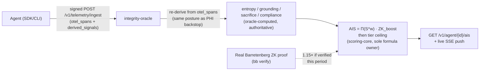

# Integrity Protocol

## README Source of Truth

This README is the repo-level status source for integrity-core: what the protocol is, which packages it owns, what is built now, what remains planned, and where deeper operational contracts live. The accepted normative protocol is [spec/integrity-protocol-v0.4.md](spec/integrity-protocol-v0.4.md). The new [v0.5 proposed amendment](spec/integrity-protocol-v0.5-proposed.md) is not yet authoritative, and [Whitepaper v3.2](spec/integrity-protocol-v3.2.md) is explanatory and non-normative. Repository ownership and implementation boundaries live in [SPECIFICATION.md](SPECIFICATION.md), [docs/INTERFACE_CONTRACT.md](docs/INTERFACE_CONTRACT.md), [docs/MAINNET_READINESS.md](docs/MAINNET_READINESS.md), and the canonical wiki at [docs/wiki](docs/wiki).

When this README, the interface contract, the wiki, and code disagree, resolve the disagreement in the same change. The rule is no silent mocks and no aspirational current-tense documentation.

## 2026-08-06 audit status

The current cross-repository audit is recorded in [`docs/audits/2026-08-06-cross-repository-status.md`](docs/audits/2026-08-06-cross-repository-status.md) and the consolidated implementation plan at `/home/xibalba/Documents/INTEGRITY — Cross-Repository Audit and Implementation Plan.md`. The clean default-branch audit verified Solidity (200 tests), Zero-Knowledge circuits (4), Oracle Rust tests (114 library + 13 e2e + 11 scoring-core), CLI (68 passed/1 skipped), middleware (119 passed), User API (51 passed against temporary PostgreSQL), and dashboard unit tests (68 passed). The SDK remains open with 242 passed, 2 failed, and 3 skipped. This repository is a strong testnet prototype, not production-ready.

Status claims below must be reconciled against that audit page. Historical handoffs and wiki log entries remain historical evidence.

**2026-08-14 re-verification:** the SDK's "242 passed, 2 failed, 3 skipped" figure above could not be reproduced from a clean checkout — `integrity-sdk`'s dev environment had two latent bugs from the `INTEGRITY-LATEST` → `integrity-core` rename: (1) `README.md`'s documented install command, `uv pip install -e ".[dev]"`, silently installs no dev tools (`dev` is a dependency-group, not an extra), and (2) `.venv/bin/pytest`'s shebang had the pre-rename absolute path baked in, so running it fell through to an interpreter without `web3` installed. Both are fixed (`integrity-sdk/README.md` now documents `uv sync` + `uv run pytest`; the stale `.venv`/`venv` were rebuilt). Re-run after the fix: **259 passed, 3 skipped, 0 failed.**

## Whitepaper v3.2 implementation status

**2026-08-17, updated 2026-08-18.** [Whitepaper v3.2](spec/integrity-protocol-v3.2.md) explains a proposed *execution firewall*: an ERC-7579 type-4 hook module installed inside an ERC-4337 smart account, evaluating proposed state transitions against a machine-checkable constraint set before commit. It is not the normative specification; proposed requirements are tracked in [v0.5-proposed](spec/integrity-protocol-v0.5-proposed.md). **The production `SovereignAgent.execute()` still dispatches without any such gate and cannot claim complete mediation** — nothing below changes that. What has changed: an experimental instance of the pattern now exists in `contracts/src/kernel/` (see the next paragraph), separate from and not wired into `SovereignAgent` — as of 2026-08-24 it also has one live, non-production reference deployment on Base Sepolia (`deployments.baseSepolia.json`'s `experimentalPhase1Reference` key), still not integrated with any real registered agent.

The implementation plan has four delivery phases mirroring the whitepaper's own §10.3 rollout — Kernel, Metered IP, Registry, Economy — plus Phase 0 identity-substrate work. **Phase 0 is implemented and locally verified. Phase I has started** (as of 2026-08-17, extended through 2026-08-19) with a deliberately narrow, Foundry-test-only, non-deployed slice — `contracts/src/kernel/IntegrityAccount.sol` and `IntegrityKernel.sol` — **promoted to these production names on 2026-08-24** (per `docs/plans/2026-08-24-phase1-promotion-decision-proposal.md`; previously `IntegrityAccountV1Experimental.sol`/`IntegrityKernelV1Experimental.sol`, a rename only — no logic change, 314/314 tests still green). Still not referenced by `Deploy.s.sol` (a dedicated `contracts/script/DeployKernelReference.s.sol` exists instead, deliberately separate from the real production stack — see `docs/plans/2026-08-24-phase1-testnet-deployment-proposal.md`), still not audited, still not the whitepaper's general constraint grammar. As of 2026-08-24 there is one live, experimental, non-production reference deployment on Base Sepolia (`IntegrityKernel` `0x3e05E67Fb6dd3eE382eD24150141ffcBE2C9c338`, `IntegrityAccount` `0x25858C53818E777C5569163F2e05570314fC947d`), NOT integrated with `XibalbaAgentRegistry` or any real registered agent — see `deployments.baseSepolia.json`'s `experimentalPhase1Reference` key and `PRODUCTION_GAPS.md` §44/§46. (A first deployment at different addresses, made before an internal Devil's Advocate review found and fixed two governance bugs — §45 — is superseded and should not be used; see §46 for why it still exists on-chain but is not this section's current reference.) It implements: an ERC-7579 hook enforcing three reference conditions (native-value spend budget, a reputation-floor precondition, a ZK-assurance-tier precondition) against `execute()` calls; §4.6's L4 escape hatch (timelocked, atomic kernel-swap governance) with guardian M-of-N quorum gating *execution* of a swap (added 2026-08-19, closing unilateral swap denial) — day-to-day `execute()` authority itself remains single-ECDSA-signer by design, and swap *proposal* still requires no guardian cooperation, only its execution does; and, as of 2026-08-24, a single additional **declared** conserved asset (`trackedToken`, an immutable ERC-20 address, `address(0)` disables it with zero behavior change — see `docs/plans/2026-08-24-phase1-declared-asset-conservation-proposal.md`), generalizing value conservation from native-ETH-only to a two-asset declared set with its own independent per-op/cumulative budget. **`preCheck` gas is measured (not estimated) at 33,321 with the token check disabled — under the whitepaper's own Table 4 budget — but at ~41,056 with it enabled, OVER that budget.** This crossing was found for real (a first, faster measurement of ~25,829 was a same-transaction warm-storage test artifact, corrected before being trusted — see `PRODUCTION_GAPS.md` §41) and is **accepted as a disclosed, permanent Phase I boundary as of 2026-08-24, not mitigated**: value conservation is a hard invariant (§4.7.1) and cannot reuse the epoch-snapshotting cache that brought the three-reference-adapter trio back under budget earlier. None of this reaches Phase I's own stated gate to Phase II ("independent audit complete; invariance argument machine-checked"). Full, precise guarantee statements: `docs/design/phase1-tracer-bullet-slice-2026-08-17.md` and `PRODUCTION_GAPS.md` §29. Phase 0 adds `contracts/src/kernel/IntegrityIdentityReadV1.sol`, a read-only discovery facade over `XibalbaAgentRegistry`. It is informed by the pinned ERC-8004 draft but explicitly returns `isERC8004Conformant() == false`: it has no ERC-721/token identity, ownership, transfer, wallet-proof, metadata-write, reputation-feedback, or validation surface. Existing agents need no migration; the current Base Sepolia deployment has not received this new singleton. See `docs/INTERFACE_CONTRACT.md` §6.1a for the exact boundary. Do not treat any "kernel," "hook," or "constraint" language elsewhere in this repo as live in *production* until this section is updated again — per this file's own no-aspirational-current-tense rule (line 7 above); the slice above is the one narrow, disclosed exception, and it is explicitly not production despite now carrying the production contract names.

The expanded v0.5 proposal also records v3.2's federated telemetry prover, stake-secured memory availability, circuit-breaker grace modes, high-frequency state channels/compiler trust, and hybrid attested-host boundary. These are all `[PLANNED]`; their missing interfaces and implementation evidence are enumerated in `docs/INTERFACE_CONTRACT.md` §16 and `PRODUCTION_GAPS.md` §29. Whitepaper argument and roadmap language is not itself an implementation.

**AIS gap, named plainly:** v0.5-proposed §4.2 redefines AIS as a *gated* weighted geometric mean — per-component floors plus a conjunctive gate — specifically so a high-violation agent can't still reach ~63% by averaging across the other axes (v3.2 §3.1.1's own worked example). That gate is `[PLANNED]`, not built; the formula in this README's own AIS section below is the current, ungated one. What IS built as of 2026-08-17: `derive_entropy`/`derive_grounding`/`self_reported_compliance` now fail closed to `0.0` on empty/no-evidence input (previously defaulted to `1.0`), directly implementing v3.2 §3.1.1's N2 ("earned, not granted") for those three components — see `integrity-oracle/backend/src/derive.rs` and `integrity_sdk/telemetry/derive.py`.

## Ecosystem Relationship

**Correction, 2026-08-12:** this section and the ones below previously described a four-repository
ecosystem with a separate `integrity-mvp` GitHub repository as the presentation layer.
`integrity-dashboard/` (in this repository) is now the actively developed operator-dashboard/
presentation layer; the standalone `integrity-mvp` repository it supersedes is stale (still
references this repo's pre-rename name, `INTEGRITY-LATEST`, and hasn't been touched since
2026-08-07) rather than deleted. Treat `integrity-dashboard/` as canonical going forward — the
diagrams below are updated to a three-repository model.

integrity-core is the trust backend and protocol foundation for two separate application
repositories, and also hosts the operator-dashboard presentation layer as its own component:

```text
integrity-core (dashboard: integrity-dashboard/)
├── xibalba-shield (endpoint security and enforcement)
│   └── integrity-core (SDK, BCC, Oracle, user API, contracts)
└── integrity-core (direct protocol API and chain access)
```

[`xibalba-shield`](https://github.com/XibalbaTechSol/xibalba-shield) is built on top of this
repository. It consumes `integrity-sdk` and submits signed endpoint-security evidence through
the BCC and telemetry pipeline; this repository never imports or calls Shield.
[`integrity-dashboard/`](integrity-dashboard/) is the presentation layer for both products: it
consumes integrity-core services directly and surfaces the Shield evidence stored by the
protocol. [`xibalba-cortex`](https://github.com/XibalbaTechSol/xibalba-cortex) acts as the local
cognitive store that anchors session roots into the protocol.

### Ecosystem Closed Loop

The three repositories form a complete, closed-loop trust ecosystem (`integrity-dashboard/` is a
component of `integrity-core`, not a fourth repository). While the integration is operational,
several components require refinement for production readiness:
The latest local cross-repository verification is recorded in [`docs/audits/2026-08-07-cross-repository-closure.md`](docs/audits/2026-08-07-cross-repository-closure.md).

**Current integration evidence and limits:**
1. **Zero-Knowledge Proof (ZKP) verification:** the local source and off-chain Noir/Barretenberg pipeline are real and tested; the currently declared Base Sepolia verifier still contains older fail-closed placeholder bytecode and is not live production verification.
2. **Behavioral Commitment Chain (BCC) middleware:** intent schemas, policy gating, and Merkle anchoring paths exist, with remaining production controls tracked in `PRODUCTION_GAPS.md`.
3. **Oracle services:** telemetry ingestion and the sole Agent Integrity Score (AIS) implementation exist; the oracle remains a single-operator trust boundary.
4. **Cross-repository status:** local integration is substantial, but production, deployment, identity, replay/origin, and runtime evidence gaps remain explicitly open.

**Ecosystem Integration Architecture (The Biological Analogy):**

To help conceptualize the ecosystem, we map each repository to its functional analogy:
- **The Brain & Intelligence Layer** (`xibalba-cortex`): The agent's local cognitive store, acting as its memory and thought processor.
- **The Immune System** (`xibalba-shield`): The local endpoint enforcement and sandbox that protects the system from internal errors and external threats.
- **The Unifying Backend + The Human Control Center** (`integrity-core`): The protocol layer that ties the entire ecosystem together, providing trust, verification, and scoring — plus `integrity-dashboard/`, the operator dashboard where humans monitor, audit, and direct the autonomous system.



See
[`docs/architecture/ecosystem-dependencies.md`](docs/architecture/ecosystem-dependencies.md)
for the canonical ownership and dependency boundaries.

**A trust and compliance layer for the agentic economy.** Integrity Protocol
uses smart contracts and immutable on-chain state to solve two problems no
purely off-chain system can:

1. **Regulatory compliance** — can a regulator or counterparty verify an AI
   agent's behavior *after the fact*, without trusting the agent's own word?
2. **Agent trust** — can one agent (or service) verify another's track record
   *before* transacting with it?

The protocol's defining architectural choice: **agents own and deploy their own
identity and reputation contracts.** On registration, an agent's own EVM wallet
deploys a set of *primitive* contracts that become its self-sovereign on-chain
identity. Nothing is registered *on behalf of* the agent by a privileged
factory — the deployment transactions are signed by the agent's own key, so the
chain itself is cryptographic proof of who controls what.

### The four foundational primitives

The protocol rests on four concepts, each answering one question a counterparty must resolve
before delegating anything of value. The order is a progression — each presupposes the one
above it:

| # | Primitive | Question |
|---|---|---|
| 1 | **Persistent Memory** | Is this the same agent over time? |
| 2 | **Agent-Owned Contracts** | Can it act, and can it lose? |
| 3 | **Authority** | *May* it act, and for whom? |
| 4 | **Reputation** | *How* has it acted? |

Two notes that prevent the usual confusions. **"Primitive" is used in three senses in this
repo:** these four are *concepts*; the [seven per-agent contracts](docs/wiki/concepts/agent-primitives.md)
(`PrimitiveSet`) are *contracts*, and only #2 is a contract at all; and the kernel/adapter
architecture (spec v3.2 §4.4, `contracts/src/kernel/IntegrityKernel.sol`) adds a third —
**kernel primitives**, the three invariants (value conservation, metered-rights depletion,
replay-domain monotonicity) the kernel enforces for adapters, unrelated to either list above
and not stored in any agent's `PrimitiveSet`. See the naming box in
[The Four Foundational Primitives](docs/wiki/concepts/foundational-primitives.md) for all
three, spelled out. And **AIS is not a primitive** — reputation is the record, AIS is a
replaceable weighted score over it. Change the formula and the record stands; delete the
record and no formula means anything.

Bonded stake sits inside #2 rather than standing alone: you can only stake what you own, and
ownership only means something when losing it hurts. Cryptographic self-sovereignty is
deliberately absent — keys are the substrate all four are *expressed in*, so it belongs with
the medium's properties, not as a peer of what it enables.

Full derivation, including why the set is complete against the protocol's own definition of an
Economic Sovereign:
[The Four Foundational Primitives](docs/wiki/concepts/foundational-primitives.md).

### 1. Persistent memory

An agent that cannot carry state across sessions is not an economic actor — it is a
stateless function invoked repeatedly. So **persistent memory sits alongside identity,
commitment, stake, and observability as a foundational primitive of this protocol**, not as
a convenience feature bolted on top of one.

This is load-bearing, not aspirational: **an agent with no anchored memory cannot
register.** Every agent must control a durable **Trust Vault** whose commitments are
Merkle-anchored on its own `StateAnchor`, and must anchor a **genesis memory root** —
signed by the agent's own controller, never by the protocol — before registration
completes. The oracle independently re-reads `StateAnchor.latestRoot` from chain and
refuses a zero root with `400 MemoryNotInitialized`. Content stays off-chain and
agent-controlled; only commitments go on-chain, so memory is provable without being
exposed.

The consequences follow from that: reputation means something because the history it scores
is one the agent itself can produce and cannot silently rewrite; copying another agent's
vault transfers no identity, stake, or AIS, because roots are bound to the original
`StateAnchor`. See
[Persistent Memory, Genesis Root & Lineage](docs/wiki/concepts/agent-memory.md) for the
full model, `docs/INTERFACE_CONTRACT.md` §4.4a for the wire-level constant, and
[`PRODUCTION_GAPS.md`](PRODUCTION_GAPS.md) §19 for exactly what is enforced today versus
what is still open.

**Integrity Health** — the HIPAA/healthcare vertical — is the flagship proof that
this works in the most heavily regulated industry there is. It's not a side
feature; it's the demonstration that makes the rest of the protocol credible.

> This is a from-scratch rewrite of an earlier prototype. Its ground rule, in
> [`docs/INTERFACE_CONTRACT.md`](docs/INTERFACE_CONTRACT.md), is **no silent
> mocks**: every piece is either real and tested against a real toolchain, or an
> honestly-documented gap. Read the interface contract before changing any
> cross-package schema, port, or env var.

---

## Architecture at a glance



`bcc_middleware` and `integrity-oracle` together form one trust domain — the
pre-execution gate (before an agent acts) and the telemetry/scoring backend
(after an agent acts, plus all on-chain reads) — see
[`docs/INTERFACE_CONTRACT.md`](docs/INTERFACE_CONTRACT.md) §6.10.

### The 7 agent primitives

Every agent, at registration, comes to own seven contracts. Two are deployed
**directly by the agent's own wallet** (so the deploy transaction proves
self-sovereign control); five are cheap **EIP-1167 minimal-proxy clones** of
shared implementation contracts (each clone is still uniquely owned and
controlled by that agent).

| # | Primitive | Deploy | Purpose |
|---|---|---|---|
| 1 | `SovereignAgent` | direct | The agent's account contract — DID, cached AIS, `execute`, controller rotation |
| 2 | `StateAnchor` | direct | The agent's own tamper-evident Merkle-root anchor for its telemetry |
| 3 | `ReputationRegistry` | clone | Per-agent AIS ledger + ZK-boost bookkeeping |
| 4 | `Slasher` | clone | Per-agent $ITK stake / dispute-gated slashing vault |
| 5 | `VerifierRegistry` | clone | Per-agent versioned pointer to the ZK verifier it trusts |
| 6 | `ComplianceGate` | clone | Per-agent regulated-industry declaration + live Integrity Health/HIPAA check |
| 7 | `AgentProfile` | clone | Per-agent domain-membership + metadata pointer |

**Call-routing rule:** every clone's admin role is granted to the agent's own
`SovereignAgent` *contract* address, never its raw EOA. All post-registration
state changes route through `SovereignAgent.execute(...)`. See
[`docs/INTERFACE_CONTRACT.md`](docs/INTERFACE_CONTRACT.md) §6 for the full
convention and the one bootstrap exception.

### Sovereign vs. Centralized Deployments

When building and deploying applications on the protocol, developers must choose between two deployment topologies depending on whether the smart contract serves an individual agent or the entire platform:

| Feature | Sovereign Mode (Agent-Owned Clones) | Centralized Mode (EOA-Owned Singletons) |
|---|---|---|
| **Architecture** | EIP-1167 minimal-proxy clones unique to each agent. | Monolithic global singleton contracts shared by all agents. |
| **Ownership** | Admin/owner role is the agent's `SovereignAgent` contract address. | Admin/owner role is the platform operator's or DAO's EOA/multisig key. |
| **Call Routing** | Admin actions must route through `SovereignAgent.execute()`. | Direct EOA interaction with the target contract. |
| **Typical Use Cases** | `IntegrityMarket` (individual prediction clones), task/service escrows, custom A2A agreements. | `A2ACapitalPool` (global allocation venue), `XibalbaAgentRegistry`, regulatory portals (`CoveredEntityRegistry`). |
| **Key Implications** | High gas efficiency (cloning), sandboxed liabilities (isolated stakes), and self-sovereign controller key rotation. | Unified liquidity, centralized verification guardrails, and platform-wide parameter standards. |

---

## Packages

| Package | Stack | Purpose | Status |
|---|---|---|---|
| [`contracts/`](contracts/) | Solidity + Foundry | The 7 primitives, factory, registries, XNS, `IntegrityGovernance`, $ITK, Integrity Health stack, ZK verifier, cross-chain reputation bridge, local `IntegrityIdentityReadV1` facade, and a Phase I kernel slice (`IntegrityAccount.sol`/`IntegrityKernel.sol`, promoted from `...V1Experimental` naming 2026-08-24 — see "Whitepaper v3.2 implementation status" above), with one experimental, non-production reference instance live on Base Sepolia as of 2026-08-24 | ✅ 321 tests locally as of 2026-08-24 (re-verify with `forge test` before quoting — this number moves); the existing production-stack Base Sepolia deployment (`singletons`) predates the identity facade and still has the older verifier bytecode (XNS/governance/CCIP bridge also not yet broadcast); the Phase I kernel reference instance (`experimentalPhase1Reference`) is separately deployed and NOT integrated with the production stack or any real registered agent |
| [`integrity-zkp/`](integrity-zkp/) | Noir + Barretenberg | The ZK circuit proving an action matches its committed intent | ✅ real `nargo`/`bb` pipeline |
| [`integrity-oracle/`](integrity-oracle/) | Rust + Axum + Postgres | Telemetry ingestion, authoritative AIS computation, on-chain reads, markets/leaderboard/wallet/contracts/BAA/VC/benchmarks/XNS/governance reads, PHI rejection, OTLP/gRPC trace receiver | Current: 80 lib tests + 9 e2e; single-operator oracle, not decentralized |
| [`integrity-sdk/`](integrity-sdk/) | Python | Agent library: DID/keys, EVM wallet, self-deploy registration, BCC, markets, telemetry, OpenAI/LangChain integrations, PHI redaction, memory anchoring | Current: 135 tests, 1 skipped + 1 opt-in oracle e2e |
| [`integrity-cli/`](integrity-cli/) | Python (Typer) | Developer CLI for identity, wallet, on-chain registration with oracle re-verification, BCC, vault, XNS | Current: 57 tests, including 1 opt-in oracle e2e |
| [`bcc_middleware/`](bcc_middleware/) | Python (FastAPI) + OPA | Pre-execution policy gate, HIPAA BAA check, verification-tier gate, signed intent-rationale commitments, reputation-sync/slashing signer loop, Merkle anchoring | Current: 91 pytest + 28 OPA tests |
| [`integrity-userapi/`](integrity-userapi/) | Python (FastAPI) + Postgres | User accounts/auth, API keys, JWT revocation, login rate limiting, wallet ownership, demo-run bridge — strictly non-chain | Current: 51 tests with real Postgres and real CORS for dashboard |
| [`integrity-dashboard/`](integrity-dashboard/) | React + Vite + TS, plus `demo/` Python engine | The integrity-core dashboard app and closed-loop demo engine — now the canonical operator-dashboard/presentation layer for the whole ecosystem, superseding the standalone `integrity-mvp` repo (stale since 2026-08-07). | Current: wired to real oracle/userapi reads and writes; 9 vitest + 20 Playwright e2e tests against live backend+chain |

---

## The Agent Integrity Score (AIS)

The protocol's trust metric. Computed in exactly one place —
`integrity-oracle/scoring-core` — and read by everyone else via the oracle's
HTTP API, never recomputed. The equations below describe the current local
implementation profile, not automatic acceptance of every v0.5-proposed floor,
evidence-admissibility, migration, or assurance rule:

```
AIS_raw = (S_entropy^wE · S_grounding^wG · S_sacrifice^wS · S_compliance^wC) · ZK_boost
AIS_final = min(AIS_raw, verification_tier_ceiling)
```

Default weights `wE=0.30, wG=0.30, wS=0.20, wC=0.20` (sum to 1.0); `ZK_boost`
is `1.15` when a real Barretenberg proof was verified for the reporting period,
else `1.0`. This is a weighted geometric mean: a zero component makes the raw
score zero rather than allowing strong dimensions to hide a catastrophic one.
Tier ceilings are 300 / 600 / 850 for Tiers 0 / 1 / 2; Tier 3 returns the raw
score. The four component scores come from an agent's telemetry — the SDK
derives first-pass signals from OpenTelemetry/MLflow spans, but the **oracle
independently recomputes entropy/grounding/sacrifice/compliance server-side**
from the same signed telemetry rather than trusting the client's numbers (see
`integrity-oracle/backend/src/derive.rs`) — the SDK's values are advisory/audit
trail only. See [`docs/wiki/concepts/ais.md`](docs/wiki/concepts/ais.md).



---

## Vision & long-term roadmap

**Thesis:** AI agents should be able to hold their own identity, own and deploy
their own smart contracts, and act as accountable economic participants —
"Economic Sovereigns," not passive tools running under someone else's
account. Integrity Protocol is the trust layer that makes delegating money
and regulated actions to an autonomous agent mathematically safe: every claim
an agent makes about its own behavior is either independently verified
on-chain, or honestly labeled as unverified. Integrity Health (healthcare) is
the flagship proof this holds in the most heavily regulated industry there
is; the multi-vertical Dashboard (markets, capital allocation, wallet) proves the
same mechanism generalizes to any domain where trust has economic value.

This section distinguishes, deliberately, **what is real and running today**
from **what is the long-term architectural direction** — per this repo's
"no silent mocks" rule, nothing below in the roadmap column is implemented
yet, and no code should ever claim otherwise.

### Identity & hardware trust

| Built today | Long-term roadmap |
|---|---|
| Software-held secp256k1/Ed25519 keypairs (encrypted local keystore) | Hardware-bound identity: keys tethered to TEE/SGX enclaves or an HSM (AWS KMS, FIPS 140-2 Level 3), so a key can't be extracted even by whoever controls the host |
| `did:integrity:<sha256(pubkey)>` DIDs, W3C DID Documents, and server-verified DNS/GitHub/Nitro evidence | Additional hardware roots (Intel SGX/HSM) and legal-controller binding |
| Agent self-registers all 7 primitives with its own signature as proof of control, and can self-service claim a human-readable XNS handle (`XibalbaNameService.sol`, first-come-first-served, no admin in the critical path) | Direct handle transfer between agents (today: release + separate re-claim by the new owner) and expiry/renewal semantics |
| **Persistent memory** (spec v0.3 §4.1/§7): the agent anchors a genesis Trust Vault root on its own `StateAnchor` through its controller during registration, and the oracle independently re-reads `latestRoot`, refusing a zero root with `400 MemoryNotInitialized` | Contract-level enforcement that the protocol's `ANCHOR_ROLE` signer cannot anchor epoch 1 (§7.2), and lineage attestation for fork/migration/recovery with no automatic AIS or stake transfer (§7.4) — neither built |

### Verification ladder

The long-term design ties an agent's AIS *ceiling* (not just its measured
score) to how strongly its identity is verified, so a freshly-created,
unverified agent can never simply out-score a hardware-attested one:

| Tier | Verification | AIS ceiling | Status |
|---|---|---|---|
| 1 — Sovereign | Software-key possession plus on-chain primitive match | 600 | Assigned at registration; enforced |
| 2 — Linked | Dual-resolver DNS TXT proof or GitHub repository proof | 850 | Built; 90-day evidence |
| 3 — Institutional | Nonce-bound AWS Nitro remote attestation | No post-boost cap | Built; 30-day evidence |
| 3 — Institutional KYC | Trusted provider-signed receipt: document authenticity + liveness + sanctions/PEP | No post-boost cap | Built; provider-neutral, raw PII excluded |
| Developer API key (testnet convenience) | Issued by `integrity-userapi` | Capped at 300 | Enforced |

Evidence is auditable, expiring, and revocable through an agent-signed challenge.
KYC providers may be commercial or self-hosted open-source stacks, but receipts are
accepted only from operator-configured Ed25519 trust roots. Clients cannot self-assert
KYC, and the Oracle stores no documents, selfies, names, or government identifiers.

### Data, telemetry & PHI safety

The SDK is a **local metrology apparatus**: it measures agent behavior (entropy,
grounding, sacrifice signals) and forwards only what the oracle needs — never
raw reasoning content by default in a regulated vertical. The precise
architecture:

- **`Redactor`** (`integrity_sdk/security/`, alongside the existing
  `attestation.py`/`vault.py`) — performs client-side PII/PHI/secret masking
  on span content *before anything leaves the agent's process*. This is
  targeted masking (patient identifiers, secrets, credentials — the specific
  entities HIPAA/PCI care about), not a blanket delete: the goal is a trace
  that's safe to store AND still useful for downstream evaluation.
- **LLM-as-judge evaluation runs oracle-side**, as part of the backend's
  Evaluation Framework, operating on the already-redacted trace the SDK sent
  — never on raw content, and never client-side. Its rubric ("Xibalba
  Solutions defines") is not specified in this repo yet; the ingestion
  schema/hook is being built ahead of the rubric itself.
- **Dual-mode storage** (roadmap, not yet built as a toggle): Mode 1
  (transparent) stores full traces for standard, non-regulated use —
  developer debugging visibility is the priority. Mode 2 (Sovereign
  ZK-Mode, for Integrity Health/healthcare and any PHI-adjacent vertical) never lets
  raw content leave local hardware at all — only a hash and a ZK proof of
  correct measurement leave the agent's process.
- **Redaction gate is closed everywhere it needs to be.**
  `integrations/openai_integrity.py` and `integrations/langchain_callback.py`
  both call `redact_text(...)` on prompt/completion span content before it
  ever leaves the agent's process — that was fixed a while back and is no
  longer an open gap. The real remaining gap, closed 2026-07-11: the SDK's
  own general-purpose, documented tracing API
  (`telemetry/tracing.py`'s `trace_run`/`traceable`/`client.traceable(...)`)
  captured raw function arguments/return values with **no** redaction. A
  `_redact_value` helper is now applied in `TraceRun.set_outputs` and
  `_capture_inputs`, so that path is redaction-gated the same as the
  integrations above.
- **Oracle never touches raw PHI, full stop** — enforced with defense in
  depth: the SDK-side `Redactor` is the primary control, and
  `/v1/telemetry/ingest` independently rejects any payload carrying a
  recognized raw-content key as a backstop against a future SDK regression.

### Decentralization path

Today, Xibalba Solutions LLC operates the oracle, the demo resolver, and
policy defaults as a single operator — appropriate for a testnet Dashboard, not
the end state:

1. **Phase 1 — Human-in-the-loop (current).** Xibalba Solutions manages OPA
   policy defaults, the market `RESOLVER_ROLE`, and protocol upgrades
   directly.
2. **Phase 2 — Hybrid council (roadmap).** Governance shared between human
   stakeholders and a council of Tier-3 Institutional agents that sustain a
   950+ AIS over a sustained period — the same mechanism this Dashboard's
   `IntegrityMarket.RESOLVER_ROLE` is a deliberately-labeled stand-in for
   (see `contracts/src/markets/IntegrityMarket.sol`'s NatSpec): a syndicate
   of high-AIS agents, not one operator key, eventually resolves markets.
3. **Phase 3 — Protocol DAO (contract built, deploy deferred).** On-chain
   governance where `$ITK` holders vote on protocol parameter changes is now a
   **real contract** — `IntegrityGovernance.sol` (lock-to-vote, timelocked
   propose→vote→queue→execute; 26 tests), read by the oracle
   (`GET /v1/governance/proposals`) and rendered live in the dashboard's
   Governance panel. It is wired into genesis `Deploy.s.sol` but **not yet
   broadcast to Base Sepolia** (a gas-costing operator action) — until then the
   endpoint returns a clean `MissingSingleton` (HTTP 400) and the UI shows an
   honest "not yet live" state. Participation writes (propose/vote) are done via
   CLI/SDK for now. See `docs/wiki/concepts/governance.md`.
4. **Cross-chain reputation (roadmap).** `CCIPReputationBridge.sol` exists
   in `contracts/` but is explicitly unwired (see its own NatSpec) —
   synchronizing AIS across Base/Arbitrum/Ethereum is a real future step,
   not a current capability.
5. **Gas abstraction (roadmap).** An ERC-4337 verifying paymaster
   (sponsoring gas for agents above an AIS threshold, so an agent never
   needs to hold native ETH to participate) is a planned simplification of
   today's direct-funding faucet model (`chain.fund_agent_wallet`) — not
   built yet.

### Advanced primitives (roadmap, explicitly out of scope for the current Dashboard)

Named here so they're tracked, not forgotten, and so nothing in this repo
should be mistaken for having built them:

- **A2A negotiation protocol** — P2P capability broadcast + bid negotiation
  over a gossip layer (libp2p/Waku), landing in a signed on-chain deal.
  Today's `A2ACapitalPool.sol` is a simpler, direct allocation primitive —
  not this.
- **ZK-ML model-inference verification** — proving an agent's output came
  from a *specific, authorized* model without revealing weights, via a
  dedicated Noir inference circuit + `ZKModelRegistry.sol`. Today's ZK layer
  (`integrity-zkp/`, `UltraPlonkVerifier.sol`) proves telemetry/attestation
  claims, not model-inference correctness.
- **Institutional credit & AIS-collateralized lending** — reputation-backed
  ITK credit lines (this is `integrity-framework/`'s originally-scoped
  concept, §12 of `docs/INTERFACE_CONTRACT.md`, not yet built).
- **Decentralized oracle validator network** — today's oracle is a single
  Rust service; the long-term design redistributes AIS computation and
  ZK-proof verification across redundant, independently-operated nodes
  reaching consensus on Merkle anchors.

### Full source vision documents

The complete, unabridged product/architecture vision (including sections not
yet reflected in this repo) lives outside the codebase — ask before assuming
any of it is implemented; treat it as intent, not documentation of current
state.

---

## Local development

```bash
make setup     # install per-package dependencies
make chain     # start a local anvil chain + run contracts/script/Deploy.s.sol
make sync-abis # extract trimmed contract ABIs into the SDK/CLI
make up        # docker-compose: postgres, redis, opa, oracle, bcc middleware, dashboard
make test      # package suites plus dashboard production build/lint
make test-e2e  # Playwright against a separately prepared real backend stack
```

Each package has its own `README.md` with package-specific detail and its own
test suite. The toolchain (Foundry, Rust, Noir/Barretenberg, OPA, Node, Python)
is pinned in [`docs/INTERFACE_CONTRACT.md`](docs/INTERFACE_CONTRACT.md) §1. See
[`docs/TESTING.md`](docs/TESTING.md) for the full test-pyramid rationale — what
each layer covers and why `make test-e2e` is separate from `make test`. GitHub
Actions runs package jobs on pushes/pull requests to `main`; Playwright remains
outside hosted CI because its real backend stack must be started separately.

### Registering an agent (the self-sovereign flow)

```python
from integrity_sdk import registration

# Deploys the agent's 2 direct contracts + 5 clones, funds its wallet, mints
# testnet ITK, and registers it — all signed by the agent's own EVM key.
reg = registration.register_agent(
    "clinical-assistant-01",
    domain_name="healthcare.integrity",
    compliance_vertical="healthcare",
)
print(reg.sovereign_agent, reg.compliance_gate)
```

Requires `FUNDER_PRIVATE_KEY` (a testnet faucet wallet that seeds the agent's
new wallet with gas + ITK) and `INTEGRITY_WALLET_PASSWORD` (encrypts the agent's
EVM keystore). See [`integrity-sdk/README.md`](integrity-sdk/README.md).

**2026-08-17:** registration is now idempotent in both the SDK and the CLI — a partial failure
mid-registration (e.g. a dropped connection after `SovereignAgent` deploys but before
`StateAnchor` does) resumes from a tracked `registration_progress.json` instead of redeploying
already-live contracts. Previously this was a real, repeated cause of orphaned testnet
deployments; `integrity-cli` had zero idempotency protection before this fix (worse than the
SDK's pre-fix state). See `PRODUCTION_GAPS.md` §28.

---

## Live deployment (Base Sepolia, chainId 84532)

The protocol genesis is deployed and verified on Base Sepolia. Full record in
`deployments.baseSepolia.json`. Key singletons:

| Contract | Address |
|---|---|
| `XibalbaAgentRegistry` | [`0x72e21e44AdD6d6e7CAa02eaedF078630afC40819`](https://sepolia.basescan.org/address/0x72e21e44AdD6d6e7CAa02eaedF078630afC40819) |
| `AgentPrimitivesFactory` | [`0x215f39C8a2Cea2F8c6976fA10bbf48479825aD6e`](https://sepolia.basescan.org/address/0x215f39C8a2Cea2F8c6976fA10bbf48479825aD6e) |
| `IntegrityToken` ($ITK) | [`0x0E87D408732BeC3d3997d9eCE2E20A6679C35655`](https://sepolia.basescan.org/address/0x0E87D408732BeC3d3997d9eCE2E20A6679C35655) |
| `DomainRegistry` | [`0xC1aee61b8826d79c21a335Fb1777cA372Bea1Ba0`](https://sepolia.basescan.org/address/0xC1aee61b8826d79c21a335Fb1777cA372Bea1Ba0) |
| `CoveredEntityRegistry` (Integrity Health) | [`0x3E42C072BA8Ca6EE6E86c8DB011eB4063b8aac07`](https://sepolia.basescan.org/address/0x3E42C072BA8Ca6EE6E86c8DB011eB4063b8aac07) |
| `SmartBAAFactory` (Integrity Health) | [`0xf791059A9E77734f3fd7dffC1ca35728547608eb`](https://sepolia.basescan.org/address/0xf791059A9E77734f3fd7dffC1ca35728547608eb) |

Per-agent primitive addresses are **not** in the static deployments file — they
are resolved live from `XibalbaAgentRegistry` on-chain (and cached by the
oracle). See [`docs/INTERFACE_CONTRACT.md`](docs/INTERFACE_CONTRACT.md) §6.

### Testnet $ITK liquidity comes from an agent, not an operator

`xibalba.integrity` is the protocol's **testnet ITK liquidity source**. Its
`SovereignAgent` (`0x360E2a56…`) holds `MINTER_ROLE` on `IntegrityToken`, and mints are
routed `SovereignAgent.execute → IntegrityToken.mint`, signed by the agent's own
controller (`integrity_sdk.chain.mint_testnet_itk_from_treasury`). Every issued token is
therefore attributable on-chain to a registered agent rather than to an operator key —
the same self-sovereign routing used for anchoring and XNS claims. This is deliberately
exercised on testnet first, so the flow's rough edges surface before any mainnet
deployment.

Registration draws from this agent when `INTEGRITY_LIQUIDITY_AGENT` names a locally
available liquidity agent, falling back to a funder mint (with a warning) otherwise. The
fallback is structural, not laziness: `SovereignAgent.execute` is controller-only, so
minting through the agent requires its controller key on the machine — true for this
single-operator testnet, false for a third party registering their own agent, which would
need a faucet service the liquidity agent runs. The funder EOA retains `MINTER_ROLE` as
issuer of last resort. See [`PRODUCTION_GAPS.md`](PRODUCTION_GAPS.md) §20.

**Before mainnet:** see [`docs/MAINNET_READINESS.md`](docs/MAINNET_READINESS.md) — the
blocker list, ordered by consequence. The headline items: all six protocol roles are
currently one EOA that also holds `MINTER_ROLE`; the deployed Base Sepolia ZK verifier
contains older fail-closed placeholder bytecode that always reverts; and
`SovereignAgent`/`StateAnchor` are deployed per-agent and non-
upgradeable, so the upgrade-path decision must be made *before* the first mainnet agent
exists.

**Known non-conformance, stated plainly:** registration now enforces spec v0.3 §4.1/§7.1
— an agent with no anchored genesis memory root is refused with `400
MemoryNotInitialized`, and `integrity-sdk` anchors that root during registration. But
`StateAnchor` is deployed **per agent**, and every agent registered before this change —
all 7 currently live, including `xibalba.integrity` — still reports `latestRoot == 0`.
They remain registered (the gate only runs at registration) and are therefore registered
agents that do not satisfy the protocol's own persistent-memory primitive until a
controller-signed `anchorRoot` is sent for each. Full detail, plus the six untouched
Appendix A gaps, in [`PRODUCTION_GAPS.md`](PRODUCTION_GAPS.md) §19.

---

## Documentation

- **[`docs/INTERFACE_CONTRACT.md`](docs/INTERFACE_CONTRACT.md)** — the single
  source of truth for cross-package schemas, ports, env vars, the 7-primitive
  architecture, the registration sequence, and the BCC/AIS/Merkle conventions.
- **[`docs/wiki/`](docs/wiki/)** — the canonical source of truth for the
  compiled knowledge base. Its entity and concept pages are published
  one-way to both the GitHub Wiki and `integrity-dashboard/`'s read-only `/wiki`
  experience. Direct edits to either downstream mirror are not an authoring
  path and may be overwritten by synchronization. Governed by a strict
  no-aspirational-content rule.
- **[`docs/architecture/ecosystem-dependencies.md`](docs/architecture/ecosystem-dependencies.md)** — cross-repository ownership and dependency direction for integrity-core (including `integrity-dashboard/`) and Xibalba Shield.
- **[`docs/TESTING.md`](docs/TESTING.md)** — test pyramid, package-level runner conventions, and E2E scope.
- **[`docs/MAINNET_READINESS.md`](docs/MAINNET_READINESS.md)** — deployment blockers and consequence-ordered readiness criteria.
- **[`docs/design/`](docs/design/)** — design decisions, audits, and implementation notes.
- **[`spec/`](spec/)** — normative protocol and Shield specifications plus versioned wire specs.

## License

MIT.
