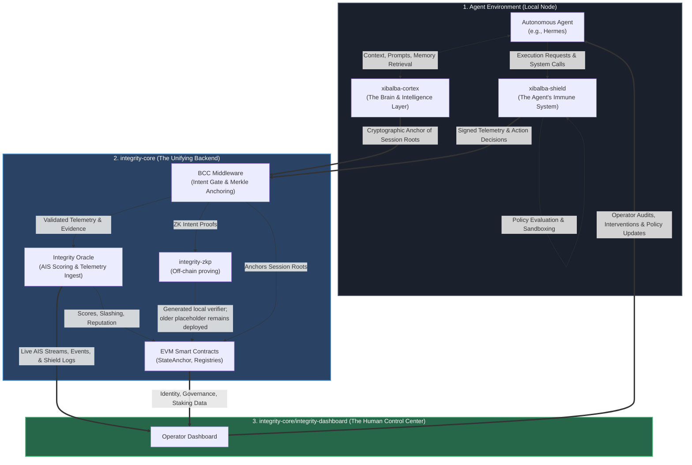
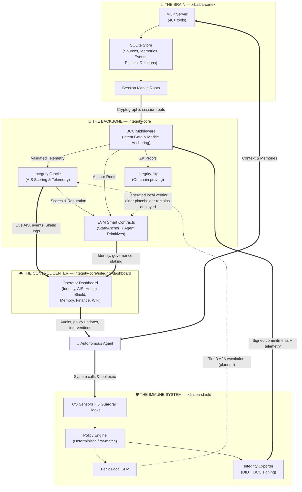

# integrity-core Repository Specification

**Updated:** 2026-08-17
**Status:** Strong testnet protocol prototype; not production-ready.

## 1. Purpose

integrity-core is the protocol trust backend for the Integrity Protocol. It owns the on-chain primitives, off-chain scoring services, Behavioral Commitment Chain middleware, SDK/CLI surfaces, user API, dashboard package, ZKP package, canonical wiki, and versioned protocol specifications.

The repository defines how AI agents establish identity, commit to behavior before execution, submit signed telemetry, receive Agent Integrity Scores, interact with compliance and market primitives, and expose evidence that downstream applications can present without inventing trust claims.

## 2. Authority

| Document | Role |
|---|---|
| README.md | Repo overview, package map, and source-of-truth precedence. |
| IMPLEMENTATION_PLAN.md | Closed/planned/blocked implementation ledger. |
| PRODUCTION_GAPS.md | Detailed production-readiness gap register. |
| docs/INTERFACE_CONTRACT.md | Internal package ports, schemas, environment variables, and coordination rules. |
| spec/integrity-protocol-v0.4.md | Normative protocol specification. |
| spec/integrity-protocol-v0.5-proposed.md | New proposed normative amendment; non-authoritative until clause-level acceptance. |
| spec/integrity-protocol-v3.2.md | Current explanatory, non-normative whitepaper. |
| spec/README.md and spec/ais-api/v1 | Versioned externally-supported wire surfaces. |
| docs/audits/2026-08-06-cross-repository-status.md | Current audit evidence and production posture. |
| docs/wiki/ | Canonical long-term project memory and downstream wiki source. |

## 3. Ecosystem Integration & Closed Loop

The integrity-core repository serves as the backbone for a 3-repository ecosystem, designed
conceptually as a living organism. (`integrity-dashboard/`, below, is a component of this
repository — the operator-dashboard/presentation layer previously developed as a separate
`integrity-mvp` repository, which is now stale/superseded, corrected 2026-08-12.)
1. **`xibalba-cortex` (The Brain & Intelligence Layer)**: The agent's local cognitive store, managing memories and contextual thought.
2. **`xibalba-shield` (The Immune System)**: The local endpoint enforcement sandbox that intercepts and neutralizes harmful actions.
3. **`integrity-core` (The Unifying Backend + The Human Control Center)**: The core protocol that securely ties everything together via cryptographic truth and scoring — plus `integrity-dashboard/`, the operator dashboard for human oversight and governance.

### Comprehensive Loop

## 4. Ownership Boundary

integrity-core owns protocol primitives and public protocol interfaces. Its `integrity-dashboard/` component must not become the protocol's source of truth for anything it doesn't already own (identity, reputation, telemetry, BCC, chain data remain integrity-core's). This repository must not import or depend on xibalba-shield or xibalba-cortex. Those repositories consume public Integrity interfaces and own their own presentation, endpoint, or local-memory implementation details.

## 5. Components

| Component | Responsibility | Current posture |
|---|---|---|
| contracts/ | EVM identity, reputation, staking, slashing, governance, health, market, and verification contracts. | Broadly tested on local/testnet paths; deployment verification remains open. |
| integrity-oracle/ | Rust/Axum telemetry intake, AIS derivation, chain reads, markets, VC/verification reads, and OpenAPI surface. | Tested prototype; production controls and live deployment review remain open. |
| bcc_middleware/ | FastAPI/OPA pre-execution intent gate, commitment verification, Merkle batching, and reputation sync. | Implemented and tested; policy/domain generalization remains partial. |
| integrity-sdk/ | Python agent SDK for registration, wallet, BCC, telemetry, markets, metrology, and redaction. | Implemented; clean-main audit found SDK test drift that must be reconciled. |
| integrity-cli/ | Typer CLI for developer and operator protocol workflows. | Implemented with passing package tests in audit evidence. |
| integrity-userapi/ | User accounts/auth, API keys, JWT revocation, demo run completion, and non-chain fan-out. | Implemented; strictly non-chain. |
| integrity-dashboard/ | React dashboard and demo scenario engine inside this monorepo. | Implemented prototype; dashboard lint/test evidence must stay commit-scoped. |
| integrity-zkp/ | Noir/Barretenberg off-chain circuit/proving pipeline. | Real off-chain proving exists; deployed on-chain verifier placeholder is not production ZK verification. |
| docs/wiki/ | Canonical wiki memory and publication source. | Validates structurally; several stale pages remain audit findings. |

## 6. Public Interfaces

- Contracts expose agent primitive deployment, state anchoring, reputation, governance, health/compliance, market, token, and verifier surfaces defined in spec/integrity-protocol-v0.4.md.
- Oracle APIs expose AIS, agent, telemetry, market, wallet, XNS/governance, and versioned AIS API surfaces defined in docs/INTERFACE_CONTRACT.md and spec/ais-api/v1.
- BCC middleware exposes pre-execution policy/commitment checks and evidence paths; versioned BCC intent schema remains a planned wire-surface closure item.
- SDK and CLI consume public contract/API surfaces and must not bypass protocol verification rules.
- Wiki publication flows downstream to `integrity-dashboard/`'s `/wiki` route and GitHub Wiki; downstream copies are read-only projections.

## 7. Trust And Evidence Model

Every trust claim must name its evidence class: code, tests, direct chain read, deployment artifact, signature, Merkle proof, telemetry row, audit log row, CI run, or manual review. A passing test proves only the tested behavior under the tested command and commit. A deployed address proves bytecode exists at that address, not ownership, role correctness, source matching, or production readiness.

## 8. Production Readiness Requirements

- Clean CI must pass on the protected branch, including SDK drift closure.
- Base Sepolia deployment records must be checked against chain state, bytecode, roles, ownership, and source.
- Automatic merge authority must be reconciled with human-review policy.
- Public schemas must have generated artifacts and conformance vectors.
- Operational runbooks must cover deploy, rollback, incident diagnosis, evidence export, and secret handling.
- Normative partial/planned gaps must remain visible in README, PRODUCTION_GAPS, specs, and wiki.

## 9. Non-Goals

- This repository does not own endpoint enforcement behavior; xibalba-shield owns that.
- integrity-core's protocol packages (contracts, oracle, SDK, BCC middleware) do not own presentation behavior; `integrity-dashboard/` — a component of this repository, not a separate one — owns its own presentation decisions independently.
- This repository does not own local agent memory storage; xibalba-cortex owns that.
- This repository does not certify production deployment without fresh CI/deployment/security evidence.

## 10. Acceptance Criteria

- README, IMPLEMENTATION_PLAN, PRODUCTION_GAPS, interface contract, protocol spec, and wiki agree on status and source-of-truth rules.
- Every public wire surface has a versioned schema or explicit planned/blocker status.
- Downstream repositories consume only documented public interfaces.
- Canonical wiki lint reports zero orphans and zero dead index links.
- Production claims are backed by current evidence, not historical intent.

## 11. Ecosystem Closed Loop

The protocol does not operate in isolation; it anchors an ecosystem conceptualized as a living
organism — three repositories (`integrity-dashboard/` is a component of `integrity-core`, not a
fourth repository) that close the trust loop between local agent execution and human oversight:

- **🧠 The Brain & Intelligence Layer** (`xibalba-cortex`): The agent's cognitive store — memories, context, reasoning provenance, session Merkle roots.
- **🛡️ The Immune System** (`xibalba-shield`): Endpoint enforcement, kernel sensing, policy gating, semantic guardrails. Detects threats and produces verifiable evidence.
- **🦴 The Unifying Backend + 👁️ The Human Control Center** (`integrity-core`): The protocol backbone — on-chain identity, BCC commitment gate, Oracle scoring, smart contracts, ZK circuits — plus `integrity-dashboard/`, the operator dashboard that visualizes health, surfaces evidence, and enables human intervention.

### Refinement & Open Gaps in the Loop

| # | Gap | Subsystem | Status |
|---|---|---|---|
| 1 | Memory → BCC formal wiring (auto-anchor session roots) | 🧠 Brain → 🦴 Backbone | Closed |
| 2 | ZK on-chain verifier (replace placeholder) | 🦴 Backbone | Closed |
| 3 | BCC intent schema versioning | 🦴 Backbone | Closed |
| 4 | Oracle production controls (rate limiting, auth) | 🦴 Backbone | Closed |
| 5 | SDK test drift reconciliation | 🦴 Backbone | Closed |
| 6 | Shield TCP-connect eBPF sensor | 🛡️ Immune | Closed |
| 7 | Shield Tier 3 cloud escalation (A2A) | 🛡️ Immune | Closed |
| 8 | Shield Action Broker hardening (SIGSTOP/cgroups) | 🛡️ Immune | Closed |
| 9 | MVP live telemetry propagation | 👁️ Control Center | Closed |
| 10 | Shield DNS observation probe | 🛡️ Immune | Closed |
| 11 | Cross-platform sensors (Windows/macOS) | 🛡️ Immune | Closed |
| 12 | Graph-memory → MVP live API wiring | 🧠 Brain → 👁️ Control Center | Closed |
