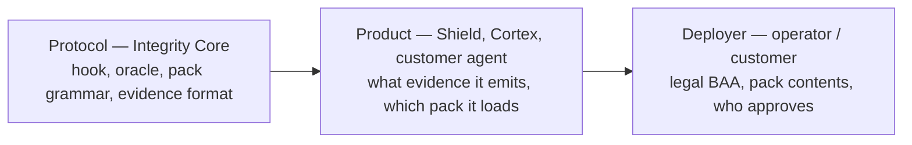

# Integrity Protocol v1 — Controls Matrix

**Status:** Draft, informative
**Normative source:** `SPEC.md`
**Purpose:** Give an auditor, CISO, or compliance buyer a direct map from a protocol guarantee to the external framework clause it addresses — and an equally direct statement of what the protocol does not cover, so nobody over-relies on it.

This document is not a certification. Passing every row here does not make an organization HIPAA-compliant, SOC 2-attested, or EU AI Act-conformant on its own. It maps **engineering capability to framework language** so a compliance program can decide what it still owns.

Three-layer responsibility model used throughout:

| Layer | Owns |
|---|---|
| **Protocol** (Integrity Core) | The hook, oracle, pack grammar, and evidence format |
| **Product** (Shield, Cortex, a customer's own agent) | What evidence it emits, which pack it loads |
| **Deployer** (the operator/customer) | Legal responsibility, BAAs, licenses, policy content inside a pack, human process around escalation |

---

## 1. HIPAA (45 CFR Parts 160, 164)

| Requirement | Protocol capability | Status | Layer still owned by deployer |
|---|---|---|---|
| Access control / minimum necessary (§164.312(a)) | `packs/integrity-health` constraint set; `delegation_active` (SmartBAA) | `[PARTIAL]` — vertical contracts exist; pack-form `[PLANNED]` | Defining "minimum necessary" per role |
| Audit controls (§164.312(b)) | Oracle-verified, anchored evidence log; console replay | `[PARTIAL]` | Retention policy, who reviews |
| PHI redaction before export | Pack `redact: enforce`; BCC/oracle MUST reject unredacted Path A. SDK `redact_phi` default-off is a disclosed blocker until then. | `[PARTIAL]` | Confirming redaction rules match the org's PHI schema |
| Business Associate Agreement evidence | `SmartBAA` delegation instrument (sign/revoke/dispute) | `[BUILT]` (vertical) / `[PARTIAL]` (as pack) | The BAA itself is a legal document, not a file this protocol produces |
| Breach notification / reconstruction | Cursor-stamped replay from oracle heads | `[PARTIAL]` | Notification timelines and content are the covered entity's obligation |
| Human authorization for record writes | Escalate class with deny-on-timeout | `[PARTIAL]` | Who is the approving human, and their competence |

## 2. NIST AI RMF / AI 100-5

| Requirement | Protocol capability | Status | Deployer-owned |
|---|---|---|---|
| Agent identity | `AgentId` (`did:integrity:sha256(pubkey)`) | `[BUILT]` | Binding identity to a real person/team |
| Least privilege | Constraint grammar caps + destination allowlists | `[PARTIAL]` (grammar exists; per-org tuning is a pack) | Setting the caps correctly |
| Human oversight on consequential actions | Escalate + deny-on-timeout | `[PARTIAL]` | Defining "consequential" per pack |
| Sandboxing / containment | Post-state hook on the enclosed account | `[EXPERIMENTAL]` (kernel slice) | — |
| Audit trail | Oracle package + Merkle anchor | `[PARTIAL]` | — |
| Continuous risk management loop (Govern/Map/Measure/Manage) | Console + escalation classes as inputs to a review cadence | `[PLANNED]` as a named artifact | The review process itself is organizational, not protocol |

## 3. Five Eyes "Careful Adoption of Agentic AI" (May 2026)

| Requirement | Protocol capability | Status |
|---|---|---|
| Identity before delegation | `AgentId` + optional hardware binding | `[BUILT]` / `[PARTIAL]` |
| Least privilege | Constraint grammar | `[PARTIAL]` |
| Containment | Hook (target), Shield (device layer) | `[EXPERIMENTAL]` / product-level |
| Human review before high-cost actions | Escalate | `[PARTIAL]` |

## 4. OWASP Agentic Top 10

| Risk class | Protocol mitigation | Status |
|---|---|---|
| ASI01 — Goal hijack | Post-state constraint independent of stated intent; hook does not trust the model's self-report | `[EXPERIMENTAL]` |
| ASI02 — Tool misuse | Destination/venue allowlists in pack constraints | `[PARTIAL]` |
| ASI03 — Identity abuse | Signed, domain-separated, replay-protected intents | `[BUILT]` |
| ASI05 — Insecure orchestration | Pack composition is conjunctive; no pack can widen another | `[PLANNED]` (pack loader) |
| ASI06 — Memory poisoning | Cortex's own hash-chained, Merkle-verifiable memory writes (product-level, not kernel) | Product `[BUILT]`, see Cortex `SPECIFICATION.md` |
| ASI09 — Prompt injection | Not solved by this protocol. The hook's guarantee holds *even if* the prompt is hijacked, because enforcement is on account state, not on reasoning. | By design, out of scope for detection |
| ASI10 — Unsafe integrations | Signed BCC envelope; `chain_id`/`verifying_contract` binding | `[BUILT]` |

**Explicit non-claim:** the protocol does not detect or prevent prompt injection. It bounds the blast radius of a successful one.

## 5. CSA AIUC-1

| Control area | Protocol capability | Status |
|---|---|---|
| Agent inventory | `packs/agents` shadow-agent standing machine (documented, not yet built) | `[PLANNED]` |
| MCP/tool allowlisting | Pack-level allowlist constraint | `[PLANNED]` (pack loader) |
| Evidence of control operation | Oracle package + decision record | `[PARTIAL]` |
| Vendor/model attestation | Content-hash pin on pack; TEE attestation verifier exists but unwired | `[PARTIAL]` |

## 6. EU AI Act — optional profile, not the spine

The EU AI Act is not v1's master specification. This row set exists so a buyer who needs it can see exactly what would have to be added as `packs/eu-ai-act`, and so nobody mistakes the US-floor default for EU conformity.

| Article | What it asks | Protocol posture |
|---|---|---|
| Art. 9 (risk management) | Continuous risk process | Engineering borrowed: escalation classes as inputs. Legal wrapper not adopted. |
| Art. 10 (data governance) | Data lineage | `[PLANNED]` as pack metadata |
| Art. 12 (record-keeping) | Retention minima | Oracle anchoring gives tamper-evidence; retention *policy* is a pack parameter, not a kernel default |
| Art. 14 (human oversight) | Oversight mechanism | Escalate class maps directly |
| Art. 17 (quality management system) | QMS documentation | Not produced by this protocol; organizational |
| Art. 50 (transparency) | User-facing AI disclosure | Not a protocol concern; product-level UI decision |
| Art. 72 (post-market monitoring) | Regulatory filing | Not produced; this protocol is not a notified body |

**Do not** treat any row in this section as "v1 supports the EU AI Act." It supports the *engineering pattern*; the legal instrument is a deployer decision, activated only if `packs/eu-ai-act` is built and a customer needs it.

## 7. What no framework's checklist should assume

Regardless of which row above is checked, the protocol never claims:

- That an agent's goals are aligned with operator intent (constrain ≠ align).
- That every bad outcome has a corresponding constraint (a pack that omits a check has a gap, not a violation).
- That the oracle's record is complete evidence of everything the agent did — only of what passed the enforcement path.
- Certification of any kind. This document is a map for an auditor's own judgment, not a substitute for it.

---

## 8. How to read `[BUILT]` / `[PARTIAL]` / `[PLANNED]` / `[EXPERIMENTAL]` here

Same vocabulary as `SPEC.md`. A row marked `[PARTIAL]` or `[PLANNED]` in this matrix means: do not represent that control as operating in production today. See `SPEC.md` §14 for the itemized, repository-grounded status table this matrix is derived from.

Proprietary-data access (an IP license, not a BAA) is the same protocol capability as the HIPAA access-control row, with a different principal and `scope_hash`. It is `packs/ip-license`, not a new kernel type, and it does not claim copy-control after delivery.
