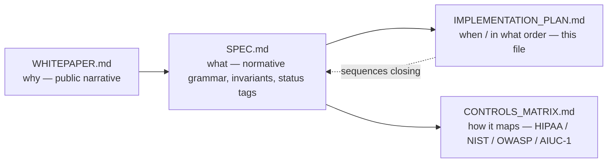
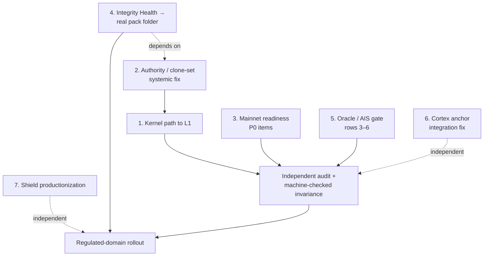
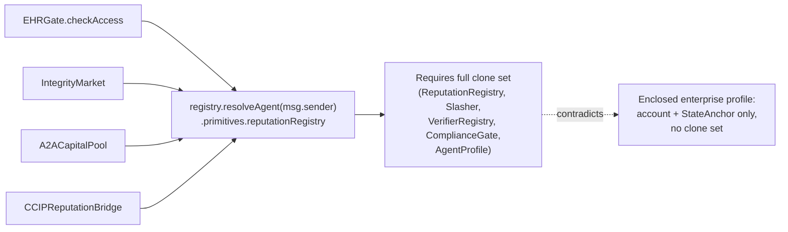
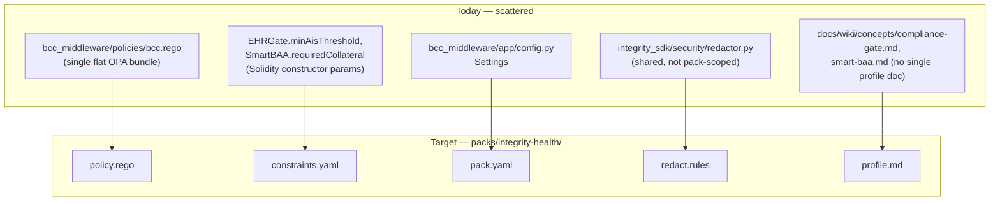
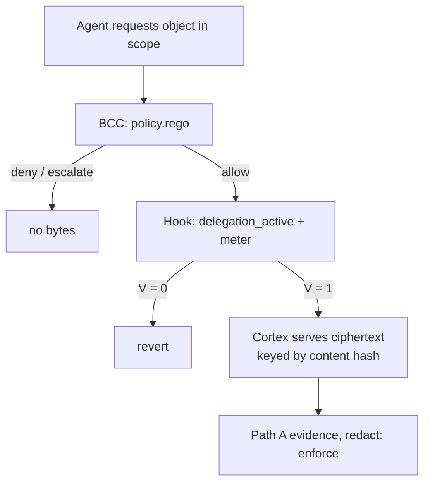
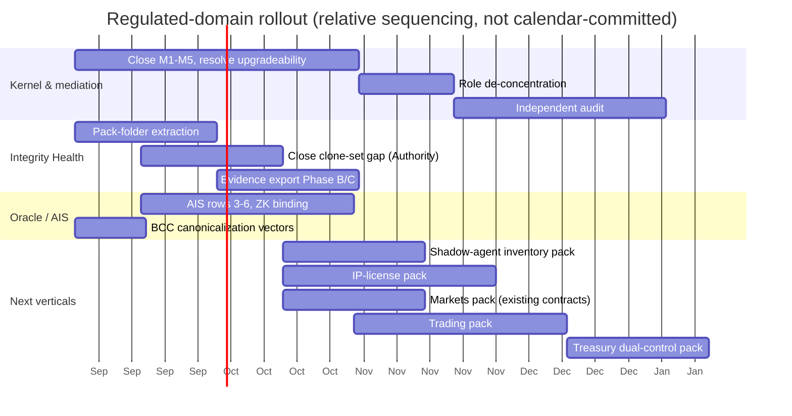

# Integrity Protocol v1 — Implementation Plan

**Status:** Draft
**Normative:** none of this. `SPEC.md` is normative; this file sequences the work that closes its `[PARTIAL]`, `[PLANNED]`, and `[EXPERIMENTAL]` tags.
**Informative:** `WHITEPAPER.md`, `CONTROLS_MATRIX.md`
**Version:** 1.0.0-draft
**Date:** August 2026
**Author:** Jacob S. Vickers, Xibalba Solutions, LLC

This file is for the people building Integrity, not for a buyer. If you are deciding whether to enclose an agent, read `WHITEPAPER.md` instead.

This document does not introduce a new requirement. Every item below traces to a status tag already in `SPEC.md`, or to a named gap in one of the three repo audits (`integrity-core`, `xibalba-shield`, `xibalba-cortex`, all read against `main` on 2026-08-20). Nothing here is a suggestion to remove built infrastructure — BCC, CCIP, the guardian governance layer, $ITK, the market contracts all stay in their repos. This plan is about what becomes **required for v1 conformance**, in what order, and what stays optional or moves to a later pack.

Status tags used below match `SPEC.md`'s: `[BUILT]`, `[PARTIAL]`, `[PLANNED]`, `[EXPERIMENTAL]`, plus `[OPEN]` for a MAINNET_READINESS.md-tracked blocker that has no code yet.

---

## 0. How the four documents fit together

Read `SPEC.md` first. This file exists because "what v1 means" and "what order we build it in" are different questions, and collapsing them into one document is what made the old v0.3/v0.4/v0.5-proposed/v3.2 stack hard to hold in your head at once.

---

## 1. Sequencing overview

Six work streams run in parallel, gated by three hard dependencies. This is not effort-ordered — it's consequence-ordered, same convention as `MAINNET_READINESS.md`.

The one thing every downstream claim depends on: **item 1 and item 3 both feed the audit gate.** Nothing here reaches non-draft `v1.0.0` before that gate, regardless of how complete packs or products are — `SPEC.md` §1 already says this. Streams 5, 6, and 7 (oracle/AIS, Cortex, Shield) can proceed independently and in parallel; they don't block the kernel audit, and the kernel audit doesn't block them.

---

## 2. Kernel path to L1 conformance

### 2.1 Close the M1–M5 mediation gaps (`SPEC.md` §6)

The experimental kernel (`IntegrityKernelV1Experimental.sol` + `IntegrityAccountV1Experimental.sol`) is a disclosed, non-deployed slice. Production `SovereignAgent.execute()` still has zero hook. Closing M1–M5 for real means:

| Gap | Today | Work item |
|---|---|---|
| M1 (no value outside mediation) | Native-value budget only; ERC-20/721 unconstrained | Extend the constraint grammar's primitive families (`SPEC.md` §4.5) to token transfers and allowances before claiming value conservation for any pack |
| M2 (every path routes through the hook) | Single-call only; batch/delegatecall/executor/fallback are rejected outright, not mediated | Decide whether v1 needs batch support at all before building it — a pack that never needs batch execution doesn't need this work pulled forward |
| M3 (module install/remove is constrained) | Not implemented against the experimental account | Wire install/remove through the same `preCheck`/`postCheck` path as `execute()` |
| M4 (kernel removal delayed + multi-party) | Timelocked swap + guardian M-of-N exists, but is a **single-signer reduction** of the full requirement, and guardian actions themselves bypass the hook (a disclosed, permanent exception) | Decide if guardian-action-bypasses-hook is an acceptable permanent exception (it plausibly is — the hook can't gate its own removal without becoming unremovable) and say so explicitly in `SPEC.md` rather than leaving it as an audit finding |
| M5 (new bypass executor is itself audited) | No `mediation_ok` auditor tool exists yet | Build the auditor `SPEC.md` §6 already asks for: a script that walks installed modules/executors on a deployed account and reports true/false, not a manual review |

None of this is a rewrite. It's finishing three conjunctive conditions into the full grammar and building one auditor tool. Do not let "the kernel already gates three things" read as "the kernel mediates."

### 2.2 Resolve the upgradeability decision — before any proxy code

This is the one architectural fork that is genuinely open, not just incomplete. `docs/design/upgradeability-decision.md` picked beacon-proxy-with-pinning; `docs/design/upgradeability-comparison.md`, written the same day, recommends the opposite (frozen contracts + swappable policy hooks via the existing `VerifierRegistry` pattern) specifically because it bounds a compromised-key blast radius to denial-of-service instead of theft.

| Option | Blast radius on key compromise | Cost |
|---|---|---|
| Beacon proxy + pinning | Theft — a compromised upgrade key can redirect logic for every account behind the beacon | Simpler upgrade path, one place to patch a bug |
| Frozen + swappable policy hooks | Denial-of-service only — a compromised key can disable enforcement (fail closed) but can't rewrite what `execute()` does with funds | No single upgrade lever; each account's hook is swapped independently, more surface to coordinate |

**This has to be settled before the M4 work above is finalized**, because M4's "multi-party kernel swap" mechanism is itself the upgrade primitive under discussion. Recommendation for a v1 that names role concentration (six protocol roles on one EOA, MAINNET_READINESS.md P0 item 1) as its own open blocker: pick frozen + swappable hooks. A denial-of-service failure mode is recoverable and legible to an auditor; a theft failure mode compounds with the existing single-EOA role concentration into a single point of total loss. Either way, write the decision into `SPEC.md` §5.2 once made — right now the spec is silent on it because it's unresolved upstream.

### 2.3 De-concentrate protocol roles

MAINNET_READINESS.md P0 item 1: arbitrator, disputer, `funderWallet`, governance, `oracleSigner`, and `resolverSigner` are one EOA today, which also holds `MINTER_ROLE` and `DEFAULT_ADMIN_ROLE`. This is an accepted testnet posture, not a mainnet one. Sequence:

1. Split signer roles across distinct keys (even before hardware custody) so a single leaked key doesn't compound.
2. Move `oracleSigner` and `resolverSigner` to keys held by the oracle/middleware processes, not a human wallet.
3. Multi-sig or timelock `governance`/`DEFAULT_ADMIN_ROLE` last, once the upgradeability decision (§2.2) is settled — no point multi-sig'ing a role whose semantics are about to change.

### 2.4 Independent audit + machine-checked invariance argument

Named in `SPEC.md` §1 and §5.1 as the gate for non-draft `v1.0.0`. Not actionable until §2.1–§2.3 land — an auditor reviewing a kernel that the team already knows doesn't close M1/M2 isn't the audit that's needed yet. Sequence this last within the kernel stream, first across the whole plan for the "call it v1.0.0, not v1.0.0-draft" milestone.

---

## 3. Mainnet-readiness sequencing (P0 → P2)

The full P0/P1/P2 register is `docs/MAINNET_READINESS.md`, 19 items, consequence-ordered. This plan does not duplicate that register; it sequences the P0 items that aren't already covered in §2 above.

| # | Item | Sequenced under |
|---|---|---|
| 2 | Deploy the real Honk-scheme verifier to Base Sepolia (source exists, deployed bytecode is an older placeholder) | Before any pack claims live ZK-boost verification in production |
| 3 | Bind ZK boost to the specific event it proves, not period-wide `BOOL_OR` | §6.2 below |
| 4 | Close BCC cross-language canonicalization divergence (float formatting; `ensure_ascii` vs. `serde_json` default) | §6.3 below |
| 5 | Accept that the 7 pre-existing agents' persistent-memory non-conformance is permanent, not pending — document it as such everywhere, don't keep re-litigating it | No further work; a documentation decision already made 2026-08-02 |
| 7 | Uniform minimum stake at registration | §4 below (ties into the Authority/clone-set work) |
| 8 | `covered_entity_address` resolved via on-chain delegation, not client-supplied | §4 below |
| 10 | Silence-as-signal (agent stops reporting while still acting) | `[PLANNED]` — pack-level policy work once oracle exposes a "last-seen" cursor gap metric |
| 11 | Lineage attestation (fork/migration/recovery) | Depends on §2.2's upgradeability decision — don't build a lineage model against an account architecture that's about to change |
| 12 | Remove every testnet convenience (auto-mint $ITK, dev auto-login, demo-trigger middleware, mock-data seed script) before mainnet | Last, immediately before any real-money deployment |
| 13 | BCC gate should fail open per-intent-class, not per-process | Small, can land any time; not audit-gating |
| 14 | RPC failover (single `publicnode` dependency today) | Ops item, not a code item; do before any SLA claim |

Items 15–19 (external audit, CI coverage confirmation, monitoring/alerting, PHI handling review, key-custody runbook) are process, not code — schedule them once §2 and the items above are closed, not before, since re-auditing after a kernel change is wasted spend.

---

## 4. Authority primitive & the clone-set idiom — the systemic fix

`SPEC.md` §3.4.1 already discloses that `EHRGate.checkAccess` requires the full `PrimitiveSet` clone set, contradicting the enclosed-enterprise-agent target. The audit confirms this is **not an EHRGate-specific bug** — `IntegrityMarket`, `A2ACapitalPool`, and `CCIPReputationBridge` all resolve reputation through the identical idiom: `registry.resolveAgent(msg.sender).primitives.reputationRegistry`. Every consumer contract in the codebase assumes the full clone set exists.

Two ways to close this, not mutually exclusive:

**(a) Parallel resolution path.** Add a resolver that accepts a `StateAnchor`-only account and reads AIS from a source that doesn't require a `ReputationRegistry` clone — e.g., a direct oracle read keyed by `AgentId` rather than by clone address. This is additive: existing sovereign-profile agents keep working unchanged.

**(b) Rearchitect the idiom everywhere.** Replace `resolveAgent(...).primitives.reputationRegistry` with a resolver interface that both profiles can satisfy. Bigger lift — touches four contracts, not one — but removes the duplication.

**Recommendation:** ship (a) first. It's additive, doesn't touch four existing production contracts, and unblocks the enterprise-profile claim in `SPEC.md` §3.4 immediately. Revisit (b) only if a second consumer contract needs the same non-clone read path and the duplication becomes a real maintenance cost.

This same work item closes MAINNET_READINESS.md P0 items 7 (uniform minimum stake) and 8 (`covered_entity_address` resolved on-chain) as a side effect, since both currently assume the same clone-set resolution path that (a) or (b) would generalize.

---

## 5. Packs roadmap

### 5.1 Integrity Health → real `packs/integrity-health/` folder

Today's on-chain body (`CoveredEntityRegistry`, `SmartBAAFactory`/`SmartBAA`, `ComplianceGate`, `EHRGate`, `HIPAAGuardrailRegistry`) is real and production-deployed. What's missing is the pack-folder *form* `SPEC.md` §7.1 defines. No `packs/` directory exists anywhere in `integrity-core` today.

Sequence:

1. Extract `bcc_middleware/policies/bcc.rego` into `packs/integrity-health/policy.rego` unchanged (no logic change, just relocation) — this is the near-term step `docs/ENTERPRISE_ADOPTION.md` Lever 3 already names.
2. Write `constraints.yaml` declaring today's scattered thresholds (`minAisThreshold`, `requiredCollateral`, verification-tier gates) as the YAML grammar from `SPEC.md` §4.3.
3. Write `pack.yaml` per `SPEC.md` §7.1's schema, pinning a version and content hash.
4. Scope `redact.rules` out of the shared SDK redactor into a pack-scoped ruleset (or explicitly document that the shared redactor is intentionally cross-pack, if that's the better call once you look at it).
5. Write `profile.md` — the HIPAA/NIST map for this specific pack, distinct from `CONTROLS_MATRIX.md`'s protocol-wide mapping.
6. Close the clone-set gap from §4 above — a pack folder claiming "no clone set required" while the underlying contract still requires one is a documentation lie, not a pack.
7. Ship HIPAA evidence export Phase B (control mapping) and Phase C (export endpoint) — Phase A (decision→leaf→anchor join) already shipped. This is what turns Integrity Health into something a covered entity's auditor can actually consume.
8. Generalize the domain-selection rule the multi-domain guardrails design doc already names: domain MUST be server-resolved, never client-asserted — same failure class as `verification_tier` spoofing. This has to land before a second pack (§5.2) exists, or the second pack inherits the same hole.
9. Ship `compile()` (`SPEC.md` §7.5) against this folder first — Integrity Health is the compiler's reference pack. Closed families only; typed reject if a constraint cannot lower.
10. Enforce `redact: enforce` in BCC/oracle for this pack (`SPEC.md` §7.7). Do not wait for IP to discover that Path A can still upload PHI.

### 5.2 Next packs, in order

| Pack | Question | Why this order |
|---|---|---|
| `agents@*` (shadow-agent inventory) | Is this workload a principal at all? | Shield's schema already names `shadow_agent_detected` as an intent type with zero backing inventory module — cheapest next pack; schema hook exists, inventory logic does not |
| `ip-license@*` | May this principal read, infer from, or train on this proprietary scope? | Same `delegation_active` family as Health (`SPEC.md` §4.5). Unblocks IP gating without a second `checkAccess` idiom. Requires `redact: enforce` server-side (§5.3). |
| `markets@*` | May this principal list, bid, or settle in an AIS-gated market? | On-chain body already exists (`IntegrityMarket.sol`, `A2ACapitalPool.sol`, `MarketFactory.sol`). Work is pack-folder form + `delegation_active` resolution, not new Solidity. Out of the v1 spine as token economy; in as a vertical pack (§5.4). |
| `trading@*` | May this approved principal spend at this venue, this size, still alive? | Needs `token_out_cap` + `meter` load-bearing (§2.1). Distinct from `markets@*`: trading is venue spend; markets is listing/bidding/settlement. |
| `treasury@*` (dual control) | Two-signer or step-up for value above a threshold | Escalation grammar (`SPEC.md` §9) plus existing primitives — no new family |
| `eu-ai-act@*` | Optional compliance profile | Only if a buyer asks |

Shadow-agent inventory also needs MCP discovery, which the Shield audit confirms is entirely unbuilt. If this pack is meant to discover MCP-speaking tools as unregistered principals, that mechanism is new work, not a refactor.

### 5.3 IP vertical — `packs/ip-license`

Access gating for proprietary data. Not DRM. Not v3.2 Metered IP (licence TBAs, ATCP/IP, marketplace) — those stay archive. This pack is Health's Authority pattern with a different principal and scope.

Sequence:

1. Kernel view `(principal, agent, scope_hash) → {active, expires, meter}` — the same work item as §4's Authority fix. Health's `SmartBAA` becomes the first body; IP is the second consumer. Do not ship a second `EHRGate.checkAccess`.
2. `packs/ip-license/` folder: `pack.yaml` (`redact: enforce`, `license_required: true`), `constraints.yaml` lowered onto `delegation_active` + `meter`, `policy.rego` (`requires_delegation`), `redact.rules`, `controls.yaml` (officer fields: licensor, scope, verbs read/infer/train/sublicense, expiry, meter, collateral), `profile.md`.
3. Server-side `redact: enforce` in BCC/oracle (`SPEC.md` §7.7) — a Health and IP blocker until Path A cannot upload raw proprietary content. SDK `redact_phi=False` default must not override.
4. Cortex: serve content-addressed ciphertext only after allow. No proprietary bytes on chain.
5. Evidence export: license id × scope_hash × decision × pack version × anchor — reuse Health Phase B/C, swap control IDs.
6. Explicit non-goals in the pack profile: copy-control after delivery, putting weights/files on chain, letting AIS refill a consumption meter, v3.2 Metered IP marketplace.

Gate to start: §4 parallel resolution path (or Health pack folder) so `delegation_active` is real. Gate to call it shipping: `redact: enforce` is server-side, not an SDK flag.

### 5.4 Market verticals — `packs/markets` and `packs/trading`

Two packs, one family of spend/participation constraints. Do not merge them. Do not put IntegrityGovernance or token-economy chapters back in the spine.

**`markets@*`** — listing, bidding, settlement inside an AIS-gated market.

| Already built | Pack work still to do |
|---|---|
| `IntegrityMarket.sol` — AIS-gated, ITK-staked, agent-owned clone | Folder form: `constraints.yaml` for AIS floor, stake, who may list/bid |
| `MarketFactory.sol` — any registered agent deploys a clone | `controls.yaml` officer fields (min AIS, stake token as pack param, not hardcoded $ITK type) |
| `A2ACapitalPool.sol` — AIS-gated A2A escrow | Resolve reputation via `delegation_active` / parallel path (§4), not `resolveAgent(...).primitives.reputationRegistry` |
| Dashboard `castVote` on `IntegrityGovernance` | Leave governance UI as-is; do not describe it as v1 protocol. Propose/queue/execute stay CLI/SDK. |

Sequence: (1) stop requiring the full clone set to read AIS for market participation — same §4 lift as Health; (2) extract thresholds into `packs/markets/`; (3) pin pack hash on the market clone or the participating account; (4) keep `$ITK` as the built default collateral parameter, typed as ERC-20 in the pack, not as kernel.

**`trading@*`** — venue spend: this size, this dest allowlist, still alive. Design notes already live at `docs/packs/trading/` (loopback adapter only). Needs `token_out_cap` + `meter` from §2.1 before the pack can claim value conservation. Adapters (FIX, x402, AP2 mandate) translate into this pack; they add no constraint of their own.

**`treasury@*`** stays after both: dual-control is escalation on top of a working spend meter.

v3.2 Metered IP marketplace, ATCP/IP, and adapter-author revenue stay archive. A later revision MAY attach them to `ip-license` or `markets` as an optional profile. They are not a prerequisite for either pack.

---

## 6. Oracle and AIS roadmap

### 6.1 AIS gate rows 3–6 (v0.5-proposed §4.3)

Rows 1–2 (fail-closed defaults for entropy/grounding/compliance-self-report on absent evidence) are `[BUILT]` and closed a real, numerically-verified exploit (a content-free submission with a claimed compute-time input previously scored higher than an honest agent). Rows 3–6 remain open:

- Compliance for non-Integrity-Health agents is self-reported with no independent check.
- Sacrifice (compute-time) is self-reported token counts, no validator or TEE attestation.
- No per-component floor plus conjunctive Θ gate exists — a 90%-violation agent still reaches a non-zero score under the geometric mean rather than gating to zero.
- The API surfaces `AIS_final` (post-boost, clamped) but not the pre-boost, unclamped `r(ι) ∈ [0,1]` value the proposed conjunctive-gate formula needs as its own input.

Sequence: ship the pre-boost accessor first (it's additive, no behavior change for existing consumers), then the per-component floor, then wire the floor into a conjunctive gate as an opt-in pack parameter before making it a default — the team's own 2026-08-17 decision deferred the entropy floor specifically pending a second live agent, and that reasoning still holds.

### 6.2 ZK-boost per-event binding + verifier deployment parity

Two separate items, easy to conflate:

1. **Binding**: today's ZK boost is period-wide `BOOL_OR` — one verified event in a period boosts every score computation in that period. `SPEC.md` §10 already flags this as `[PARTIAL]`, must-disclose. Fix: bind the boost multiplier to the specific verified event's contribution, not the whole period's aggregate.
2. **Deployment parity**: the real generated verifier (Honk scheme, despite the `UltraPlonkVerifier.sol` filename) exists in source and passes Foundry tests, but Base Sepolia still runs an older fail-closed placeholder. Fix: deploy the real verifier, then confirm the `NUMBER_OF_PUBLIC_INPUTS` mismatch flagged in the audit (11 for Honk's internal accumulator vs. 3 expected by the existing Foundry fixture) doesn't describe two different verifier artifacts being conflated — resolve this naming confusion before deployment, not after.

### 6.3 BCC cross-language canonicalization

`SPEC.md` §3.7 now discloses this: three Python implementations of canonical-JSON encoding (`integrity_sdk`, `integrity_cli`, `bcc_middleware`) plus one Rust implementation (oracle, `serde_json`) diverge on non-ASCII escaping. Fix by one of:

- A shared canonicalization library compiled once and bound into both languages (most robust, most work).
- A committed byte-for-byte test-vector suite covering non-ASCII payloads, run in CI for both languages, as a cheaper interim close.

Do the test-vector suite now; revisit the shared-library approach only if the divergence recurs after the vectors are pinned.

### 6.4 CCIP — conditions to wire, not a timeline

`CCIPReputationBridge.sol` is real, reworked for the per-agent clone model, and deliberately unwired. It stays `[PLANNED]`, not v1-required, until a real second-chain customer exists — bridging only `baseScore`, never ZK-boost state, is a considered design choice (a compromised verifier on one chain must not inflate scores everywhere), not a gap to close on a schedule. No work item here beyond: when a second chain is actually needed, deploy a peer bridge and grant `BRIDGE_ROLE` per agent, per the existing NatSpec.

---

## 7. Cortex integration fixes

`SPEC.md` §8.6 names four disclosed gaps in the anchoring path between Cortex's session Merkle root and this protocol's on-chain commitment. This work is split between the two repos — Cortex owns its own root construction (already correct and frozen for v1); `integrity-core` owns defining what the anchor consumer accepts.

| Gap | Owner | Work item |
|---|---|---|
| Hash-space mismatch (Cortex: SHA-256 sorted-pair; chain: keccak256 sorted-pair) | integrity-core, with Cortex cooperation | Decide which side converts. Recommendation: integrity-core's receiving endpoint re-hashes the received SHA-256 root under keccak256 before committing on-chain — this keeps Cortex's local hash-chain untouched (frozen for v1, per Cortex's own `SPECIFICATION.md` §0) and puts the conversion where the chain-facing convention already lives |
| No receiving contract/schema for `XIBALBA_ANCHOR_URL` | integrity-core | Define the endpoint: request schema (Cortex's `{session_id, root_node_id, exchange_count, valid, root_kind}` dict is already the de facto request shape — formalize it), response shape, and where in `bcc_middleware` or the oracle it lives |
| Unauthenticated anchor POST | Cortex, once integrity-core defines the endpoint | Add a DID signature to the anchor payload, matching the pattern the SDK's signed telemetry path already uses — this is a small, additive change to `anchor_session_root()` once there's a signature scheme to sign against |
| Conformance vectors are a stub (`tests/conformance/test_vectors.json`, 16 lines) | Cortex | Populate real vectors once the "portable event kernel" batch-Merkle profile is actually needed by an external implementation — don't build this speculatively ahead of a concrete second consumer |

Lower priority, noted for completeness: the `retrieval_trace_evidence` inclusion-proof call has no MCP tool wrapper yet (direct `GraphStore` API only), and Cortex's `pyproject.toml` declares a local-path dependency on a sibling `integrity-core` checkout — worth confirming this stays a dev-time convenience and doesn't quietly become a runtime coupling as both repos evolve.

---

## 8. Shield productionization

Shield's local enforcement loop (sensors → policy engine → Action Broker → event log) works today and is independently valuable with `--no-exporter` and zero Integrity Protocol account. The gaps below are about closing the distance between what Shield's docs claim and what ships, and about wiring what exists but isn't turned on by default.

### 8.1 Wire or formally scope the six guardrail hooks

All six hooks (`ingress`, `retrieval_context`, `model_routing`, `output`, `tool_execution`, `post_action_verification`) are built and tested as library calls, but `shield run`'s own event loop never passes any to `EventRouter`. This is deliberate — the sensor loop watches OS-level telemetry, not an agent runtime's own semantic calls — but it means "Shield has six guardrail hooks" currently reads stronger than "Shield ships six guardrail hooks a runtime integrator must wire in themselves." Work item: either (a) ship a reference integration showing one real agent runtime calling into these hooks, so "built" has a working example behind it, or (b) make the SPEC/README language explicit that these are a library for instrumented runtimes, not part of `shield run`'s default loop. Both are cheap; pick (a) if a design partner exists to integrate against, (b) if not.

### 8.2 OPA sidecar packaging

The policy engine hard-depends on a local OPA REST sidecar that nothing in `shield run`'s own Quickstart starts. Every event fails closed to `deny` until an operator manually runs `opa run --server`. Work item: either bundle a supervised OPA lifecycle into `shield run` itself (the existing `shield local-run --profile` smoke driver is close to this shape already — promote it from dev-tool to production-supervised, or build the production version alongside it) or make the manual-start requirement loud and first in the Quickstart rather than implicit.

### 8.3 Platform breadth

Windows and macOS sensors are interface-boundary stubs (`yield from []`) — zero real telemetry off Linux. TCP-connect is blocked at compile on the current BCC/kernel combination; DNS observation is unbuilt entirely. This is the single largest platform-breadth gap for any multi-OS rollout. Sequence after the guardrail-hook and OPA-packaging items above, since a second platform multiplies whichever packaging decisions get made for Linux first.

### 8.4 Doc-vs-code drift cleanup

None of these are architecture decisions — they're documentation debt that should be closed opportunistically, framed as routine hygiene rather than defects to be embarrassed about:

- `slm_training/` and `models/` are described in detail (file paths, line-level behavior) across four docs but do not exist in the repository tree; `--slm-backend local` cannot function against the tracked repo alone.
- `integrity-sdk` is pinned to `@main`, not a commit SHA, though multiple docs claim it's pinned to a specific reviewed commit.
- The backend is plain `http.server`, not FastAPI as `CLAUDE.md` describes.
- `shield.content_classifier` (Metadata DLP) is referenced by dotted path in README/SECURITY but no such file exists in the tree.
- Test-count claims disagree across currently-live docs (118 vs. 135 vs. 137 passed).

Fix: one pass reconciling each claim against the actual tree, landing corrected numbers/paths in the same commit that touches each doc for another reason — no need for a dedicated cleanup sprint.

---

## 9. Regulated-domain rollout sequence

Healthcare (Integrity Health) stays first — it is the only vertical with production contracts that already implement `delegation_active` (as `SmartBAA`). IP-license starts as soon as that kernel view is shared; it is the second consumer of the same family, not a new protocol. Markets pack-folder extraction can run in parallel because `IntegrityMarket` / `A2ACapitalPool` already exist — the work is wrapping them, not writing them. Trading and treasury wait on `token_out_cap` + `meter` (§2.1). Each vertical is a folder against the same three verbs. v3.2 Metered IP marketplace is not on this chart.

---

## 10. Definition of done — non-draft v1.0.0

Per `SPEC.md` §1 and §5.1, all of the following, not a subset:

1. M1–M5 demonstrated and machine-checked, not disclosed-and-reduced (§2.1–§2.2 above).
2. Independent audit complete (§2.4).
3. At least one non-stub pack fully in the `packs/` schema form, including its evidence-export path (§5.1).
4. AIS gate rows 3–6 landed, or explicitly re-deferred with a named reason and re-review date, not silently carried forward (§6.1).
5. Cortex anchoring gaps closed enough that "session evidence anchored and ancestry-verified end to end" is true, not aspirational (§7).
6. MAINNET_READINESS.md P0 items 1–8 closed (§2.3, §3, §4).

Until then, the honest sentence from `WHITEPAPER.md` stands: this is a testnet/prototype protocol specification with a narrow experimental reference implementation. That is a description, not an apology — it is also exactly what lets a security or compliance buyer trust the rest of what's written here.
