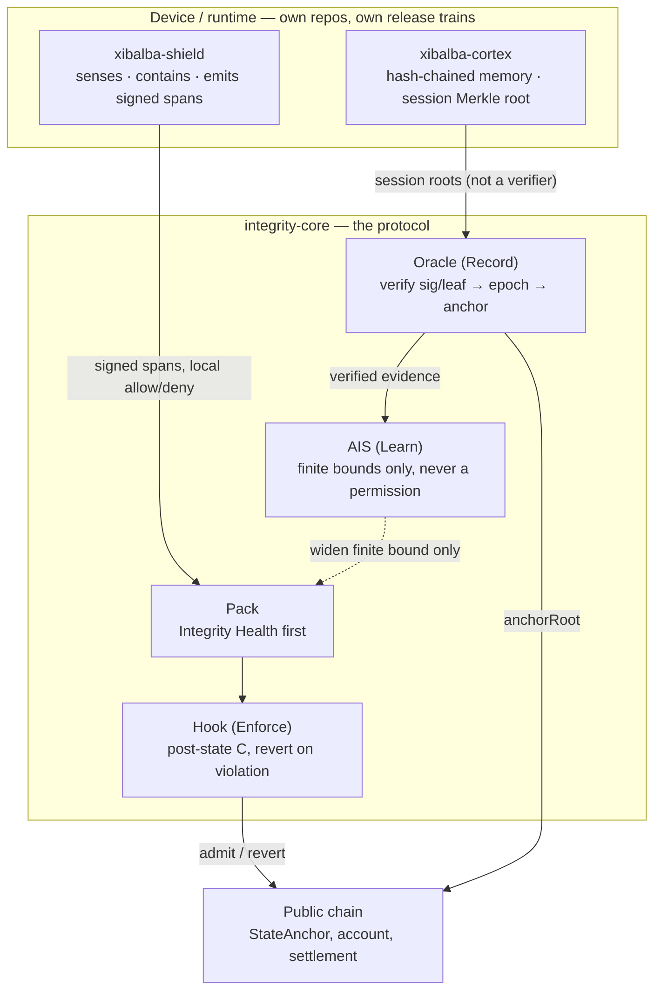
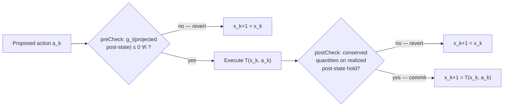
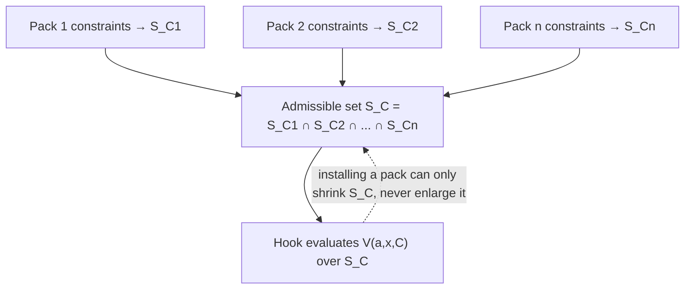
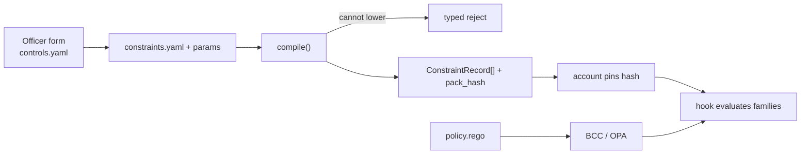
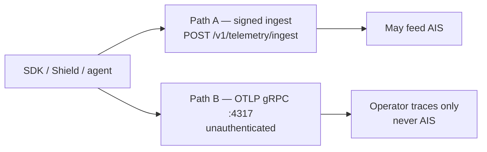
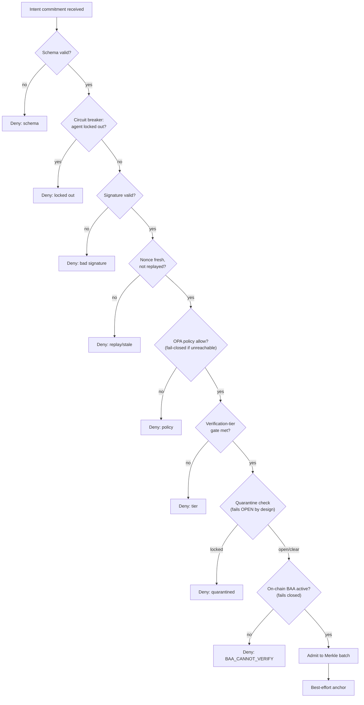
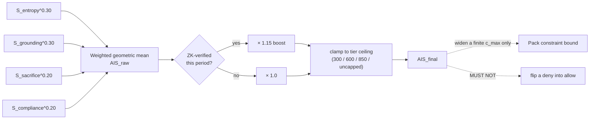

# Integrity Protocol v1 Specification

**Status:** Draft
**Normative:** this document
**Informative:** `WHITEPAPER.md`, `CONTROLS_MATRIX.md`, `IMPLEMENTATION_PLAN.md`
**Version:** 1.0.0-draft
**Date:** August 2026
**Author:** Jacob S. Vickers, Xibalba Solutions, LLC

Implementations claim conformance only against this file. The current explanatory whitepaper is `WHITEPAPER.md` (v3.2); older v3, v0.3, v0.4, and v0.5-proposed documents are archived.

The key words MUST, MUST NOT, SHOULD, MAY are RFC 2119.

Status tags on a requirement:

| Tag | Meaning |
|---|---|
| `[BUILT]` | Present in `integrity-core` (or the named product repo) on `main` and treated as the live path |
| `[PARTIAL]` | Exists; this document's semantics supersede older docs. The reduction is disclosed here. |
| `[PLANNED]` | Normative when shipped; not required to claim v1 kernel conformance |
| `[EXPERIMENTAL]` | Exists as a non-deployed, non-production slice. MUST NOT be claimed as the live path. |

A tag applies to the nearest heading or bullet. Untagged text is definitional.

**How to read this file**

| If you are… | Read |
|---|---|
| Deciding whether to buy or enclose an agent | `WHITEPAPER.md`, then stop. Come back here only for a status tag. |
| Implementing the hook, oracle, SDK, or a pack | This file, in order. §4–§7 are the contract. |
| Mapping a control to HIPAA / NIST / OWASP | `CONTROLS_MATRIX.md`. It does not add requirements. |
| Sequencing the work | `IMPLEMENTATION_PLAN.md`. It does not add requirements. |
| Tracking what this file names but doesn't yet define | [`docs/design/spec-open-definitions.md`](design/spec-open-definitions.md). It does not add requirements either — it proposes fills for gaps this file already discloses (e.g. `scope` in §4.5). |

---

## 1. Conformance

A **v1 Core** implementation MUST provide:

1. An enclosed account whose state transitions are mediated by the hook in §6.
2. Evaluation of a constraint vector \(C\) on the **post-state** per §5.
3. An evidence plane (§8) that stores signed packages and exposes epoch cursors.
4. An oracle that verifies those packages and submits roots (§8.3).
5. Pack loading per §7. A Core MAY ship with zero packs installed; it MUST accept a pack that satisfies the schema.

A **v1 Pack** MUST be conservative (§7.2 R4). A pack MUST NOT be required to implement Integrity Health, ZK ingest, or a second chain.

**Conformance levels:**

| Level | Required |
|---|---|
| **L0 — Record** | Signed spans + evidence store + oracle verify/anchor. No hook. |
| **L1 — Constrain + record** | L0 plus a hook that evaluates a pack's \(C\) on the enclosed account. |
| **L2 — Full v1** | L1 plus escalate (deny-on-timeout) and at least one non-stub pack. |

v1.0.0-draft targets **L1 on one chain, one OS, one pack stub**. Independent audit and a machine-checked invariance argument are the named gate for non-draft `v1.0.0`. They are not a prerequisite for calling this document v1.

Until M1–M5 are demonstrated, implementations MUST describe themselves as: a testnet/prototype protocol specification with a narrow experimental reference implementation.

---

## 2. Objects and planes

v1 is a three-plane system. No other top-level plane is defined.

| Plane | Object | Role | MUST NOT |
|---|---|---|---|
| **Enforce** | Account \(A\), Hook | Modular smart account. ERC-7579 type-4 hook evaluates \(C\) and reverts on violation. | Become an analytics platform |
| **Record** | Cortex (reference), Oracle | Persistent evidence and memory; verify and anchor | Become the final authority to move funds; be a second hook |
| **Learn** | AIS | Evidence-derived integrity measurement | Create unbounded authority; turn deny into allow |
| **Settle** | Chain (StateAnchor, account) | Tamper-evident commitments and high-value settlement | Store raw telemetry or PHI |



Shield can run with no Core; Cortex can run with no Core. The closed loop is Shield and Cortex both calling Core: local containment plus durable memory plus an account that cannot leave the box.

**Shield** (`xibalba-shield`, own repo) is a product that emits SDK spans and MAY load `packs/integrity-health` or `packs/agents`. It is not a protocol object.

**Console** is an operator API over the evidence plane + hook telemetry. It is not a protocol object.

**Xibalba Cortex** is Integrity v1's persistent evidence and memory plane in the **reference architecture**. A future enterprise deployment MAY substitute a conforming store. Cortex MUST NOT be a second verifier. The oracle verifies; Cortex stores, indexes, and serves replay.

**AIS** is derived from verified evidence. It is a parameter of \(C\), never a permission.

---

## 3. Types

### 3.1 Account state

Let \(X\) be the finite set of EVM state assignments reachable by \(A\).

At step \(k\):

\[
x_k = (b_k, \ell_k, n_k, q_k, m_k, \pi_k, h_k) \in X
\]

| Field | Type | Meaning |
|---|---|---|
| \(b\) | balances | Native and token balances controlled by \(A\) |
| \(\ell\) | allowances | ERC-20 / operator approvals |
| \(n\) | nonce | Replay counter |
| \(q\) | meters | Remaining consumable units, keyed by meter id |
| \(m\) | modules | Installed ERC-7579 modules and their config |
| \(\pi\) | params | Operator / pack parameters (finite bounds, allowlists). Not the agent's policy. |
| \(h\) | `bytes32` | StateAnchor head: commitment to durable memory |

The agent policy (model + harness) is **not** a field of \(x\). It is outside the TCB.

`kill_epoch` is a monotone meter on the account. An intent whose `kill_epoch` does not equal the account's MUST fail.

### 3.2 Action

\[
a \in U = \{(\mathit{to}, \mathit{value}, \mathit{calldata}, \mathit{op})\}
\]

`op` is call, delegatecall, or batch. A batch is one \(a\) whose components MUST each be mediated.

### 3.3 Identity

Constraints MUST be keyed by a durable agent id, not a raw key.

```text
AgentId      = IntegrityDid | ERC8004TokenId
IntegrityDid = "did:integrity:" || sha256(pubkey)
ChainRef     = EIP155ChainId
AccountRef   = CAIP10Account
PackId       = name "@" semver
MeterId      = bytes32
```

\(C\) is a function of identity. Key rotation MUST NOT drop \(C\). An implementation that binds \(C\) only to `msg.sender` when that sender is a rotatable EOA is not conformant.

Live stack: `did:integrity:<sha256(pubkey)>`. `[BUILT]` An ERC-8004-shaped read facade exists as `[EXPERIMENTAL]` (`IntegrityIdentityReadV1`) and MUST report `isERC8004Conformant() == false` until a separately accepted claim.

### 3.4 Account profiles

Both profiles MUST use the same hook, evidence format, memory chain, AIS inputs, and packs.

| Profile | Ownership | On-chain footprint | v1 commercial default |
|---|---|---|---|
| **Enclosed enterprise agent** | Organization-owned ERC-4337 account; agent session keys; operator governance | Account + `StateAnchor` head only. No clone set required. | Yes |
| **Sovereign economic agent** | Identity bound to ERC-6551 TBA or equivalent | MAY deploy the full `PrimitiveSet` (§3.4.1) | Optional, not required |

A hospital MUST NOT be required to mint an NFT, or deploy a clone set, to enclose an internal agent.

#### 3.4.1 PrimitiveSet (sovereign profile only) `[BUILT]`, count `[NOT NORMATIVE]`

The current self-sovereign identity layout in `integrity-core` is `SovereignAgent` and `StateAnchor` (direct deploy, agent-signed) plus a set of EIP-1167 clones (`ReputationRegistry`, `Slasher`, `VerifierRegistry`, `ComplianceGate`, `AgentProfile`). This is `[BUILT]` today. The number and composition of clones is an **implementation detail, not a protocol invariant** — v1 does not fix "seven" as a normative count, and a future revision MAY shrink, merge, or drop clones. What is structurally load-bearing, if the sovereign profile is used at all, is only: (a) the agent's own key signs its identity-defining deploys, and (b) every post-registration call against a deployed clone routes through the agent's own account contract, never a raw EOA.

The clone set exists for agents that opt into the sovereign profile: on-chain markets, staking, or a portable, transferable identity.

It is **not required** for the enclosed enterprise profile as a v1 target: an enterprise agent conformant with this document needs only an account plus a `StateAnchor` head; it MUST NOT be required to deploy `ReputationRegistry`, `Slasher`, `VerifierRegistry`, `ComplianceGate`, or `AgentProfile` clones to be enclosed.

**Disclosed gap `[PARTIAL]`:** the live `EHRGate.checkAccess` implementation today resolves `registry.resolveAgent(msg.sender).primitives.reputationRegistry` — i.e. it currently requires an agent to be registered through `AgentPrimitivesFactory` (the full clone set) before its AIS can gate PHI access. The enterprise profile's "no clone set required" claim is this document's **target**, not yet the live path for the Integrity Health pack. Closing this gap needs either an AIS/reputation read that does not require a `ReputationRegistry` clone, or a documented exception where an enclosed enterprise healthcare agent still deploys that one clone. Do not represent minimal-footprint enterprise Integrity Health agents as already working end-to-end.

### 3.5 Reputation parameter

Let \(r \in [0,1]\) be an attested score (AIS, or ERC-8004 if the operator pins it). For each numeric bound \(c_i\):

\[
c_i(r) = c_i^{\min} + r\,(c_i^{\max} - c_i^{\min}), \qquad c_i^{\max} < \infty
\]

An implementation MUST reject configuration with \(c_i^{\max} = \infty\). \(r\) MAY widen a bound. \(r\) MUST NOT remove a constraint. \(r\) MUST NOT change a pack `deny` into `allow`.

### 3.6 Memory commitment `[PARTIAL]`

\[
h_{k+1} = H(h_k \,\|\, H(\delta_k))
\]

\(H\) is a collision-resistant hash (SHA-256 or keccak256; a deployment MUST name one). Only \(h_k\) is required on-chain. Payload lives in the evidence plane, content-addressed by the leaf. Presenting a history inconsistent with \(h_k\) MUST fail verification.

Genesis: registration SHOULD require a non-zero \(h_0\). Enforcing `latestRoot != 0` at `registerPrimitives` and oracle ingest is `[PLANNED]` (P0).

### 3.7 Domain separator `[BUILT]` (BCC path)

An intent is valid in exactly one domain, exactly once.

```text
Domain = lenpref(chainId) || lenpref(account) || lenpref(packId)
       || lenpref(licenceOrMeterId) || lenpref(epoch)
```

Encoding MUST be length-prefixed. Concatenation of raw strings is non-conformant. Nonce MUST be strictly monotone in that domain.

Live BCC commitments bind `chain_id` and `verifying_contract`. `[PARTIAL]`: the experimental kernel's replay-domain binding and the ZK circuit's `intent_commitment` do not yet bind `chain_id`.

**Disclosed residual `[PARTIAL]`:** canonical-JSON encoding is implemented three times (`integrity_sdk/bcc.py`, `integrity_cli/bcc.py`, `bcc_middleware/app/canonical.py`, all Python) and once more inside the oracle (Rust `serde_json`). Python's `ensure_ascii=True` escapes non-ASCII bytes; `serde_json` does not by default. A signature computed over one encoding and checked over the other diverges for any payload with non-ASCII content. This MUST be closed (single canonicalization crate/library shared across languages, or an explicit byte-for-byte test vector suite) before BCC signatures can be called cross-language conformant. See `IMPLEMENTATION_PLAN.md` §2.

---

## 4. Constraint grammar

This section is the v1 language. Packs compile into it. The hook evaluates it. Nothing else is enforced on-chain.

### 4.1 Sign convention

A constraint is \(g : X \to \mathbb{R} \cup \{+\infty\}\).

\[
g(x) \le 0 \quad\text{means satisfied.}
\]

The admissible set is

\[
S_C = \{\, x \in X \mid g_i(x) \le 0 \text{ for all } i = 1,\ldots,m \,\}.
\]

The margin of a state is \(\min_i (-g_i(x))\). The hook SHOULD expose per-\(g_i\) margin to the console.

### 4.2 Abstract syntax `[PARTIAL]` / `[EXPERIMENTAL]`

```text
C            = g ("," g)*
g            = g_id ":" expr
expr         = cmp | "AND" "(" expr ("," expr)+ ")"
             | "OR"  "(" expr ("," expr)+ ")"   ; pack-local only; see 4.4
cmp          = term op term
op           = "<=" | ">=" | "==" | "!="
term         = UINT | ADDR | BYTES32 | BOOL
             | state_ref | param_ref | call
state_ref    = "pre." path | "post." path
path         = "balance" "[" ADDR "]"
             | "allowance" "[" ADDR "]" "[" ADDR "]"
             | "nonce"
             | "meter" "[" MeterId "]"
             | "module" "[" ADDR "]" ".installed"
             | "head"
             | "timestamp"
param_ref    = "param." IDENT
             | "id." IDENT
             | "r"
call         = "sum_out" "(" window "," destset ")"
             | "attestation_age" "(" AgentId ")"
             | "owner_of" "(" ADDR ")"
```

`pre` is \(x_k\). `post` is \(T(x_k, a)\). A constraint that reads only `pre` and ignores `post` for a quantity the action can change is non-conformant for that quantity.

The experimental kernel slice (`IntegrityKernelV1Experimental`) implements a **reduced** grammar: native-value spend budget, a reputation-floor precondition, and a ZK-assurance-tier precondition. It is not this grammar. Status: `[EXPERIMENTAL]`. It MUST NOT write storage in `preCheck`. Projected checks belong in `preCheck`; conservation of realized post-state belongs in `postCheck`.

### 4.3 Concrete YAML (pack surface)

```yaml
pack: integrity-health@1.0.0
constraints:
  - id: daily_outbound
    g: post.sum_out(24h, NOT allowlist) - param.daily_cap
  - id: meter_nonneg
    g: 0 - post.meter[ehr_write]
  - id: no_self_uninstall
    g: 1 - post.module[KERNEL].installed
  - id: spend_cap
    g: (pre.balance[USDC] - post.balance[USDC]) - param.max_usdc_out
```

`g` in YAML is the real-valued expression. Compilers MUST NOT invert the sign. Unknown identifiers MUST fail closed.

### 4.4 Conjunction at the hook

\[
V(a,x,C) = \prod_{i=1}^{m} \mathbf{1}[g_i(T(x,a)) \le 0] \in \{0,1\}
\]

`OR` MAY appear **inside a single pack-local** \(g_i\). `OR` MUST NOT be used to let one pack disable another pack's \(g_j\).

**Hook wins:** if Rego returns allow and \(V = 0\), the transition MUST NOT commit.

### 4.5 Primitive families `[PARTIAL]`

**Value conservation (settlement).** For participant set \(P\) and declared fee to a named recipient:

\[
\sum_{j \in P} \Delta b_j = 0
\]

A transition that mints, burns, or leaks MUST revert unless a constraint **explicitly** authorizes that class. Native ETH balance alone is non-conformant as the conservation check; ERC-20/721 and allowances MUST be in scope for any pack that claims value conservation.

**Monotone meters.** Working **and** inbound orders update meters in `preCheck` on the projected book. A reject rolls the projection back. Caps apply to working + filled, not filled only.

\[
q_{k+1} = q_k - c_k,\quad c_k \ge 0,\quad q_{k+1} \ge 0,\quad q_0 = Q
\]

A meter MUST NOT increase except by an operator-signed refill that is itself constrained. AIS MUST NOT refill a loss cap.

**Replay domain.**

\[
n_{k+1} > n_k,\qquad d(a) = d_{\text{declared}}
\]

**Delegation / license (`delegation_active`).** A principal-to-agent grant: `(principal, agent, scope_hash) → {active, expires, meter}`. The hook MUST treat a missing, expired, revoked, or out-of-scope grant as \(V = 0\) when the installed pack requires one. Integrity Health's `SmartBAA` is the first on-chain body of this family (covered entity = principal, business associate = agent, PHI class = scope). An IP-license pack is the same family with a different principal and scope. Packs MUST NOT each invent a second `checkAccess` idiom that bypasses this family.

Status: `[PARTIAL]` — `SmartBAA` is `[BUILT]`; a kernel-level view `(principal, agent, scope_hash)` that both Health and IP consume is `[PLANNED]`. `covered_entity_address` is still client-supplied on the BCC path today; resolving it through this view is P0.

**`scope` is not yet defined — a known hole, not an omission by oversight.** This section
requires an "out-of-scope grant" check and a "PHI class = scope" / "IP-license = same family,
different scope" reading, but never says what a scope *is* beyond an opaque `scope_hash`.
Containment against an opaque value is undecidable, so today's enforcement is exactly what
`SmartBAA` hard-codes, not a general capability check. A typed capability algebra is proposed in
[`docs/design/spec-open-definitions.md`](design/spec-open-definitions.md) §1 and must land
before the `[PLANNED]` kernel-level view above is implementable.

### 4.6 Gas bound

Each \(g_i\) MUST declare `gas_max`. Evaluation MUST use a metered call. Exceeding `gas_max` MUST be treated as \(V = 0\), not as "skip this constraint."

The v3 whitepaper's 40k `preCheck` budget is a target, not a silent requirement of this spec. Live reads of foreign registries MUST be amortized (epoch snapshots) or declared out of that budget. Do not claim both a 40k cap and live ERC-8004 / licence TBA reads on every call.

### 4.7 Forbidden

A conformant compiler MUST reject:

- Unbounded loops over attacker-supplied arrays
- Reads of `block.coinbase` or `prevrandao` to decide \(g_i\)
- A constraint that is satisfied when evaluation throws
- \(c^{\max} = \infty\)
- Relaxation of another pack's \(g_j\)
- World-event predicates ("the election result is X")
- Fail-open on oracle-cursor staleness, for the value path
- Storage writes in `preCheck`

---

## 5. Verification rule

Let \(T\) be the EVM transition of \(A\).

\[
x_{k+1} =
\begin{cases}
T(x_k, a_k) & \text{if } V(a_k, x_k, C) = 1 \\
x_k & \text{otherwise (revert)}
\end{cases}
\]

Rejection MUST be a revert. It MUST NOT be a compensating transaction.

`preCheck` MAY reject on **projected** post-state. `postCheck` MUST re-check conserved quantities on the **realized** post-state and revert if they do not hold. A pass in `preCheck` and a fail in `postCheck` MUST leave \(x_{k+1} = x_k\).

This is the errata to whitepaper v3 Appendix A. Projected arithmetic is not \(T(x,a)\). Claiming Proposition 1 of a `preCheck`-only native-balance gate is non-conformant.



### 5.1 Forward invariance `[PLANNED]` as machine-checked

**Proposition 1.** If \(x_0 \in S_C\) and every transition of \(A\) is mediated by the rule above, then \(x_k \in S_C\) for all \(k \ge 0\), for every sequence \(a_0, a_1, \ldots\), including adversarial sequences and sequences signed with stolen keys.

Proof is induction on \(k\): a revert leaves \(x_k \in S_C\); an accept has \(T(x_k,a_k) \in S_C\) by definition of \(V\).

Proposition 1 does not say \(S_C\) is a good box. A catastrophe that \(C\) permits is permitted with assurance. If any of M1–M5 fail, Proposition 1 is **void**, not degraded.

Independent audit plus a machine-checked argument is the named gate for non-draft v1.0.0.

### 5.2 Placement `[EXPERIMENTAL]`

The kernel MUST be an ERC-7579 type-4 hook. `preCheck` / `postCheck` MUST run on every execution path named in §6, including `executeFromExecutor` and module install/remove.

Live production `SovereignAgent.execute()` does **not** dispatch through this full ERC-7579 hook. A disclosed, non-production reference instance exists at `contracts/src/kernel/` and is deployed to Base Sepolia (`deployments.baseSepolia.json` → `experimentalPhase1Reference`, `PRODUCTION_GAPS.md` §44) for its own research purposes (Halmos-verified invariants). It MUST NOT be wired to any real registered agent, and MUST NOT be referenced by *production* deployment tooling. §5.3 describes the narrower mechanism actually live in production accounts today.

A companion type-1 validator MAY enforce session keys. Rich policy that reads foreign account state MUST NOT be placed only in the ERC-4337 validation phase.

### 5.3 Live execution/anchor policy hooks `[PARTIAL]`

Distinct from, and narrower than, §5.2's full ERC-7579 kernel hook: live `SovereignAgent.execute()` and `StateAnchor.anchorRoot()` each consult a swappable, fail-closed policy contract set by the controller -- `IExecutionPolicy` / `IAnchorPolicy` (`contracts/src/core/`), installed via `setExecutionPolicy` / `setAnchorPolicy`. `address(0)` on the host is the skip path (no policy installed, matching today's already-registered agents). Once a policy is set, a `false` return or a revert from it MUST fail closed: no value movement, no root write, no nonce consumption.

This is real and already live in `SovereignAgent.sol` / `StateAnchor.sol`'s deployed-going-forward source, not a proposal. `ConstraintExecutionPolicy.sol` (AIS floor, native-value cap, target allowlist, ERC-20/721 caps) and `AllowlistAnchorPolicy.sol` are working reference implementations, covered by `contracts/test/PolicyHooks.t.sol`.

**Deployed-vs-live gap, disclosed, not glossed over:** `SovereignAgent` / `StateAnchor` are deployed directly per agent, not behind a shared upgradeable proxy (§16's file-authority table's own upgradeability item; `docs/design/upgradeability-decision.md`; `MAINNET_READINESS.md` P0-6). This hook therefore only reaches an agent whose registration happened after the hook landed in the bytecode that registration deployed. Verified directly on-chain 2026-08-31: `executionPolicy()` reverts against all three currently-registered real agents on Base Sepolia (`xibalba.integrity`, `xibalba-health` -- registered 2026-08-30, still predates this -- and `xibalba-quant`), while a genuinely-supported call (`ais()`) succeeds against the same contracts, confirming the gap is "feature absent from that deployment," not a network or ABI-mismatch artifact. A new registration going forward gets the hook automatically; an already-registered agent cannot, short of resolving the open upgradeability decision.

---

## 6. Complete mediation `[PLANNED]` (auditor) / `[EXPERIMENTAL]` (slice)

Let \(E\) be the set of paths that can change \(A\)'s state. The hook MUST be invoked on every path in \(E\).

A deployment is **mediated** only if all of the following hold:

| ID | Rule |
|---|---|
| M1 | No value that the operator treats as in-scope MAY live in an EOA or contract the hook does not mediate. |
| M2 | Direct execute, executor modules, fallback handlers, and batches MUST route through the hook. |
| M3 | Module install and removal MUST be constrained transitions. |
| M4 | Kernel removal MUST be delayed and multi-authorized. Immediate self-uninstall MUST revert. |
| M5 | A new executor that bypasses the hook MUST be uninstallable only via M3–M4, and MUST fail mediation audit until removed. |

Implementations SHOULD expose a `mediation_ok` boolean from a published audit checklist. Console SHOULD refuse "enclosed" labeling when `mediation_ok` is false.

The experimental slice covers `execute()` against three reference conditions and a **single-signer** kernel swap. That is a disclosed reduction of M4, not a silent one.

Re-enable of a killed account is `Escalate` class `reenable`: two humans, or one human plus delay. The agent MUST NOT clear its own kill.

---

## 7. Packs

v1 extension surface. A pack compiles to \(C\) plus off-chain policy. A new vertical that needs a new daemon, a new brand, or a fourth verb is not a pack.

### 7.0 Three layers, two extra words

Keep this small:

```text
integrity-core          protocol: hook + oracle + pack loader     (this repo)
xibalba-shield          product: device / network agent           (own repo)
xibalba-cortex          product: evidence / memory plane          (own repo)
```

Inside Core, specialization is only a **pack**. An **adapter** is not a pack and not a product. It is a translator that maps someone else's schema into a pack. It adds no constraint of its own.

| | Lives | Example |
|---|---|---|
| **Pack** | `integrity-core` folder | Integrity Health (`packs/integrity-health`) |
| **Adapter** | next to a pack, or in a product SDK | AP2 mandate → Integrity Health params; FIX → `packs/trading`; loopback test broker |
| **Product** | its own GitHub repo | Shield, Cortex |

Integrity Health is the first pack, not an adapter and not Shield. `contracts/src/health/` (`CoveredEntityRegistry`, `SmartBAA`, `ComplianceGate`, `EHRGate`, `HIPAAGuardrailRegistry`) is the current `[PARTIAL]` on-chain body of that pack. The pack-folder form is `[PLANNED]`. Shield **loads** Integrity Health; it does not own it.

If a new venue or mandate format needs a new constraint id, write an adapter. If a new vertical needs new constraints, write a pack. If it needs a new daemon or a new brand, it is a product repo, not Core.

### 7.1 Schema `[PLANNED]` as the only extension API

```text
packs/<id>/
  pack.yaml           required — manifest
  constraints.yaml    required — compile input for the hook
  policy.rego         required — off-chain allow / deny / escalate
  redact.rules        required — what Path A may upload
  controls.yaml       required — officer-facing form fields
  profile.md          informative — vertical map (HIPAA, IP, trading, …)
  views.yaml          informative — console widgets
```

```yaml
# pack.yaml
id: integrity-health
version: 1.0.0
kernel: ">=1.0.0-draft <2.0.0"
gas_max_total: 350000
params:
  daily_cap:        { type: uint256, c_max: "50000e6", default: "10000e6" }
  min_ais:          { type: uint256, c_max: 1000,      default: 600 }
  license_required: { type: bool,                      default: true }
escalation:
  classes: [ehr_write, baa_missing, license_missing]
  timeout: deny          # MUST be deny; allow is non-conformant
redact: enforce          # off | warn | enforce — see §7.7
domain: server-resolved  # never client-asserted
```

`PackId = id@version` plus content hash. Pin in the account. Installing or replacing a pack is a constrained transition. No on-chain adapter registry is required for v1. `[PLANNED]`: attested registry.

`constraints.yaml` is the authoring syntax of §4.3. The compiler **lowers** each `g` onto a closed family (§7.6). If it cannot lower, it rejects. The hook does not interpret arbitrary YAML on-chain.

`controls.yaml` is the officer UI contract: one form field per `params.*` id, labels in the buyer's language, no Solidity. Natural language MAY fill the form. The form is what gets hashed and pinned.

`policy.rego` input/output is the live BCC shape:

```text
input:  { agent_id, intent_type, covered_entity_address, pack_id, ... }
output: { allow: bool, violations: [string], escalate: string|null, requires_delegation: bool }
```

`requires_delegation` is the generic flag. Integrity Health's `requires_baa` is an alias of it, not a second protocol.

### 7.2 Obligations (was v3 adapter R1–R5)

| ID | Rule |
|---|---|
| R1 Determinism | Same payload → same \(C\). No time/coinbase/rand in compilation. |
| R2 Totality | Unparseable input → reject with a typed reason. Never silent accept. |
| R3 Bounded cost | Declared `gas_max`. No unbounded attacker iteration. |
| R4 Conservatism | MAY only add constraints. MUST NOT relax another pack or the base mandate. |
| R5 Identity | Published with source, machine-readable semantics, and a version hash the account pins. |

### 7.3 Composition

**Proposition 2.** If packs \(1..n\) induce \(C_1..C_n\), then

\[
S_{C} = \bigcap_{j=1}^{n} S_{C_j} \subseteq S_{C_j} \quad \forall j.
\]

Installing a pack MUST NOT enlarge the reachable set. Liveness MAY degrade. Console SHOULD show the binding \(g_i\) (least margin).



### 7.4 Policy vs constraints

`policy.rego` MAY `allow`, `deny`, or `escalate` off-chain or pre-hook. It MUST NOT authorize a transition that any installed \(g_i\) rejects. Hook wins. Rego is never compiled to Solidity.

### 7.5 Compiler `[PLANNED]`

Off-chain, in `integrity-sdk` (or a small `pack-compiler` module in `integrity-core`). Deterministic (R1). Unparseable input → typed reject, never accept (R2). The compiler MUST NOT emit a new Solidity contract per pack.

```text
compile(pack_dir, param_values) -> Result
  ok:
    pack_id, pack_hash, kernel_range
    constraints: [ConstraintRecord]
    policy_hash, redact_hash, controls_hash
    gas_max_total
  err:
    code: unknown_id | cannot_lower | unbounded | c_max_infinite
        | relaxes_other_pack | gas_max_missing | redact_required
    path, message
```

`ConstraintRecord` is what the hook stores. Closed v1 families — YAML may grow; this enum MUST NOT change without a spec revision:

| Family | Meaning | Status |
|---|---|---|
| `native_value_budget` | per-op + cumulative wei | `[EXPERIMENTAL]` kernel |
| `token_out_cap` | ERC-20/721 out, allowlist dest | `[PLANNED]` |
| `meter` | monotone remaining units | `[PLANNED]` |
| `reputation_floor` | snapshot score ≥ min | `[EXPERIMENTAL]` kernel |
| `assurance_tier` | ZK-boost / tier required | `[EXPERIMENTAL]` kernel |
| `module_installed` | kernel cannot self-uninstall | `[PLANNED]` |
| `delegation_active` | principal→agent grant in scope | `[PARTIAL]` — SmartBAA body `[BUILT]`; kernel view `[PLANNED]` |



### 7.6 First packs (informative)

| Pack | Question | Phase |
|---|---|---|
| stub | Can the loop run? | 1 |
| `integrity-health@*` | May this principal touch PHI? | 2 |
| `agents@*` | Is this workload a principal at all? | 3 |
| `ip-license@*` | May this principal read, infer from, or train on this proprietary scope? | 3 |
| `trading@*` | May this approved principal spend at this venue, this size, still alive? | 3+ |
| `markets@*` | May this principal list, bid, or settle in an AIS-gated market? | 3+ |
| `eu-ai-act@*` | Optional profile | only if a buyer asks |

`ip-license` and `markets` are packs. They are not kernel types. v3.2 Metered IP (ERC-6551 licence TBAs, ATCP/IP, adapter marketplace) remains archive; the access-gating pack does not require it. Existing `IntegrityMarket.sol` / `A2ACapitalPool.sol` stay in the repo as the first on-chain body of `markets@*`, not as v1 spine.

### 7.7 Redaction obligation `[PARTIAL]`

`pack.yaml` `redact` is one of `off | warn | enforce`.

| Mode | Path A unsigned/unredacted payload |
|---|---|
| `off` | Accept (non-regulated packs only) |
| `warn` | Accept and mark the package `redact_incomplete` |
| `enforce` | BCC and the oracle MUST reject. SDK constructor defaults MUST NOT be able to override this. |

Integrity Health and `ip-license` MUST ship `redact: enforce`. A deployment that claims either pack while Path A can upload raw PHI or proprietary content is non-conformant.

**Disclosed gap:** `integrity-sdk` integrations (`IntegrityOpenAI`, `IntegrityLangChainCallback`) default `redact_phi=False`. The SDK cannot infer the installed pack. Until BCC/oracle enforce `redact: enforce` server-side, default-off redaction is a Health and IP blocker, not an SDK preference. `trace_run` redacts unconditionally; the named integrations do not.

---

## 8. Evidence plane, oracle, and hybrid ledger `[PARTIAL]`

### 8.1 Split of duties

| Job | Who |
|---|---|
| Ingest, store, index, redact, replay | Cortex (reference) or a conforming store |
| Verify signatures, proofs, heads; advance `oracle_verified`; submit roots | Oracle |
| Hold \(h_k\) and settle value | Chain |

The oracle MUST NOT be renamed Cortex. Cortex MUST NOT submit roots except through the oracle, other than a documented disaster-recovery path that is itself audited.

### 8.2 Ingest contract (the dual-span rule)

Two pipes exist. They MUST NOT be confused.

| Path | Transport | May feed AIS? | Notes |
|---|---|---|---|
| **A — signed ingest** | HTTP `POST /v1/telemetry/ingest` (or BCC intercept) | Yes | Only AIS input. Oracle re-derives numeric signals; client `derived_signals` are audit-only. `[BUILT]` |
| **B — OTLP** | gRPC `:4317` | No | Operator traces. Unauthenticated. Stored separately. `[BUILT]` |

`otel_spans` on a signed Path A request are **not** the Path B OTLP table. Integrators MUST NOT score Path B as AIS. A signed-OTLP bridge is optional and MUST carry `integrity.agent.id` plus a signature before it may become Path A.



OpenTelemetry is the canonical collection convention. Integrity-specific attributes (agent id, pack id, policy version, decision, approval, tool, evidence hash) ride on the span. Hierarchical convention, informative: `agent.run` → `agent.plan_and_reason` (`agent.thought`) → `agent.execute_tool` (`gen_ai.*`).

When the installed pack sets `redact: enforce` (§7.7), PHI and proprietary content MUST be redacted before Path A egress, and BCC/oracle MUST reject an unredacted Path A package. SDK constructor flags MUST NOT override a pack `enforce`. `[PARTIAL]` — see §7.7 disclosed gap.

### 8.3 Package and verify

```text
Package = {
  agent_id, account, pack_id, domain,
  leaf,           # H(span)
  head_claimed,   # claimed h_k
  span_or_proof,  # redacted span XOR zk public inputs + proof
  decision,       # allow | deny | escalate | resolved
  V_reasons[],
  cursor,
  sig
}
```

In default mode the SDK MAY send a redacted span. In `profile: zk` the SDK MUST NOT send raw regulated content.

The oracle MUST:

1. Check `sig` against the agent's current keys (`sha256(pubkey)` matches `AgentId`).
2. Check `domain` and nonce.
3. Check `leaf` inclusion against `head_claimed`, or verify the ZK statement.
4. Reject if `head_claimed` is not a descendant of the last accepted head (no forks).
5. Independently re-derive any numeric signals used as AIS inputs. `[BUILT]` for entropy/grounding/sacrifice on Path A.
6. Advance `oracle_verified`.
7. Submit `anchorRoot` to StateAnchor. After inclusion, advance `chain_anchored`.

High-risk actions, approvals, policy changes, and incidents SHOULD be anchored immediately. Low-value spans MAY batch. Cadence is a deployment parameter.

### 8.4 Cursors

```text
Cursor = observed | oracle_verified | chain_anchored
```

Always \(\textit{chain_anchored} \le \textit{oracle_verified}\).

Policy that evaluates a decision MUST record the cursor pair it used. A later, more authoritative epoch that would have denied MUST be attributable to those decisions (replay), not silently overwritten.

Stale cursor on a value-increasing path MUST fail closed when the pack requires a fresh cursor. Reduce-only MAY remain open if `allow_reduce_on_stale = 1`.

### 8.5 Cortex responsibilities (reference)

- Canonical event ingestion from SDK, Shield, tool gateways, and account receipts.
- Persistent agent memory as an append-only commitment chain.
- Evidence bundles for audit, incident response, and model evaluation.
- Derived features for AIS.
- Cursor management.
- Policy and pack version pinning.
- Replay APIs: what the agent knew, which policy applied, what it attempted, and why it was allowed or denied.

Cortex MAY inform a future action. The hook decides whether a specific value-moving action commits.

### 8.6 Cortex reference implementation — disclosed anchoring gaps `[PARTIAL]`

The reference evidence store's local hash-chain and session-Merkle-root construction (§3.6) are `[BUILT]` and independently sound, but the step that anchors a Cortex session root into this protocol's on-chain commitment (§8.3) has four open, named gaps. A deployment MUST NOT claim "session evidence anchored and ancestry-verified end to end" until these are closed.

| Gap | What's true today | Why it matters |
|---|---|---|
| Hash-space mismatch | Cortex's session Merkle root is a sorted-pair root over **SHA-256** leaves. This protocol's on-chain `StateAnchor`/`TrustVault` convention is a sorted-pair root over **keccak256** leaves. The two are never converted or compared. | A root anchored from Cortex cannot be verified against on-chain state without an explicit re-hash step that does not exist yet. Per §3.6, a deployment MUST name one hash function — Cortex and the chain currently name different ones for the same session. |
| No receiving contract or schema | Cortex's `anchor_session_root()` posts to an operator-configured `XIBALBA_ANCHOR_URL`. Neither repo documents what that endpoint must accept, validate, or return. | §8.3's oracle verification steps (sig, domain, leaf inclusion, head-descendant check) have no defined counterpart for a Cortex-originated root. |
| Unauthenticated anchor submission | The anchor POST carries no DID signature, no nonce — unlike every other producer's Path A telemetry (§8.2). | Anyone who can reach the configured URL and knows the expected shape could submit a claimed root. §8.3 Step 1 ("check `sig` against the agent's current keys") has nothing to check for this path today. |
| Conformance vectors are a stub | The "portable event kernel" batch-Merkle profile is documented as reproducible by an independent implementation, with test vectors meant to prove it. The vector file is a 16-line placeholder. | Interoperable, cross-implementation verification of Cortex evidence is not yet demonstrable. |

Closing these is protocol-side work (define the receiving contract, pick who owns the hash-space conversion) as much as Cortex-side work; see `IMPLEMENTATION_PLAN.md` §6.

---

## 9. Decision grammar

Off-chain / pack policy. Does not replace \(V\).

```text
Decision     = Allow | Deny | Escalate
Allow        = { "allow", cursor, reasons[] }
Deny         = { "deny",  cursor, constraint_id | rule_id, reasons[] }
Escalate     = { "escalate", class, until, cursor, reasons[] }
```

`Escalate` means: the hook MUST treat the action as denied until an authorized human (or listed multi-party) emits `Allow` for that `class` and body hash, or the pack defines a timeout **deny**. Timeout MUST NOT default to allow.

Human approval MUST be domain-separated and single-use (§3.7). The agent MUST NOT resolve its own escalation.

Integrity Health intents: when Shield domain is set, missing BAA MUST deny (403), not warn. `[PARTIAL]` — advisory on some `bcc_middleware` paths today; hard deny is P0.

### 9.1 BCC gate flow (live pre-execution path) `[BUILT]`

This is the concrete decision pipeline behind §9's grammar on the live path today — `POST /v1/bcc/intercept`, before the account is asked to admit anything.



Each deny path is typed and reported; a reachable audit endpoint is not required for the decision itself, so an unreachable audit log cannot flip a deny into an allow.

---

## 10. AIS `[PARTIAL]`

AIS is an evidence-derived integrity measurement, not a global reputation token.

\[
AIS_{a,t} = f(E_{a,0:t}, P_{a,0:t}, B_{a,0:t}, A_{a,0:t})
\]

| Symbol | Meaning |
|---|---|
| \(E\) | Verified evidence completeness and signature validity |
| \(P\) | Policy compliance, denials, exceptions, escalation outcomes |
| \(B\) | Behavioral consistency, drift, anomaly indicators |
| \(A\) | Assurance: signed workload identity, hardware or ZK attestations |

Live formula (ungated geometric mean with optional ZK boost and identity-ceiling clamp) is `[BUILT]` in `scoring-core`. The gated / conjunctive form from v0.5-proposed is `[PLANNED]`. Identity ceiling clamp is `[BUILT]`. Keyword grounding is `[PARTIAL]`.



A single exact-zero input component annihilates `AIS_raw` (weighted geometric mean, not a weighted average) — this is `[BUILT]` and numerically verified server-side, closing a real scoring exploit where a content-free submission with a claimed compute-time input previously outscored an honest agent under the old fail-open defaults. `[PARTIAL]`: the fail-closed defaults for entropy/grounding/compliance-self-report on absent evidence are `[BUILT]`; the per-component floor plus conjunctive gate (rows 5–6 of the v0.5-proposed evidence table) and a pre-boost, unclamped `[0,1]` accessor are `[PLANNED]`. Compliance for non-Integrity-Health agents and sacrifice (compute-time) both remain self-reported, with no validator or TEE attestation, until those rows land.

AIS MAY drive one of four bounded outcomes:

| Outcome | Permitted effect |
|---|---|
| High confidence | Larger but finite quota |
| Normal | Standard controls |
| Reduced | Narrow quotas or step-up |
| Integrity failure | Quarantine, revoke session, require human |

AIS MUST NEVER:

- Change a policy `deny` into `allow`
- Set \(c^{\max} = \infty\)
- Be computed from Path B (unsigned OTLP)
- Be treated as the reason a hook passed

ZK boost, if used, SHOULD bind to the specific event. Period-wide `BOOL_OR` boost is `[PARTIAL]` and MUST be disclosed.

---

## 11. Trust tiers

| Tier | Components | Failure |
|---|---|---|
| Trusted | Chain + EVM, EntryPoint, kernel bytecode, constraint grammar | Total. Keep this set small. |
| Attested | Packs, oracle binary, Cortex binary, validators | Wrong \(C\) faithfully enforced; pin versions; audit |
| Untrusted | Agent policy \(\pi\), prompts, tools, bundlers, counterparties | Contained if M1–M5 hold |

\(\pi\) MUST NOT be trusted. Proposition 1 is stated over adversarial \(a_k\) for that reason.

TEE attestation verifiers MAY exist. Wiring them into a live Tier-3 admission path is `[PLANNED]`.

---

## 12. Residual non-goals (normative exclusions)

A conformant implementation MUST NOT claim:

| Exclusion | Reason |
|---|---|
| Correctness of \(\pi\) | Outside TCB |
| Copy control / DRM after delivery | Access is not copy. Gating access to proprietary data is a pack (`ip-license`, §7.6), not this exclusion. |
| Complete mediation without M1–M5 | Guarantee void |
| AIS or reputation as a deny-override | §3.5, §10 |
| Token economy (governance, implied cap, adapter marketplace) | Not v1 spine. Slashable ERC-20 collateral, including $ITK as the built default, remains a pack parameter. `markets@*` is a pack over existing market contracts, not a kernel type. |
| Metered IP marketplace (v3.2 Phase II: ERC-6551 licence TBAs, ATCP/IP, settlement) | Archive. Access gating does not require it. |
| EU AI Act as kernel types | Profile / pack only |
| Shield as a protocol object | Product on Core |
| Cortex as a second verifier | Evidence plane |
| Chargebacks, legal liability, tax filing, settlement-issuer diversity | Outside protocol |
| World-event / price oracle | Wrong tool |
| Scoring unsigned OTLP | §8.2 |
| Physical RF entropy as identity | Archived research |

---

## 13. Liveness (normative minimum)

| ID | Rule |
|---|---|
| L1 | Ambiguity → reject with typed reason. No silent fail-open on the value path. |
| L2 | Every pack declares `gas_max`; overflow → reject. |
| L3 | Unattested hook installable only by explicit operator override. |
| L4 | Kernel removal is delayed + multi-party (M4). |

v3.x Adaptive Grace Modes, ATCP/IP state channels, and DA-Escrow are archived. They are not v1.

---

## 14. Implementation status (Core)

Grounded against `XibalbaTechSol/integrity-core` `main` as of 2026-08-20, plus `xibalba-cortex` and `xibalba-shield`.

| Item | Tag |
|---|---|
| SDK signed telemetry + BCC intercept | `[BUILT]` |
| Path A vs Path B ingest split | `[BUILT]` — naming in SDK/docs still required so integrators cannot confuse tables |
| Oracle ingest, verify, store, AIS API | `[BUILT]` |
| Server-side AIS re-derivation | `[BUILT]` |
| AIS identity-ceiling clamp | `[BUILT]` |
| Oracle → ReputationRegistry score push | `[BUILT]` |
| StateAnchor + Merkle batch | `[PARTIAL]` |
| Cortex evidence / memory plane | `[BUILT]` as product; protocol pin is this file |
| ERC-7579 hook + post-state \(V\) | `[EXPERIMENTAL]` |
| Constraint grammar §4 | `[PARTIAL]` — freeze this text as the language |
| M1–M5 mediation checklist | `[PLANNED]` as a shipped auditor |
| M4 multi-party kernel swap | `[EXPERIMENTAL]` single-signer reduction |
| Identity keyed \(C\) | `[PARTIAL]` |
| Pack schema §7.1 + compiler §7.5 | `[PLANNED]` as the only extension API |
| Closed constraint families §7.5 | `[PARTIAL]` — three families in experimental kernel; `delegation_active` view `[PLANNED]` |
| Integrity Health pack in this schema | `[PARTIAL]` (BAA/ComplianceGate/PHI scan exist; not this folder form) |
| `ip-license` pack | `[PLANNED]` — same `delegation_active` family as Health |
| `markets` pack | `[PLANNED]` as pack form; `IntegrityMarket.sol` / `A2ACapitalPool.sol` `[BUILT]`, out of spine |
| Pack `redact: enforce` server-side | `[PARTIAL]` — SDK default-off `redact_phi` is a Health/IP blocker until BCC/oracle reject |
| Hard BAA deny on Shield-domain paths | `[PARTIAL]` / P0 |
| Genesis `latestRoot != 0` | `[PLANNED]` / P0 |
| Escalate + deny-on-timeout as first-class OBS | `[PARTIAL]` |
| ZK ingest profile | `[PARTIAL]` off-chain; on-chain verifier is a fail-closed placeholder |
| On-chain licence TBA; IntegrityGovernance; Metered IP marketplace | out of v1 spine (archive). Market contracts stay in repo as `markets@*` body. |
| Independent audit + invariance proof | `[PLANNED]` — gate for non-draft v1.0.0 |
| Upgradeability of `SovereignAgent` / `StateAnchor` | `[OPEN]` — decided (beacon+pin), reopened same day in favor of frozen contracts + swappable policy hooks; **unresolved**, blocks any proxy code |
| Protocol role concentration | `[OPEN]` — arbitrator/disputer/funderWallet/governance/oracleSigner/resolverSigner + `MINTER_ROLE` + `DEFAULT_ADMIN_ROLE` are one EOA today (testnet posture, named P0 for mainnet) |
| ZK verifier: source vs. deployed | `[PARTIAL]` — real generated verifier (Honk scheme) exists in source; Base Sepolia still runs an older fail-closed placeholder |
| Single RPC dependency, no failover | `[OPEN]` |
| Silence-as-signal (agent stops reporting while still acting) | `[PLANNED]` |
| Uniform minimum stake at registration | `[OPEN]` — an agent can register and hold a score while risking nothing |

**Phase 1 (Freeze Core) exit:**

1. SDK emits a signed span + Merkle leaf. `[BUILT]`
2. Cortex stores; oracle verifies and anchors a root. `[PARTIAL]` / `[BUILT]`
3. Hook enforces a constraint file from the active pack (stub acceptable). `[EXPERIMENTAL]`
4. Policy engine can allow / deny / escalate. `[PARTIAL]`
5. Console shows replay + pending escalations. `[PARTIAL]`

Integrity Health pack contents are Phase 2 and MUST NOT block calling this constitution v1.

---

## 15. Machine-readable fragment (canonical)

```yaml
protocol: integrity
version: 1.0.0-draft
verbs: [constrain, record, escalate]
planes: [core, cortex, ais, chain]
profiles: [enclosed_enterprise, sovereign_economic]
hook:
  grammar: post-state
  admit: "forall g_i <= 0"
  hook_wins: true
  preCheck: projected
  postCheck: realized
oracle:
  is_price_feed: false
  is_cortex: false
ingest:
  path_A_scores: true
  path_B_scores: false
ais:
  authority: false
  may_lift_c_max: false
  may_flip_deny: false
escalation:
  timeout: deny
packs:
  composition: conjunction
  widen: false
  families:
    - native_value_budget
    - token_out_cap
    - meter
    - reputation_floor
    - assurance_tier
    - module_installed
    - delegation_active
  redact_enforce_server_side: true
exclusions:
  - token_economy_as_spine
  - metered_ip_marketplace
  - drm_after_delivery
  - world_event_oracle
  - eu_ai_act_as_spine
  - fourth_verb
  - unsigned_otlp_ais
```

---

## 16. File authority (after cutover)

| File | Authority |
|---|---|
| `docs/WHITEPAPER.md` | Informative, public |
| `docs/SPEC.md` | **Normative** |
| `docs/CONTROLS_MATRIX.md` | Informative mapping |
| `docs/IMPLEMENTATION_PLAN.md` | Informative roadmap. Sequences the work that closes the `[PARTIAL]`/`[PLANNED]`/`[EXPERIMENTAL]` gaps named in this file. It MUST NOT introduce a requirement this file doesn't already state. |
| `docs/archive/` | Historical. Do not implement from these. |

When README, wiki, interface contract, and this file disagree, this file wins for protocol meaning; the disagreement MUST be repaired in the same change.
