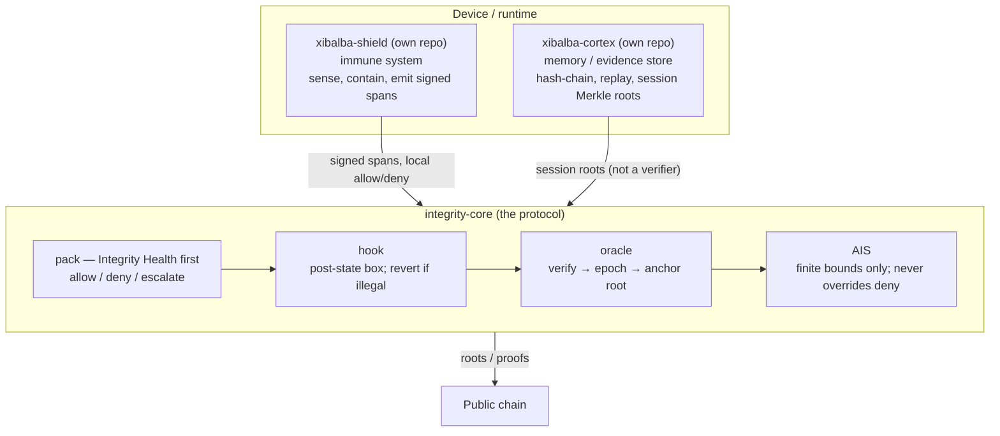
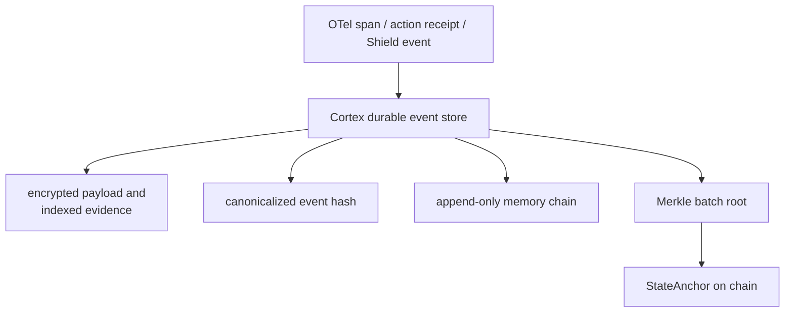
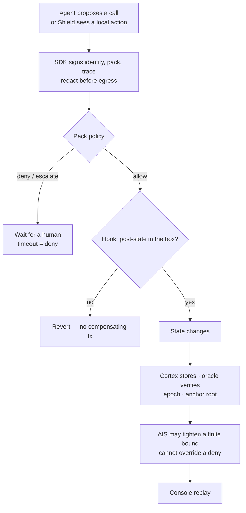

# Integrity Protocol v1

**A small hook that bounds what an agent may do, an evidence plane that records what it did, and a score that may tighten the box — never open the door.**

Jacob S. Vickers
Xibalba Solutions, LLC
Racine, Wisconsin
August 2026

This paper is for a security or compliance buyer deciding whether to put an agent near money, patient data, proprietary files, or production tools. Engineers implement from `SPEC.md`. Auditors map controls in `CONTROLS_MATRIX.md`. The build order is `IMPLEMENTATION_PLAN.md`.

---

## The problem in one page

Agents already hold balances, call tools, and pay. MCP tells them how to use tools. A2A tells them how to find each other. ERC-8004 gives them an on-chain name and a reputation score. x402 lets them settle in the same HTTP round trip. [ERC-8004](https://eips.ethereum.org/EIPS/eip-8004)

None of that stops the next call.

A reputation score is a story about the past, written by people with a reason to shade it. An execution constraint is a decision about the future, made by the same machine that settles the transaction. If the constraint fails, the transaction does not exist.

That is the hole. Integrity fills it.

The protocol is a closed loop with a small kernel at the center:

1. **A hook** inside the agent's smart account. Every in-scope state change goes through it. If the resulting state is outside the operator's box, the call reverts.
2. **An evidence plane** (Xibalba Cortex in the reference deployment) beside the chain. The SDK sends a signed trace. Cortex stores it. An oracle verifies it and anchors a root. The chain never sees raw prompts, PHI, or telemetry.
3. **A score** (AIS) derived from that verified history. It may widen a finite bound or require a human. It may not set the bound to infinity, and it may not turn a deny into an allow.

Verticals are **packs** — constraint files, policy, redaction rules, and an officer-facing form. Integrity Health is the first pack. Intellectual-property access and AIS-gated markets are later packs against the same three verbs. None of them is a second protocol.

Integrity does not make agents correct. It makes their failures **bounded**, and it makes the bound **replayable**.

---

## What changed

For most of the history of public chains, a person signed the transaction. Hesitation was a safety feature. That latency is gone. An agent signs at machine rate, from an inference process nobody fully characterizes — including the people who trained it.

The coordination stack arrived faster than the control stack. MCP and A2A say how parties talk and leave trust to the application. ERC-8004 went live on Ethereum on 29 January 2026 and, within months, had more than 170,000 registered identities and 150,000 feedback records across Ethereum, BNB Smart Chain, and Base. [Xiong et al., 2026](https://arxiv.org/abs/2606.26028) Settlement matured in parallel. The stack is real. It is also incomplete in a specific way: every layer is either a claim ("I am this agent") or a retrospective ("they rated me after the money moved").

Neither posture prevents anything.

A second, quieter gap sits next to that one. Even when a team does log the agent, the log is usually a dashboard the operator must trust. Regulators and counterparties do not buy dashboards. They buy **signed, queryable evidence** that can be checked against a public commitment. OpenTelemetry is the right pipe for that evidence. It is not the evidence itself. [OpenTelemetry GenAI](https://opentelemetry.io/docs/specs/semconv/gen-ai/)

---

## The gap, measured

The first large audit of ERC-8004 as deployed — Ethereum, BSC, and Base, through 13 May 2026 — makes the hole concrete. [Xiong et al., 2026](https://arxiv.org/abs/2606.26028)

**Most identities are not agents.** Only 3%, 4%, and 15% of registrations on Ethereum, BSC, and Base expose a valid registration file and at least one live service endpoint. On Ethereum, 53% never set a URI. Ownership is concentrated (Gini 0.733 on Ethereum). Registration volume is a poor proxy for a working fleet.

**Reputation, as deployed, is not a trust signal.** Scores are not on a shared scale. Feedback need not correspond to a verified interaction. A single input can move an aggregate. Writing a review is cheap.

**Manipulation is not theoretical.** Reviewers showing coordinated Sybil behavior are 73.5% of reviewers on Ethereum, 59.2% on BSC, and 90.6% on Base. Strip that feedback and 15.8%, 77.9%, and 86.8% of rated agents have nothing left under their displayed score.

**Reputation does not travel.** Among agents that claim to live on more than one chain, scores across chain pairs are uncorrelated. Each deployment is a silo.

**The hard-assurance piece did not ship.** The Validation Registry — stake-secured re-execution, zkML, TEE attestations — had no confirmed mainnet deployment on those chains in the study window. Identity and reputation shipped. The part that would make "trustless" mean something did not.

ERC-8004 itself is clear that Sybil attacks are possible and that unfiltered scores are not the product. That honesty does not fill the enforcement gap. An agent economy can limp on weak reputation. It cannot survive a single unbounded action whose loss no after-the-fact rating can unwind.

The compliance version of the same hole: HIPAA, NIST AI 100-5, Five Eyes agentic-AI guidance, OWASP's Agentic Top 10, and CSA AIUC-1 are all asking, under different names, for a bounded account and a record that cannot be quietly rewritten. Logging is not that answer. A filter on the prompt is not that answer. See `CONTROLS_MATRIX.md`.

---

## What Integrity is

Three repos. One loop. Products sit on the protocol; they are not the protocol.



Shield can run with no Core. Cortex can run with no Core. The closed loop is when Shield and Cortex call Core: local containment plus durable memory plus an account that cannot leave the box.

Three verbs. Three planes. That is the architecture.

**Constrain.** The kernel sits in the account as an ERC-7579 hook. It sees the post-state of the proposed call, not just the selector and the to-address. Filters on calldata are brittle; a predicate on the resulting balances, allowances, and meters is not. If any constraint fails, the transaction reverts. There is no partial fill to unwind. [ERC-7579](https://eips.ethereum.org/EIPS/eip-7579)

**Record.** The SDK emits a signed span and a Merkle leaf. Cortex (or a conforming evidence store) keeps the payload off-chain. The oracle verifies signatures, advances an `oracle_verified` epoch, and submits a root to StateAnchor. Policy that ran on a stale cursor must say so. Replay is a feature, not a forensic emergency.

**Escalate.** The pack can allow, deny, or require a human. AIS and other scores may widen a finite bound. They may not set the bound to infinity. A perfect history buys a larger box, never an open door. That is the structural answer to cheap Sybil reputation.

Identity, memory, and an agent-owned account make the agent durable. They do not make it safe. Each of those primitives enlarges what the agent can do. The hook is what narrows what it may do.

**Xibalba Shield** is the first extra binary: a device agent that emits the same spans, plus the Integrity Health pack. It is not Integrity. It consumes Integrity.

**Xibalba Cortex** is Integrity v1's persistent evidence and memory plane in the reference deployment. It is not a second verifier and it is not allowed to move funds. An enterprise MAY later bring a conforming store. Until then, Cortex is how the closed loop remembers.

---

## The guarantee

If every path that can change the account goes through the hook, then an account that starts inside the operator's box stays inside that box — including when the model is prompt-injected, confused about decimals, or signing with a stolen key.

Authentication answers "did the designated key sign this?" Authority answers "is the resulting state one this account is allowed to enter?" Public-key crypto settles the first question. It does not touch the second. Integrity decides the second in the same transaction, before commit.

Two conditions sit under that sentence:

**Complete mediation.** Value cannot live in a sidecar EOA the hook never sees. Direct calls, executors, batches, and module install/remove all go through the hook. An agent that can uninstall its own supervisor has no supervisor.

**Post-state constraints.** The check is on where the account lands, not on how the call was spelled.

Cortex then preserves a replayable, cryptographically committed history of the decisions and evidence that led to each transition. AIS may adjust finite operating bounds from that verified history. It cannot remove a constraint.

What this does not say:

- It does not say the box was well chosen. A constraint set that permits a catastrophe permits it with full assurance. The protocol turns an undefined loss into a defined one. Someone still has to write the box.
- It does not make the model honest, the retrieval clean, or the tool description true.
- It does not stop someone from copying plaintext after delivery. Access control is not copy control.
- It does not run your agent or pick your model.
- It does not restore card-network chargebacks, name who is legally liable, file taxes, or pick a winner among AP2, Visa TAP, Mastercard Agent Pay, and x402. Those are mandate formats and legal instruments. Integrity can consume a mandate as pack input. It does not replace the mandate.

If mediation is incomplete, the guarantee is void. That is a deployment property, not a slogan. A mediation audit is part of taking this to production.

---

## The hybrid ledger

The blockchain is the tamper-evident commitment and settlement layer. Cortex is the high-throughput evidence, memory, analytics, and replay layer.

Do not put raw traces, prompts, PHI, endpoint logs, model outputs, or large memory objects on chain. Put those in Cortex under tenant-controlled retention and encryption, then anchor a Merkle root or signed commitment on chain at a defined cadence.



High-risk actions, approvals, policy changes, and incidents SHOULD be anchored immediately. Low-value spans MAY batch. The cursor pair `oracle_verified` / `chain_anchored` makes lag auditable instead of silent.

A customer can verify a record against the anchored root without trusting the dashboard. That is the difference between a log and evidence.

OpenTelemetry is the canonical ingestion channel. Integrity-specific fields ride on the span: agent id, pack id, policy version, decision, approval, tool, evidence hash. Unauthenticated OTLP is traces for operators. Signed ingest is the only path that may feed AIS. Mixing those two is how integrators score the wrong data. The SDK MUST name the path.

---

## Two account profiles

Agent-owned contracts were not a mistake. Requiring every hospital to mint an NFT in order to audit an internal agent would be.

Both profiles use the same hook, evidence format, memory chain, AIS inputs, and packs.

| Profile | Use | Ownership |
|---|---|---|
| **Enclosed enterprise agent** | Shield, Integrity Health, internal tools, treasury | Organization-owned ERC-4337 account, agent session keys, operator governance |
| **Sovereign economic agent** | On-chain agents, licensing, autonomous commerce | Identity bound to an ERC-6551 token-bound account or equivalent [ERC-6551](https://eips.ethereum.org/EIPS/eip-6551) |

v1's first commercial path is the enterprise profile. The sovereign profile is first-class, not the universal baseline.

---

## Packs, not products

A hospital, a payments desk, and a generic agent fleet do not need three protocols. They need three folders.

```text
packs/integrity-health/
  pack.yaml           name, version, redaction mode
  constraints.yaml    what the hook will never allow
  policy.rego         allow / deny / escalate
  redact.rules        what Path A may upload
  controls.yaml       the form a compliance officer fills in
  profile.md          HIPAA / NIST map for that pack
```

A new vertical is a new pack. The hook, Cortex, the oracle, and the SDK stay still. A compliance officer authors from the form, not from Solidity. The compiler lowers the form onto a closed set of on-chain families. If it cannot lower, it rejects.

Later packs against the same three verbs: shadow-agent inventory, IP access gating (license in, bytes out only on allow — not DRM after delivery), AIS-gated markets, venue trading, treasury dual-control. An EU high-risk profile only if a buyer asks. Statutes are profiles. They are not the constitution.

Tokenomics, if it returns, attaches to evidence objects (stake on attestation quality, slash on policy violation). It does not change the envelope schema and it is not part of v1.

---

## How a call actually moves



Gas abstraction (paymaster) is an integration convenience so the agent need not hold the native token. It is not the product.

Adapters — if you use that word — may only add constraints. Installing another pack can shrink the box. It cannot punch a hole in an existing wall.

---

## What we will not sell you

- A score that replaces a deny.
- DRM over delivered files.
- A guarantee that the agent "meant well."
- An EU quality-management system as the master spec.
- A token that you need in order to be safe.
- Chargebacks, legal liability allocation, tax filing, or a settlement-rail monopoly fix.

v1 is a runtime you can enclose an agent in, and an evidence trail a CISO or a covered entity can export. If a later market for metered licenses or staked adapter authors appears, it will be a pack and a legal review, not a chapter of this paper.

---

## Status

This is Integrity Protocol **v1**. It replaces the split story of "whitepaper v3 vs specification v0.3." Those documents are archive.

Code already exists in `integrity-core` (contracts, SDK, oracle, policy middleware, console) and in `xibalba-cortex` and `xibalba-shield`. v1 is the decision to treat **the closed loop** as the product and everything else as archive or a future pack.

| Piece | v1 posture |
|---|---|
| Hook + post-state constraints | Core. Live path is `[EXPERIMENTAL]` — a non-deployed kernel slice. Production `SovereignAgent.execute()` is still ungated. |
| Complete mediation as a deployment rule | Core. Not yet a shipped auditor. |
| Identity + StateAnchor + signed telemetry | Core. Signed ingest and server-side AIS re-derivation are live. |
| Cortex evidence plane + hybrid ledger | Core of the reference architecture. Product exists; protocol pin is this document. |
| Oracle (verify, epoch, submit) | Core |
| AIS as bounded feedback | Core. Never authority. |
| Pack schema + Integrity Health pack | First vertical. Contracts exist; pack folder form is the remaining work. |
| IP access gating / AIS-gated markets | Later packs, same verbs. Not DRM. Not a token marketplace. |
| Shield agent (one OS) | First extra binary |
| Enterprise vs sovereign account profiles | Both specified. Enterprise is the first commercial path. |
| ZK ingest (no raw PHI upstream) | Pack profile |
| On-chain license NFTs, token economy, adapter marketplace | Not v1 |

Until the mediation path is coherent and independently audited, the honest sentence is: **v1 is a testnet/prototype protocol specification with a narrow experimental reference implementation.** That honesty is a selling advantage in security.

---

## Who should use this

**A security or compliance buyer** who is about to let an agent touch ePHI, a treasury, or production tools, and who needs a deny that happens now plus a file they can hand an auditor later.

**An engineer** who will install the hook, point the SDK at Cortex and the oracle, and write or review a pack — not fork the protocol for each customer.

If you need a new daemon to support a new industry, the architecture has failed. Add a pack.

---

## Read next

- `SPEC.md` — types, mediation conditions, constraint grammar, Cortex/AIS contracts, status tags
- `IMPLEMENTATION_PLAN.md` — the sequenced roadmap that closes every `[PARTIAL]`/`[PLANNED]`/`[EXPERIMENTAL]` gap named in `SPEC.md`, across the kernel, packs, oracle, Shield, and Cortex
- `CONTROLS_MATRIX.md` — HIPAA / NIST / OWASP / AIUC-1 map (buyer appendix, not architecture)
- `docs/archive/` — superseded drafts. Do not implement from them.

The kernel is small on purpose. A competitor can copy a hook. What they cannot copy cheaply is a working evidence path, a memory plane that actually remembers, and packs written against real mandates. That only happens if the core stays small enough to finish.
