# Integrity Protocol

## A Verification and Execution-Control Layer for the Autonomous Intellectual Property Economy

**Jacob S. Vickers** — Founder, Xibalba Solutions, LLC • Racine, Wisconsin

**Version 3.2 (canonical Markdown edition)** • August 2026

---

> **Status of this document.** This is the explanatory, non-normative Markdown edition of the whitepaper, revised in light of reference implementations and recorded as a proposal for the next normative specification. It reflects two revision passes: **v3.1** reconciled the specification against the implementations that already exist in this ecosystem (`integrity-core`, `xibalba-cortex`, `xibalba-shield`), and **v3.2** incorporates the amendment register arising from adversarial technical review — liveness/DoS traps (§4.7), AIS oracle centrality (§3.1.5), forensic memory withholding (§3.2.5), micro-transaction gas friction (§7.5), the exfiltration surface (§9.5), and competing-paradigm skepticism (§1.5, §10.4). Every substantive change is flagged inline as `PROPOSED NORMATIVE CHANGE`; they are **proposed normative changes**, not active protocol requirements until accepted. The change register is in Appendix D, and the proposed amendment is `archive/2026-08/integrity-protocol-v0.5-proposed.md`.
>
> Three v3.2 amendments were **implemented differently from the register**, each because transcribing them verbatim would have contradicted an existing section: ZK-telemetry is recorded as a research horizon rather than a roadmap phase (§3.1.5); the hybrid TEE configuration is framed as joint coverage of two attack surfaces rather than "complete mediation achieved" (§9.5); and grace modes operate strictly inside the bound floors AIS establishes (§4.7.2). Appendix D records each with its reasoning.
>
> Nothing in this document should be read as describing deployed code. The kernel, adapter registry, and ERC-4337/7579/6551 licence integration exist as local experimental code and tests, but are not uniformly deployed or production-ready; AIS, the ZK attestation pipeline, memory-chain components, and identity registry have partial-to-built local implementations with deployment boundaries recorded in `../PRODUCTION_GAPS.md`. See `../README.md` and `../PRODUCTION_GAPS.md` in this repository for the current build state. The rule this repository holds itself to — *no silent mocks and no aspirational current-tense documentation* — applies to this file too.

> **Audience.** This document is written for two readers at once. Sections 2–7 describe the proposed protocol with enough precision for an engineer to evaluate and implement after the corresponding normative clauses are accepted; Sections 8 and 10, and the risk analysis in Section 9, address capital allocation. Readers wanting only the argument should read Sections 1, 8 and 10. All executable code is deferred to the appendices.

> **Important notice.** This document is published for technical and informational purposes. It is not an offer to sell, or a solicitation of an offer to buy, any security, token, or other instrument, and it is not investment, legal, accounting, or tax advice. Statements concerning future protocol capability, adoption, revenue, token supply dynamics, or market size are forward-looking and subject to substantial uncertainty; actual outcomes will differ. All economic figures in Section 8 are parametric illustrations computed from explicitly stated hypothetical inputs, not forecasts, projections, or promises of return. Digital assets carry risk of total loss. Protocol components described as planned or in development are not yet audited or deployed; see Section 9 for a candid enumeration of the threats this design does not eliminate.

**Relationship to the normative specification.** This whitepaper explains the protocol's thesis, architecture, economics, and proposed direction. It is not the authority for implementers. The active normative baseline is `archive/2026-08/integrity-protocol-v0.4.md`; the v3.1 foundation and v3.2 amendments collected here are recorded as a `[PROPOSED]` amendment in `archive/2026-08/integrity-protocol-v0.5-proposed.md`. If the proposal is rejected or modified, this whitepaper must be revised to match the accepted specification. Implementation status must be established from source, tests, the interface contract, and the production-gap register rather than inferred from this paper.

---

## Abstract

Autonomous software agents have become economic principals: they hold balances, negotiate terms, purchase data, and settle payments without a human in the transaction loop. The coordination stack for this activity assembled quickly — messaging and discovery through MCP and A2A, identity and reputation through ERC-8004, settlement through stablecoin rails such as x402 — but it assembled with a hole in the middle. Every one of those layers describes what an agent *claims* or what it *did*. None of them constrains what an agent *may do* at the moment of execution.

The consequence is measurable rather than hypothetical. The first large-scale empirical audit of ERC-8004, covering Ethereum, BNB Smart Chain and Base through May 2026, found that the reputation layer intended to carry trust satisfies none of the four conditions a trust signal requires, that a majority of reviewers on every chain studied exhibit coordinated Sybil behaviour, and that the Validation Registry — the one component specified to carry hard assurance — had no confirmed mainnet deployment as of its observation cutoff.[^1] A later direct review found deployed Validation proxy bytecode, while canonical project material still labels that component unstable; deployment existence therefore must not be conflated with stable, exercised assurance.

A sovereign agent rests on three foundational primitives: a portable on-chain identity that survives key rotation and gives a mandate something durable to bind to; a cryptographically committed persistent memory that makes metered rights enforceable and disputes decidable; and agent-owned contracts that let the agent hold and move assets as a principal. Each of these expands what an agent *can* do. None of them narrows what it *may* do, and an agent that is durable, attributable and self-directed but unconstrained is the most consequential configuration in the stack, not the safest.

The Integrity Protocol supplies the missing layer. It is an **execution firewall**: a verification kernel installed as an ERC-7579 hook module inside an agent's smart account, which evaluates every proposed state transition against a machine-checkable constraint set *before* that transition is allowed to commit. Constraints are not hardcoded. Developers publish **adapters** — deterministic, gas-bounded compilers that translate a licensing agreement, a risk mandate, or a spending policy into the constraint vocabulary the kernel enforces — so that the set of enforceable policies grows without protocol upgrades. Intellectual property is represented as an ERC-6551 token-bound account, which makes a licence a live, metered, transferable object holding its own royalty balance and consumption ledger rather than a document describing one. Gas is abstracted through an ERC-4337 paymaster so that agents need never hold a native token, and protocol fees are routed to the stakers who capitalise the adapter and validator sets.

The guarantee the protocol offers is precise, and its boundaries are stated plainly: **subject to complete mediation of an account's transitions, the reachable state set of an enclosed agent is contained in an operator-declared admissible set, for every input the agent's reasoning may produce — including adversarial ones.** It does not make agents correct. It makes their failures bounded, and bounded failure is the precondition institutional capital requires.

---

## Reading this document

This paper makes one argument, and the rest is detail:

> **AI agents can now sign transactions on their own. Nothing currently stops them from signing a catastrophic one. We put a check inside the account — not beside it — so a transaction that would break the rules cannot be written to the chain at all.**

If you read nothing else, read that sentence, Section 1, and Section 10.

**Three claims, in plain terms.**

1. **Every existing safety layer either describes agents or grades them afterward.** Identity says who an agent claims to be. Reputation says how it behaved last month. Neither prevents the next action.
2. **We check the *outcome*, not the request.** Before a transaction commits, we compute what the account's state *would become*, and test it against rules the operator wrote in advance. Fail the test, and the transaction reverts — there's nothing to unwind, because nothing happened.
3. **We do not claim the agent behaves well.** We claim its *damage is bounded*, even if the agent has been completely hijacked and the attacker holds its keys. That's a weaker promise than "safe AI," and it's the one that's actually achievable — and the one an underwriter needs.

**How the sections layer.** Sections 1 and 10 are the argument. Sections 2–7 describe the proposed engineering architecture; accepted implementer requirements remain in v0.4 unless and until corresponding v0.5 clauses are reviewed and accepted. Sections 8–9 are economics and honest risk. Dense sections open with an *In plain terms* box; if the box is enough, skip to the next one.

**A note on tone.** Where this paper says a thing is unproven, incomplete, or not yet built, that is deliberate rather than modest. A verification protocol that oversells itself is worse than none, and the same standard is applied to our own components throughout — including several places where our reference implementation failed its own spec and we say so.

---

## 1 The Verification Gap

### 1.1 What changed

For most of the history of public blockchains the entity signing a transaction was a person, and the latency of human judgment was itself a safety mechanism. A human reviews a prompt, hesitates, notices that a counterparty looks wrong, and declines. That mechanism is now gone. An agent operating a wallet evaluates and signs continuously, at a rate bounded by block production rather than attention, and it does so on the basis of an inference process whose output distribution is not fully characterised by anyone — including its authors.

The infrastructure to let those agents find one another and pay one another arrived faster than the infrastructure to constrain them. Anthropic's Model Context Protocol standardised the agent-to-tool interface; Google's A2A protocol standardised agent discovery, messaging and task lifecycle. Both specify how parties communicate and explicitly defer the question of whether a counterparty can be trusted to the application layer. [ERC-8004](https://eips.ethereum.org/EIPS/eip-8004) ("Trustless Agents") was designed to fill that gap with three on-chain registries — Identity, Reputation and Validation — and went live on Ethereum mainnet on 29 January 2026, drawing more than 170,000 registered agent identities and over 150,000 feedback records across Ethereum, BSC and Base within its first months. Settlement matured in parallel, most visibly through x402, which settles stablecoin payments inside the HTTP request/response cycle.

The stack, in other words, is real. It is also incomplete in a specific and consequential way.

### 1.2 The gap, measured

Every layer just described is either **declarative** (an agent asserts an identity and a capability set) or **retrospective** (a counterparty rates an interaction after value has already moved). Neither posture prevents anything. The first empirical audit of ERC-8004 as deployed makes the practical size of this gap unusually legible, and it is worth stating the findings without softening, because they are the strongest available argument for the layer this paper proposes:

- **Declared identity is mostly empty.** Only 3%, 4% and 15% of registered agents on Ethereum, BSC and Base respectively expose a valid registration file together with at least one live declared service endpoint. Registration volume is a poor proxy for deployed capability; on Ethereum, 53% of identities never set a URI at all, and ownership is severely concentrated (Gini 0.733).

- **Reputation, as deployed, is not a trust signal.** The audit evaluates the Reputation Registry against four necessary conditions — commensurability, robustness, groundedness, and economic soundness — and finds it satisfies none. Scores are not on a shared scale, feedback need not correspond to any verified interaction, a single input can move an aggregate, and the median cost of writing a feedback record is between \$0.0027 and \$0.055 depending on chain.

- **Manipulation is not theoretical.** Reviewers exhibiting coordinated Sybil behaviour account for 73.5%, 59.2% and 90.6% of all reviewers on Ethereum, BSC and Base. Removing their feedback leaves 15.8%, 77.9% and 86.8% of rated agents with no valid feedback supporting their displayed reputation.

- **Reputation does not travel.** Among agents declaring registration on multiple chains, scores across chain pairs are statistically uncorrelated (Spearman $\rho = 0.05$, $p = 0.56$ for BSC–Base; $\rho = 0.14$, $p = 0.48$ for ETH–Base). Each deployment is an isolated silo.

- **The cited audit did not confirm the hard-assurance component at its cutoff.** The Validation Registry — the tier intended to carry stake-secured re-execution, zkML proofs and TEE attestations — had no confirmed mainnet deployment on any studied chain as of 13 May 2026.[^1] Later direct review found deployed proxy bytecode, while canonical project material still described Validation as unstable; deployed code is not evidence of stable, exercised assurance.

[^1]: X. Xiong et al., ["Can Trustless Agents Be Trusted? An Empirical Study of the ERC-8004 Decentralized AI Agent Ecosystem"](https://arxiv.org/abs/2606.26028), arXiv:2606.26028, July 2026, §2.

**The agent-commerce stack.** Layers above the rule describe agents; the enforcement layer constrains them. Integrity operates *within* the execution path of the account, so that a rejected action is never committed rather than merely recorded.

| Layer | Standard | What it does |
|---|---|---|
| Communication & discovery | MCP, A2A | makes agents legible |
| Identity & reputation | ERC-8004 | makes agents accountable |
| **Enforcement** | **Integrity Protocol** | **makes agents bounded** |
| Account & modularity | ERC-4337, ERC-7579, ERC-6551 | makes agents programmable |
| Settlement | stablecoins, x402 | makes agents payable |

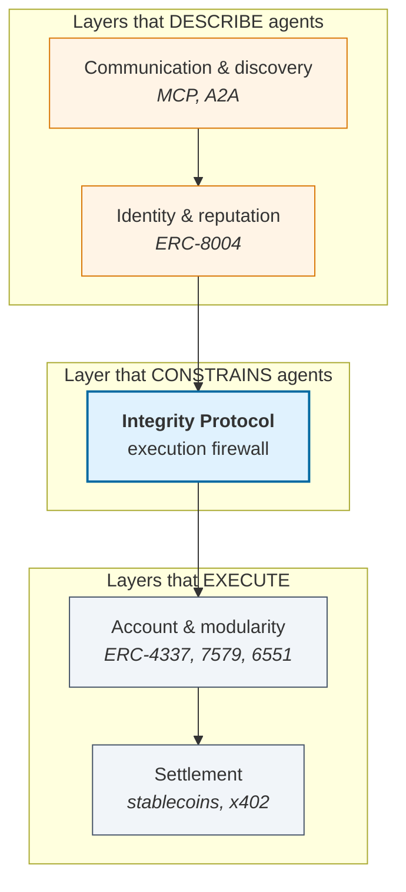

**In plain terms.** Everything above the enforcement layer *talks about* agents. Everything below *does what agents ask*. Until now there was nothing in between deciding whether the request should be allowed. Integrity sits in that slot, and it sits *in the execution path* — meaning a rejected action is never committed, rather than being recorded and regretted.

> **The structural observation.** A reputation score is a statement about the past, computed by parties with an incentive to shade it, aggregated by a rule the relying party chooses after the fact. An execution constraint is a statement about the future, evaluated by the same machine that settles the transaction, and it either holds or the transaction does not exist. These are different kinds of object. An agent economy can function with weak reputation. It cannot function with *no enforcement*, because the loss from a single unbounded action is unbounded, and no amount of after-the-fact rating recovers it.

### 1.3 Thesis

The Integrity Protocol occupies the enforcement position: below identity and reputation, above settlement, and — critically — *inside* the execution path rather than adjacent to it. Its central claim is a **containment** claim, not a correctness claim. We do not assert that a constrained agent behaves well. We assert that its reachable state set is contained within a region the operator declared in advance, for all inputs, including inputs supplied by an adversary who has fully captured the agent's reasoning through prompt injection or model compromise. Correctness is a property of the agent; containment is a property of the account. Only the second is achievable with today's tools, and it happens to be the one that underwrites capital deployment.

### 1.4 A note on the physical analogy

Earlier drafts of this work framed the protocol in thermodynamic language: the unconstrained agent as an open system whose entropy grows without bound, the verifier as a Maxwell's demon sorting admissible transitions from inadmissible ones. That framing is retained here because it is a genuinely useful *design discipline* — it forces the engineer to ask what quantity is conserved, what the boundary is, and what crosses it — but it should be read as analogy and not as physics. Blockchain state is not a thermodynamic ensemble, and calling a verification failure an entropy increase does not license borrowing the Second Law's necessity.

The analogy earns its keep at exactly one point, and it is worth naming because it disciplines the economics. Landauer's principle holds that the demon cannot sort for free: the information it acquires must eventually be erased, at a thermodynamic cost. The protocol's equivalent is that **every constraint evaluation costs gas. There is no free verification.** This is why Section 9.3 treats assurance as an explicit cost-minimisation problem rather than a maximisation of rigour, and why an adapter with unbounded gas consumption is a protocol bug and not merely an inefficiency. Where this paper needs a guarantee, it proves it from invariance, not from thermodynamics.

### 1.5 Comparative architecture: competing safety dogmas

> **`PROPOSED NORMATIVE CHANGE` (v3.2) — new subsection.** Skepticism toward on-chain execution mediation almost always rests on attachment to one of five alternative paradigms. Each relies on a foundational, unstated assumption that collapses under adversarial conditions at machine rate. Stating them explicitly is not a rhetorical exercise: each failure mode below maps onto an adversary class from Table 1, and the mapping is what shows the paradigms are not merely weaker but *categorically unable* to address the relevant class.

| Paradigm | Unstated assumption | Where it collapses |
|---|---|---|
| 1. Model guardrails (Llama-Guard, NeMo) | Alignment can bound execution safety probabilistically | Non-deterministic; prompt injection unsolved (**A1**), and bypassed entirely on key leak (**A4**) |
| 2. Retrospective Web3 reputation (ERC-8004, slashing pools) | Value-at-risk never exceeds accumulated reputation | "Dine and dash" — a one-star review does not return the cash (**A3**) |
| 3. Hardware-only enclaves (SGX, Nitro) | Host-code integrity implies state-transition validity | A TEE faithfully signs a catastrophic transaction (**A2**) |
| 4. Centralized Web2 IAM and card rails | Agents stay inside one vendor's silo under human supervision | 30–90 day dispute finality against millisecond execution |
| 5. Paper contracts and human courts | Judicial discovery can resolve multi-agent cascades | 3-year proceedings against an undercapitalised operator |

**Table 1b.** The five paradigms and the adversary class each fails to address.

**1.5.1 Probabilistic model-layer guardrails.** The dogma holds that safety belongs in the inference layer — system prompts, constitutional fine-tuning, input/output classifiers. The fatal assumption is that safety is a *probabilistic classification problem*. Language models are stochastic token predictors whose output distribution cannot be mathematically bounded against injection (A1); and if signing credentials or session keys leak (A4), the adversary interacts with the account directly, bypassing every inference filter. The decisive difference: **a guardrail evaluates intent; the kernel evaluates the resulting post-state.** You cannot enforce value conservation (12) with a prompt.

**1.5.2 Retrospective Web3 reputation.** The dogma holds that registries and slashing pools supply sufficient deterrence. The fatal assumption is that an agent's value-at-risk will never exceed the economic value of its accumulated reputation. But reputation is retrospective and execution is instantaneous: an agent managing a treasury can behave honestly for six months, drain in block $N$, and accept a downgraded score in block $N+1$. §1.2's audit data compounds this — 73.5%–90.6% of reviewers on deployed registries exhibit coordinated Sybil behaviour, and a feedback record costs cents. This is the same argument as §2.3: **authenticity is not authority**, and a rating is not a bound.

**1.5.3 Hardware-only enclaves.** The dogma holds that running agents in SGX or Nitro Enclaves makes on-chain verification redundant. The fatal assumption conflates *host-code integrity* with *state-transition validity*. A TEE guarantees the binary was not tampered with from outside; it does not evaluate whether the transaction that binary produces is admissible. An untampered model that hallucinates a malformed swap or miscalculates a liquidation threshold (A2) will have that transaction **faithfully and securely signed.** TEEs also have no native view of cross-contract accounting: monotone meter depletion (13), counterparty identity status, and global exposure limits are invisible to an enclave. The two are complementary tiers, not substitutes — a point developed as a case study in §9.5.

**1.5.4 Centralized Web2 IAM and payment rails.** The dogma holds that enterprise agents will run on IAM roles, OAuth, and card settlement. The fatal assumption is that autonomous agents remain confined to a single vendor's silo under continuous human supervision. Card rails carry 30-to-90-day chargeback windows; an agent trading compute or data at machine speed cannot tolerate that settlement-finality gap. Cross-jurisdiction interaction makes it worse: centralized IAM requires mutual vendor onboarding, shared custody, and platform trust — and ultimately a *human custodian* to pause the system.

**1.5.5 Paper contracts and human courts.** The dogma holds that MSAs, ToS and liability law govern agent conduct. The fatal assumption is that judicial discovery can resolve multi-agent cascading failures. When recursive agents negotiate, sub-license and execute tens of thousands of sub-tasks across jurisdictions in seconds, discovery cannot reconstruct proximate cause — which is precisely why §3.2's typed evidence classes exist, since untyped increments cannot distinguish an observed event from a model inference. And a three-year proceeding against a bankrupt operator provides no liquidity or redress.

> **The unifying observation.** Every competing paradigm intervenes either *before* execution (prompts, enclaves) or *after* it (reputation, courts, chargebacks). Before is probabilistic; after is too late. The Integrity Protocol operates at the moment of state commit — the only position from which a bound can be both certain and timely.

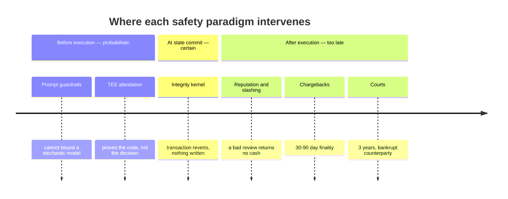

**In plain terms.** The competing approaches aren't wrong so much as *mistimed*. Guardrails and enclaves act before the agent decides, when the outcome isn't known yet. Reputation and courts act after value has moved, when the money is gone. There is exactly one instant where you can both know the outcome and still prevent it — the moment the state transition is about to be written — and that instant is where this protocol lives.

---

## 2 System Model and Threat Model

### 2.1 The agent as a controlled system

> **In plain terms.** This section says one thing formally: *an account with no checks can eventually reach every possible state, including all the bad ones.* Not "is likely to" — **can**. That distinction is the whole reason underwriters won't fund autonomous agents. An insurer can price a 2% chance of a \$1M loss; it cannot price "any loss up to the entire balance is reachable." The formalism below exists to make that statement precise enough to then *disprove* under mediation.

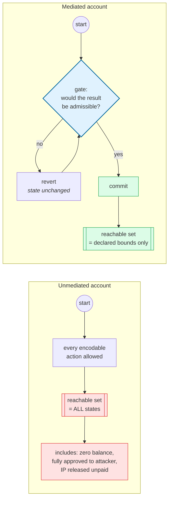

Fix a smart account $A$. Its state at step $k$ is

$$x_k \in X, \qquad x_k = (\underbrace{b_k}_{\text{balances}},\ \underbrace{\alpha_k}_{\text{allowances}},\ \underbrace{\nu_k}_{\text{nonces}},\ \underbrace{q_k}_{\text{licence budgets}},\ \underbrace{m_k}_{\text{module config}},\ \underbrace{\theta_k}_{\text{policy params}})$$

where $X$ is the (finite but astronomically large) set of admissible EVM state assignments reachable by the account. An agent policy $\pi$ — in practice a language model wrapped in a tool harness — observes some context $o_k$ and emits a proposed action $a_k \in U$, where $U$ is the set of encodable calls: target address, value, calldata, and operation type. The account's transition function is

$$x_{k+1} = T(x_k, a_k) \tag{1}$$

realised by the EVM. Writing $\mathrm{Re}_T(x_0)$ for the set of states reachable from $x_0$ in $T$ transitions, an account whose transitions are unmediated admits every encodable action, so

$$\lim_{T \to \infty} \mathrm{Re}_T(x_0) = X \tag{2}$$

which includes the zero-balance state, the fully-approved-to-an-adversary state, and every state in which licensed material has been released without payment. Equation (2) is the problem stated exactly: **it makes no claim about how likely a bad outcome is, only that every bad outcome is attainable.** Underwriting requires the second kind of statement, not the first.

The essential modelling point is that $\pi$ **is not part of the trusted computing base.** We place no distributional assumption on $a_k$ whatsoever. Whatever guarantee we obtain must hold when $a_k$ is chosen adversarially, because in the presence of prompt injection it *is* chosen adversarially.

### 2.2 Adversary classes

| Class | Name | Capability |
|---|---|---|
| **A1** | Instruction hijack | Adversary controls $o_k$ (retrieved document, tool output, counterparty message) and thereby steers $a_k$ arbitrarily within $U$. Requires no key material. |
| **A2** | Capability confusion | Agent emits a well-formed call whose semantics it has misunderstood — wrong decimals, wrong target, wrong chain. No adversary required; this is unforced error at machine rate. |
| **A3** | Malicious counterparty | A registered, well-reputed counterparty behaves correctly until value at risk exceeds the cost of its accumulated reputation, then defects. |
| **A4** | Delegation leak | A session key, operator role, or automation credential is exfiltrated. The signature that results is cryptographically valid. |
| **A5** | Replay / domain confusion | A payload valid in one chain, epoch, or licence context is replayed into another. |

**Table 1.** Adversary classes assumed throughout. The protocol is designed so that the same enforcement mechanism addresses all five, because all five terminate in the same place: an inadmissible state transition attempting to commit.

### 2.3 Why authentication is not authorisation

The dominant control in deployed systems is signature verification. This is necessary and insufficient, and the reason is worth stating formally because it is the load-bearing observation of the entire design.

A signature check is a predicate on *provenance*: $\sigma(a_k)$ evaluates whether $a_k$ was produced by a holder of a designated key. It is a statement about the past of the message. It says nothing about $T(x_k, a_k)$ — about where the action lands the system. Under A1 the key is never stolen; the legitimate agent signs the adversary's instruction. Under A4 the key is stolen and every subsequent signature verifies. In both cases authentication returns true and the account is drained.

> **Authenticity versus authority.** *Authenticity* answers: did this instruction originate from the designated signer? *Authority* answers: is the resulting state transition one this account is permitted to make? Public-key cryptography settles the first question completely and the second not at all. The Integrity Protocol is a mechanism for deciding the second question, in the same transaction, before the transition commits.

### 2.4 Complete mediation

One further condition is required, and because the whole guarantee rests on it we state it before making any claims. Let $E$ be the set of execution paths through which the account's state can change. The kernel's guarantee holds **only if it is invoked on every path in $E$** — the principle of complete mediation from classical protection-system design. In practice this means:

1. all value must live in accounts the kernel mediates, not in adjacent EOAs;
2. every installed execution path — direct calls, executor modules, fallback handlers, batched operations — must route through the hook;
3. module installation and removal must themselves be constrained transitions, or the agent can simply uninstall its own supervisor.

Point (iii) is not a footnote. **An enforcement layer that can be removed by the entity it constrains provides no guarantee at all**, which is why module governance is treated as a first-class constraint in Section 4 rather than as configuration.

> **`PROPOSED NORMATIVE CHANGE` (v3.1) — complete mediation is binary.** This condition has a direct and unforgiving consequence for any codebase adopting the protocol: an account type that retains *any* ungated execution path cannot host the guarantee, and cannot be retrofitted to host it unless that path is removed or itself routed through the hook. An account with a legacy `execute()` that dispatches without invoking the kernel is not partially compliant; it is non-compliant, because the adversary of Section 2.1 will simply use that path. Deployments should state explicitly which accounts are inside the guarantee and which are not, rather than allowing readers to assume uniform coverage.

---

## 3 Foundational Primitives: What an Agent Must Be

Section 2 modelled the agent as a controlled system without asking what kind of object it is. That omission has to be repaired before the kernel can be specified, because a constraint is not a free-floating predicate. It must attach to a subject, be evaluated against a history, and bind assets the subject actually controls. Absent those three things there is nothing for $\mathbf{C}$ to be a constraint *on*.

Three primitives supply them. None is original to this protocol — they are the architecture the agent economy is converging on independently — but each is load-bearing for a different part of the guarantee, and a reader evaluating whether to build on the Integrity Protocol needs to know which assumptions the kernel *inherits* rather than *establishes*.

| Primitive | Property | Question answered |
|---|---|---|
| **I. Identity** | Portable, verifiable, stable under key rotation | who is bound? |
| **II. Memory** | Committed, append-only, replayable | bound to what history? |
| **III. Ownership** | Agent as root owner of its own contracts | over which assets? |
| **Verification kernel** (§4) | Mediated, conjunctive, pre-commit | and within which bounds? |

**Figure 2.** The three primitives make an agent a durable economic actor. The kernel makes it a *bounded* one. Each primitive is necessary; the three together are not sufficient, and the reason they are not is the subject of Section 3.4.

### 3.1 Primitive I — On-chain identity as the binding surface

In a decentralised setting there is no registrar to telephone. An agent's standing is established cryptographically or not at all, which means it needs a presence that outlives any particular key and survives movement between chains.

[ERC-8004](https://eips.ethereum.org/EIPS/eip-8004) supplies this as three singleton registries deployed once per EVM chain. The **Identity Registry** extends ERC-721 with URI storage, so every agent is a transferable NFT whose `tokenURI` resolves to a registration file declaring endpoints, capabilities, controlling addresses and supported trust models; identifiers align with EIP-155 and CAIP-10, so the same agent is addressable across chains and browsable by existing wallets and indexers with no bespoke tooling. The **Reputation Registry** records bounded, attributable feedback tied to that identity. The **Validation Registry** lets an agent request independent verification of its work and lets validator contracts — stake-secured re-execution, zkML verifiers, TEE attestation oracles — post results on chain.

Two consequences bear directly on the kernel.

**Constraints must be indexed by something durable.** A mandate bound to a raw address dies at the first key rotation and does not survive a move to a second chain — and an enforcement layer with a gap at exactly the moment of key rotation is an enforcement layer with a scheduled outage. Writing the constraint vector as a function of identity,

$$\mathbf{C} = \mathbf{C}(\iota), \qquad \iota = \mathrm{id}(A) \in I \tag{3}$$

makes the mandate portable in the same way the identity is.

**Reputation parameterises bounds; it never removes them.** For a constraint $g_i(x) \le 0$ whose threshold depends on attested reputation $r(\iota) \in [0,1]$:

$$c_i(\iota) = c_i^{\min} + (c_i^{\max} - c_i^{\min}) \cdot r(\iota), \qquad c_i^{\max} < \infty \tag{4}$$

**The finiteness of $c_i^{\max}$ is the whole design.** A perfectly-reputed agent obtains the most generous bound in the schedule; it does not obtain an unbounded one. This is the structural answer to adversary class A3, which is precisely the strategy of accumulating reputation until the value at risk exceeds it.

> **Remark 1.** ERC-8004 explicitly places incentives and slashing outside the scope of its registries: they record validation results but do not price them. That gap is one of the concrete places this protocol adds value, by putting staked capital behind validators so that an attestation carries economic weight rather than being cheap talk (Section 8).

> **`PROPOSED NORMATIVE CHANGE` (v3.1, corrected in v3.2) — §3.1 states an Integrity interface obligation, not an ERC-8004 deployment mandate.** What the kernel actually requires of identity is the three properties named in Figure 2: portable, verifiable, and stable under key rotation, resolvable within the gate's gas budget. Native ERC-8004 registration is one possible interoperability route, not a label that can be applied to a DID registry with different token, ownership, transfer, wallet-proof, metadata, event, and interface-detection semantics.
>
> A deployment may satisfy the Integrity identity obligation by either route: (a) registering agents natively in ERC-8004's registries, or (b) maintaining its own durable identity registry and exposing a **versioned Integrity read profile** over it. Route (b) is what this ecosystem does — `XibalbaAgentRegistry` remains the DID-keyed substrate and `IntegrityIdentityReadV1` is a custom discovery facade. It pins the reviewed ERC-8004 Draft revision but explicitly reports non-conformance. Generic ERC-8004 wallets and indexers cannot consume it as an ERC-721 Identity Registry. An earlier draft's statement that Validation had no confirmed mainnet deployment was stale; direct review found deployed proxy bytecode, while canonical project material still labels that component unstable.
>
> **What route (b) gives up, stated plainly.** Native token identity, ERC-721 ownership and transfers, EIP-155/CAIP-10 addressability, standard wallet/indexer discovery, and direct consumption of ERC-8004's Reputation and Validation Registries. None is load-bearing for Proposition 1. Convergence onto a single registry is deliberately deferred until a counterparty requires native registration, a stable Validation Registry is worth consuming for the assurance tier (§3.1.2), or cross-chain portability becomes a live requirement.
>
> **What route (b) must not do:** maintain two reputation systems. $r(\iota)$ has exactly one authoritative source (§3.1.1). An adapter that also surfaced a second, differently-computed reputation number would reintroduce the commensurability failure §1.2 diagnoses.

#### 3.1.1 Where $r(\iota)$ comes from: the Agent Integrity Score

> **`PROPOSED NORMATIVE CHANGE` (v3.1) — new subsection.** Version 3.0 contained an unresolved tension at its centre. Section 1.2 devotes its most forceful passage to demonstrating that ERC-8004 reputation, as deployed, **satisfies none of the four conditions a trust signal requires** — it is not commensurable, not robust, not grounded, and not economically sound. Equation (4) then makes $r(\iota)$ a live input to every reputation-parameterised bound in the protocol. The paper never reconciled these: it demolished the available reputation signal and then consumed one anyway, without specifying where a *trustworthy* one originates. This subsection closes that gap, and it is load-bearing rather than descriptive — a constraint schedule parameterised by a manipulable score is a constraint schedule an adversary tunes.

> **In plain terms.** Earlier we argued that existing on-chain reputation is worthless — manipulable, ungrounded, cheap to fake. But our own formula uses a reputation number to decide how much freedom an agent gets. So where does a *trustworthy* number come from? That's what this section answers.
>
> The short version: we compute the score ourselves from what the agent actually did, using four signals. Three design choices make it hard to game:
> - **No evidence scores zero, not full marks.** You earn standing; you don't start with it.
> - **Only independently verifiable evidence counts.** What the agent merely *claims* about itself is worth nothing.
> - **A floor on each signal, enforced as a hard gate.** You can't offset a compliance failure by contributing lots of compute.
>
> The third one matters more than it sounds. Averages let a strong number hide a weak one — which is exactly the attack. A gate doesn't.

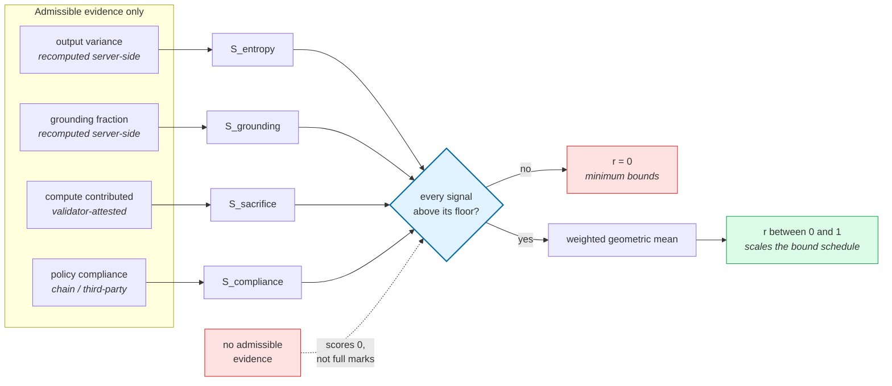

The protocol computes $r(\iota)$ itself, from telemetry, as the **Agent Integrity Score (AIS)**. Before defining it, state what a reputation term consumed by (4) must satisfy — the definition follows from these rather than the reverse:

- **N1 — Bounded.** $r(\iota) \in [0,1]$, so that $c_i^{\max}$ in (4) is a real ceiling.
- **N2 — Earned, not granted.** Absence of evidence must score *low*, not high. An agent that has demonstrated nothing has earned nothing. This is design rule L1 (§4.6) applied to the score itself: ambiguity resolves to restriction.
- **N3 — Non-compensable below a floor.** A strong component must not buy standing past a failing one. Otherwise A3 reduces to "excel on the cheap axes, fail on the expensive one."
- **N4 — Grounded in verifiable evidence.** A component raised by an agent's own unverifiable assertion is not a trust signal; it is a self-declaration with extra steps.
- **N5 — Monotone in evidence.** More verified good behaviour must never lower the score, or the metric punishes participation.

> **`PROPOSED NORMATIVE CHANGE` (v3.1) — AIS is redefined as a *gated* weighted geometric mean over *admissible* evidence.** The v3.0-era construction (a bare weighted geometric mean over whatever telemetry arrived, with missing axes defaulting to full marks) violates N2, N3 and N4. The defects are not hypothetical; they were found by evaluating the reference implementation numerically, and they compose into a practical attack described at the end of this subsection.

**Evidence admissibility (N4).** A component is computed **only** from evidence the protocol can independently verify — recomputed server-side from the raw content of a signed submission, read from chain state, or attested by a staked validator (§8.2). Evidence that is merely *asserted* by the scored agent is inadmissible. A component with no admissible evidence takes the value $0$, **not** a neutral or maximal default. This single rule is what makes N2 and N4 hold, and it is the inverse of the prior behaviour.

**Definition.** With each $S_\bullet \in [0, S_{\max}]$, $S_{\max} = 1000$, weights $w_E = 0.30$, $w_G = 0.30$, $w_S = 0.20$, $w_C = 0.20$ (validated to sum to unity), and a declared floor $S_\bullet^{\text{floor}}$ per component:

$$\mathrm{AIS}_{\text{base}} = \underbrace{\left[\prod_{\bullet} \Theta\!\left(S_\bullet - S_\bullet^{\text{floor}}\right)\right]}_{\text{conjunctive gate (N3)}} \cdot \underbrace{\prod_{\bullet} S_\bullet^{\,w_\bullet}}_{\text{weighted geometric mean}} \tag{4a}$$

Because the weights sum to one, the geometric factor lies in $[0, S_{\max}]$, so $\mathrm{AIS}_{\text{base}} \in [0, S_{\max}]$ and N1 holds after normalisation.

The gate is deliberately the **same conjunctive $\Theta$-product form as the verification functional (10)**. This is not an aesthetic choice: a reputation floor *is* a constraint, and expressing it in the kernel's own vocabulary means the floors are declarable, auditable, and visible in margin telemetry (§4.1) exactly like every other constraint. An operator can therefore see how close an agent is to losing standing *before* it does, which a bare mean cannot express.

> **On the discontinuity.** A floor is a cliff: a component one unit below its floor scores zero overall, one unit above scores normally. This is intended and is the same shape as every other constraint in the protocol — $\Theta$ is a step function by construction, and L1 requires that ambiguity resolve to restriction rather than to interpolation. What makes a cliff safe to operate against is *visibility*, which margin telemetry supplies. What makes it unsafe is discovering it only on rejection.

The reputation term consumed by (4) is the **normalised base score**:

$$r(\iota) = \frac{\mathrm{AIS}_{\text{base}}}{S_{\max}} \in [0,1] \tag{4b}$$

> **Normalisation is load-bearing, and the boost must stay outside it.** The implementation reports a *boosted* score $\mathrm{AIS} = \mathrm{AIS}_{\text{base}} \cdot Z$ with $Z \le 1.15$, deliberately **not** clamped to $S_{\max}$ — a fully-boosted top performer reports up to 1150. That is a reasonable choice for a display metric and a **dangerous one for a constraint input.** Normalising the boosted score by $S_{\max}$ would yield $r(\iota) > 1$, and by (4) that pushes $c_i(\iota)$ *above* $c_i^{\max}$ — destroying the finite ceiling that (4) exists to guarantee and re-opening precisely the A3 strategy of accumulating standing until it exceeds the value at risk. Constraint evaluation MUST therefore use (4b) over the **pre-boost** score, and MUST clamp to $[0,1]$ regardless. The assurance multiplier enters constraints on its own terms (§3.1.2), never by inflating $r(\iota)$.

| Component | Admissible evidence | Shape | No admissible evidence ⇒ | Floor |
|---|---|---|---|---|
| $S_{\text{entropy}}$ | Output variance recomputed server-side from raw span content | Gaussian decay $e^{-1.5v^2}$ — rewards *stability*, not any particular performance level | $0$ (unproven, **not** "perfectly stable") | $S^{\text{floor}}_E > 0$ |
| $S_{\text{grounding}}$ | Grounding fraction recomputed server-side from raw span content | Linear — no principled nonlinearity applies to a fraction | $0$ | $S^{\text{floor}}_G > 0$ |
| $S_{\text{sacrifice}}$ | Compute **attested by a staked validator or TEE**, not self-reported token counts | Logarithmic $\log_{10}(h+1)/3$, saturating at 1000 hours — so a whale contributing 100× does not score 100× higher, which would make the metric pay-to-win | $0$ | none (contribution is optional) |
| $S_{\text{compliance}}$ | On-chain compliance-gate reads, staked-validator attestation, or third-party signed decision records — **never the scored agent's own violation flags** | Linear inverse — violations are near-binary per action | $0$ (unproven, **not** "clean") | $S^{\text{floor}}_C$, set high |

**Table 1a.** AIS components, their admissible evidence, and their fail-closed defaults. The two rightmost columns are the substance of the v3.1 change: **every default inverts, and floors are introduced.**

Two component-specific notes, because both are load-bearing:

- **$S_{\text{sacrifice}}$ must be attested, not asserted.** Deriving contributed compute from self-reported token counts divided by a proxy constant makes the axis free to fabricate, and because it is the only axis that can be raised without producing any analysable content, it is the axis an attacker uses to escape a fail-closed default. Attestation is exactly what the Validation Registry (§3.1) and staked validators (§8.2) exist to provide.
- **$S_{\text{compliance}}$ carries the highest floor and admits the least evidence.** It is the component A3 attacks directly — the whole strategy is to accumulate standing while violating policy — so it is the component least able to tolerate self-report. Where no independent compliance evidence exists for an agent, the correct score is $0$ and the correct consequence is the minimum bound, not a generous one.

#### Why the gate is necessary: what a bare geometric mean does and does not give you

A weighted geometric mean is often described as making a score "non-compensable, because any single zero zeroes the product." **That claim is true only at exact zero, and exact zero is a knife-edge rather than a property.** Evaluated numerically against the reference weights, with all other components at maximum:

| $S_{\text{compliance}}$ (of 1000) | resulting $r(\iota)$, **ungated** |
|---|---|
| 0 (exactly) | 0.000 |
| 1 | 0.251 |
| 100 (a 90% violation rate) | 0.631 |
| 250 | 0.758 |
| 590 | 0.900 |

So compensation is *discounted*, not *prevented*: an agent violating policy on nine calls in ten still reaches roughly two-thirds of the bound schedule, and the discontinuity between $S = 0$ and $S = 0.001$ (which scores 63.1) is a floating-point accident, not a design. **N3 therefore requires the explicit gate in (4a); the mean alone does not deliver it.** With a floor at $S^{\text{floor}}_C = 400$, every row above 0.631 and below the floor collapses to zero, and the schedule becomes what it was intended to be.

The gate also repairs the interaction that made the old defaults dangerous. Under the previous construction — missing axes defaulting to full marks, sacrifice derived from self-reported tokens — an agent submitting spans carrying **token counts but no analysable content** received maximal entropy, maximal grounding and maximal compliance by default, and bought the remaining axis with claimed compute:

| Claimed GPU-hours (no content) | $r(\iota)$, old construction |
|---|---|
| 1 | 0.631 |
| 10 | 0.809 |
| **100** | **0.923** |

For comparison, an honest agent with real but mediocre telemetry across all four axes scored **0.465**. The content-free agent outscored it roughly two-to-one, which inverts the incentive the metric exists to create. Under (4a) with admissibility and floors, the same submission scores **0.000** — it has produced no admissible evidence on three axes and cannot gate through. The honest agent's 0.465 is unchanged, and a genuinely strong agent (800 across the board, 100 attested hours) scores 0.772.

Three properties now hold, each mapping onto a requirement above:

1. **Finite ceiling (N1).** With the normalisation of (4b), $r(\iota) \in [0,1]$, so $c_i(\iota)$ is bounded above by $c_i^{\max}$ regardless of score. A perfect agent receives the most generous bound in the schedule, never an unbounded one.
2. **Non-compensability (N3)** is supplied by the gate, not by the mean. Below any floor the score is exactly zero; above all floors the mean still discounts weakness steeply, which preserves gradation without permitting escape.
3. **Absence fails closed (N2).** An agent with no admissible evidence on an axis scores zero on that axis, fails its gate, and resolves to the *minimum* bound everywhere — matching L1.

**Against the four conditions of §1.2**, explicitly:

| Condition | ERC-8004 as deployed | AIS under (4a) | Holds by |
|---|---|---|---|
| Commensurability | Scores not on a shared scale | Single bounded scale $[0,1]$, fixed validated weights, declared floors | **construction** |
| Robustness | A single input can move an aggregate | Below a floor the score is zero; above it, weakness is steeply discounted | **construction** (the gate) |
| Groundedness | Feedback need not correspond to any verified interaction | Components computed only from admissible evidence; unverifiable assertion scores zero | **construction for entropy/grounding** (server-side recomputation); **requires attestation infrastructure for sacrifice/compliance** |
| Economic soundness | Median cost of a feedback record \$0.0027–\$0.055 | Not written by feedback records; inputs are attested work and independently-read compliance state | **requires attestation infrastructure** — the cost of a fabricated input is the cost of defeating a staked validator, not of a cheap write |

The right-hand column matters more than the checkmarks. **Two of the four conditions hold from the definition alone; the other two hold only to the extent the attestation layer actually exists.** Where compute is self-reported rather than attested, or compliance rests on an agent's own violation flags, groundedness and economic soundness degrade to ERC-8004's posture no matter how the mean is computed — the signature proves *who* sent the numbers, never *whether they are honest*. Server-side recomputation from the raw content of a signed submission is what makes the first two grounded; staked validators and on-chain compliance reads are what must make the last two. Until then, those axes should carry conservative floors and be reported with their evidence class attached rather than silently blended into a single number.

#### 3.1.2 The assurance multiplier and its expiry

$Z$ is not a reputation term. It is an **assurance-tier** term: $Z = 1.15$ while the agent holds a live, on-chain-verified zero-knowledge attestation, and $Z = 1$ otherwise. The attestation is verified against a real proving pipeline, and — critically — it **expires**. An agent must re-earn it each reporting period; standing decays without ongoing evidence rather than accruing permanently.

This is the mechanism Table 2's *assurance tier* row and §5.5 element 2 both reference, and it is already the pattern a licence condition should use: the kernel reads a boolean/timestamp that a prior transaction established, and never re-verifies a proof inside the gate path (which would blow the 6k-per-constraint budget of Table 4 immediately).

#### 3.1.3 Honest limitations of AIS

Three, stated rather than buried:

- **The oracle computing AIS is in the Trusted tier for this input.** A constraint reading $r(\iota)$ inherits the integrity of whoever computes it. This is a real trust assumption and it is not removed by the score being on-chain — only its *tampering after publication* is.
- **Absent and catastrophic are deliberately indistinguishable *in the score*.** Both produce zero, and under N2 that is correct rather than regrettable: an agent that has demonstrated nothing and an agent that has demonstrated failure have both failed to earn standing. The distinction is real and operators need it, but it belongs in **margin telemetry and evidence-class reporting** (§3.2, §4.1) — an operator should be able to see *no admissible evidence on axis X* separately from *evidence showing failure on axis X*, while both resolve to the same bound. Blending them into one number to look informative would trade a safety property for a cosmetic one.
- **Component inputs need their own attestation story.** "Verified GPU-hours" is only as good as the verification behind the word *verified*. Where that verification is self-reported, $S_{\text{sacrifice}}$ inherits the weakness — which is exactly the role the Validation Registry and staked validators of Section 8 exist to fill.
- **The reported score and the constraint input are different objects.** The implementation's published `ais` field is post-boost and unclamped (up to 1150); the constraint input is the normalised pre-boost score of (4b). Any integration that feeds the display metric directly into a reputation-parameterised bound has introduced the ceiling-violation described above. This is a live footgun in the current interface, not a hypothetical one — see the note under (4b).

#### 3.1.4 Implementation delta

(4a) is a redefinition, not a description, so the reference implementation does not yet satisfy it. The specific deltas, so the gap is explicit rather than implied:

| # | Required by | Current behaviour | Change |
|---|---|---|---|
| 1 | N2 | `derive_entropy` and `derive_grounding` return **1.0** (maximum) when no values are present | Return $0$; distinguish *absent* from *measured-zero* in the returned struct so telemetry can report the difference |
| 2 | N2 | `self_reported_compliance` returns **1.0** for an empty batch | Return $0$; absence of compliance evidence is not evidence of compliance |
| 3 | N4 | Compliance falls back to the agent's own `policy_violation`/`flagged` span metadata for every non-healthcare agent | Admit only independently verifiable compliance evidence; absent it, score $0$ |
| 4 | N4 | `derive_sacrifice` divides **self-reported** token totals by a proxy constant | Require validator/TEE attestation for the compute claim; unattested compute scores $0$ |
| 5 | N3 | No floors exist; the bare mean permits the compensation shown above | Add declared per-component floors and the conjunctive $\Theta$ gate |
| 6 | N1 | `ais` is post-boost and unclamped (up to 1150) | Expose a separate pre-boost, normalised accessor for constraint use; keep the boosted value for display only |

Items 1–2 are small and strictly safety-increasing. Items 3–4 depend on attestation infrastructure that Phase III delivers (§10.3), and until then the honest posture is high floors on those axes plus explicit reporting that they are unattested — **not** a score that quietly treats assertion as evidence.

#### 3.1.5 Decentralising the telemetry prover

> **`PROPOSED NORMATIVE CHANGE` (v3.2) — new subsection.** §3.1.3 places the oracle computing AIS in the **Trusted** tier. That is a real centralisation: if the ingestion service is compromised, $r(\iota)$ is falsified and Proposition 1's bounds are evaluated against false premises — the guarantee still holds mechanically, but against the wrong admissible set. Migrating this oracle from *Trusted* to *Attested* (Table 6) is therefore a requirement for economic soundness, not an optimisation.

**Phase I — server-side recomputation (partial current baseline).** A single operator ingests telemetry and recomputes components server-side. Fail-closed empty-evidence defaults (part of N2) are locally implemented. Independent compliance/sacrifice evidence, non-compensable floors (N3), the conjunctive gate, and the pre-boost constraint accessor remain proposed/open. Even when those mitigations exist, they bound damage from a *buggy* pipeline; they do not remove the trust placed in operator integrity. Stated plainly: in Phase I the AIS oracle is a single point of trust, and the protocol should say so rather than imply otherwise.

**Phase II — federated consortium with threshold attestation.** Telemetry is routed to a set of independent validating nodes, and an on-chain AIS update requires an $M$-of-$N$ threshold signature from that set. The trust assumption shifts from *one operator's integrity* to *non-collusion among staked members* — a genuine improvement, and the point at which the oracle can honestly be described as Attested rather than Trusted, because the members carry stake that is slashable under §3.2.5's machinery. Phase II is the actual decentralisation target and requires no unavailable technology.

> **Research horizon — ZK-telemetry (not a roadmap phase).** The structurally ideal endpoint would eliminate the off-chain oracle: the agent's runtime generates a zero-knowledge proof $\pi$ that its execution adhered to declared policy, and the hook verifies $\pi$ on chain, making the AIS update trustless.
>
> **This is stated as a research direction, deliberately not as a delivery phase.** Proving properties of language-model inference in zero knowledge is far outside current practical cost — zkML for even small models remains orders of magnitude too expensive for per-span proving, and "adhered to its system prompt" is not yet a well-posed circuit. Presenting it as a scheduled phase would repeat the failure pattern §1.2 identifies: specifying a hard-assurance tier without evidence that it is stable and exercised. A protocol that criticises that pattern must not reproduce it. What *is* tractable near-term is narrower: ZK proofs over *deterministic* post-processing of telemetry (e.g. that a reported aggregate was computed correctly from a committed input set), which strengthens Phase II without requiring inference-level proving.

### 3.2 Primitive II — Persistent memory as state conservation

Determinism requires that state persist. An agent whose memory is a per-invocation cache is not an economic actor but a function call: it cannot accrue reputation, because it cannot be held to a past it does not retain, and it cannot be audited, because there is nothing to reconstruct.

Treat memory as a first-class component of the state. Augment the state vector of (1) with a durable memory term $\omega_k \in \Omega$ — accumulated context, licensing history, counterparty priors — and require every transition to commit to it.

> **`PROPOSED NORMATIVE CHANGE` (v3.1) — the commitment must use an injective encoding, not concatenation.**
> Version 3.0 defined the chain as $h_{k+1} = H(h_k \mathbin\Vert H(\delta_k))$. This is inconsistent with the protocol's own warning in Section 4.4 that "a domain separator built by naive string concatenation is itself an attack surface" — the criticism applies with equal force here. Under raw concatenation the field tuples `("ab", "c")` and `("a", "bc")` produce identical bytes, which is exactly the ambiguity the replay-domain invariant (14) exists to prevent. The reference implementation (`xibalba-cortex`) independently arrived at the correct construction, which is proposed here for normative acceptance in v0.5.

Let $\mathrm{canon}(\cdot)$ be a canonical, **injective** serialisation — concretely, JSON with sorted keys, no insignificant whitespace, ASCII escaping, and rejection of non-finite numbers, or any encoding with an equivalent injectivity proof. Then:

$$h_k = H(\mathrm{canon}(\omega_k)), \qquad \omega_{k+1} = \omega_k \Vert \delta_k$$

$$h_{k+1} = H\big(\mathrm{canon}\{\,\texttt{schema},\ \texttt{subject},\ \texttt{seq},\ \texttt{class}(\delta_k),\ \delta_k,\ h_k\,\}\big) \tag{5}$$

with $H$ collision-resistant. Binding `schema` and `subject` into the digest makes chains upgrade-safe and prevents cross-subject splicing; `seq` binds ordinal position; `class` is defined immediately below.

> **`PROPOSED NORMATIVE CHANGE` (v3.1) — the increment must be typed.**
> Version 3.0 treated every $\delta_k$ as homogeneous. This is not sufficient to support the forensic-replay claim below. That claim asserts an auditor can "identify which input produced which decision," which is unsupportable if a model's speculative inference commits to the chain with the same standing as an observed on-chain event. Each increment therefore carries an **evidence class** $\mathrm{class}(\delta_k)$ drawn from a closed set — the reference implementation uses `declared_intent`, `observed_event`, `extracted_proposition`, `inference`, `summary`, `policy` — and the class is bound into the digest. Relying parties MUST be able to filter by class; a dispute resolved on an `inference` increment is a different evidentiary object from one resolved on an `observed_event`.

Only the commitment $h_k$ occupies chain state. The chained form in (5) is an append-only accumulator, so verifying the head verifies the whole history. Three properties follow, and the kernel depends on each.

- **Forensic replay.** Since $(\omega_0, \{\delta_k\})$ reconstructs $\omega_k$ exactly, an auditor can rebuild the agent's state at the instant of a disputed action and identify which input produced which decision. Disputes become *decidable* rather than adjudicated — for a licensor, the difference between an allegation and a proof.

- **Fork resistance.** An agent cannot maintain two histories. Presenting a memory inconsistent with the committed chain fails verification, which is precisely what makes the metered budget of (13) enforceable rather than advisory: a consumption counter is only a control if the consumer cannot fork the ledger it is counted in.

- **Cross-domain continuity.** When the same commitment is checked on a destination chain, the agent acting there is provably the same agent, carrying the same encumbrances, as the one on the source chain. Without this, cross-chain operation is an unmediated gap in the constraint set — and by the complete-mediation requirement of Section 2.4, an unmediated path voids the guarantee entirely. This is exactly where adversary class A5 operates.

#### 3.2.1 Where the payload lives

> **`PROPOSED NORMATIVE CHANGE` (v3.1) — specify the property, not the mechanism.**
> Version 3.0 required that "the payload lives in content-addressed storage (IPFS, Arweave, Filecoin) keyed by that commitment." This over-specifies. Nothing the kernel reads on-chain ever touches the payload: the verification functional (10) evaluates constraints over licence and account state, and the lifecycle anchors only $h_{k+1}$. Fork resistance and cross-domain continuity require only that the *commitment* be verifiable, which a local durable store satisfies completely. Only forensic replay imposes a requirement on the payload, and that requirement is **availability at dispute time, not publicity**.

The correct obligation is therefore:

**Availability obligation.** The holder of a memory chain MUST be able to produce $(\omega_0, \{\delta_k\})$ consistent with the anchored head, on demand, within a defined challenge window. **Failure to produce rules against the withholder.** Content-addressed storage (IPFS, Arweave, Filecoin) is one implementation satisfying this obligation; a durable local store with an anchored commitment and a contractual production obligation is another.

This relaxation is deliberate and bounded. It does **not** dissolve the concern of Section 3.4 — a single-owner store cannot *forge* history against an anchored commitment, but it can *withhold* it, and withholding defeats "disputes become decidable" just as effectively as forgery would. The availability obligation is what converts withholding from an undetectable advantage into an adjudicable default. Deployments MUST specify their challenge window; a protocol that anchors commitments and stays silent on production has specified an accumulator, not an evidence system.

#### 3.2.2 Retraction under an append-only accumulator

> **`PROPOSED NORMATIVE CHANGE` (v3.1) — new subsection.**
> Version 3.0 specified an append-only chain and said nothing about erasure. This is a genuine gap rather than an omission of detail: personal data, credentials, and material subject to a right of erasure will enter an agent's memory, and "append-only" and "delete on request" cannot both be satisfied after the fact.

The only construction compatible with both is **redact-before-commit**: sensitive material is detected and removed at ingest, prior to the computation of $\delta_k$, so that the committed chain never contains it. Post-hoc redaction of a committed increment is not available — it would invalidate every subsequent $h$ — and protocols claiming otherwise are describing a mutable log. Where an already-committed increment must be withdrawn, the correct mechanism is **supersession**: a later increment marks the earlier one superseded, the chain remains intact and verifiable, and relying parties honour the supersession. The distinction matters legally as well as cryptographically: supersession preserves the evidence that something was retracted, which is usually the property a licensor or regulator actually wants.

#### 3.2.3 Cost and the solvency condition

Memory is not free, and the cost introduces a useful discipline. An agent that programmatically funds its own storage and compute must satisfy a solvency condition

$$\underbrace{\bar{p}\,\Lambda_k}_{\text{value earned}} \ \ge\ \underbrace{c_s\,|\omega_k| + c_c\,\Lambda_k}_{\text{storage} + \text{compute}} \tag{6}$$

where $\Lambda_k$ is work performed, $\bar{p}$ the realised price of that work, and $c_s$, $c_c$ the unit costs of retention and computation respectively. Agents that cannot generate value cannot indefinitely retain state, so the reputation graph prunes abandoned participants without any central operator deciding who is inactive.

#### 3.2.4 Reference implementation

`xibalba-cortex` is the reference implementation of this primitive: a hash-chained, domain-separated memory store exposing verification (`memory_verify_chain`), per-session roots (`memory_session_merkle_root`), and anchoring to the protocol's `StateAnchor` contract. It satisfies (5) as revised — its digest already binds schema, subject, sequence and evidence class through a canonical injective encoding — and it implements redact-before-commit at ingest. It stores payloads in a durable local store rather than content-addressed storage, which conforms to §3.2.1 as revised and did not conform to v3.0 as written. **This is the specific case in which implementation experience corrected the specification rather than the reverse.**

#### 3.2.5 Stake-secured availability and forensic redress

> **`PROPOSED NORMATIVE CHANGE` (v3.2) — new subsection.** §3.2.1 replaced mandated public storage with an availability obligation: produce the payload consistent with the anchored digest, on challenge, or the default rules against you. That default is **economically hollow against exactly the adversaries it needs to bind.** An attacker who has already drained value or exfiltrated licensed weights (A1, A3, A4) discards the local store, accepts an adverse judgment against an account it was going to abandon anyway, and walks. An unenforceable default is not a control. This subsection supplies the missing economics.

> **In plain terms.** Earlier we relaxed a rule: agents may keep their memory in ordinary local storage instead of a public network, so long as they can produce it when challenged, and "refusing to produce it counts against you."
>
> That sounds fine until you notice who we're worried about. An attacker who has already drained an account and is about to abandon it *does not care* that a default judgment goes against them. "It counts against you" is only a deterrent if there's something left to lose.
>
> So we require money to be at stake up front. An agent holding its memory privately posts a bond. If someone challenges it to produce a record and it can't, the bond is split: part paid to whoever was harmed, the rest burned. No arbitration, no discretion — the hash either matches or it doesn't, and because our encoding is injective there's exactly one right answer.
>
> Honest caveat, stated in the section below: this makes running an agent more capital-intensive, and that works against adoption. It's a real trade, not a free win.

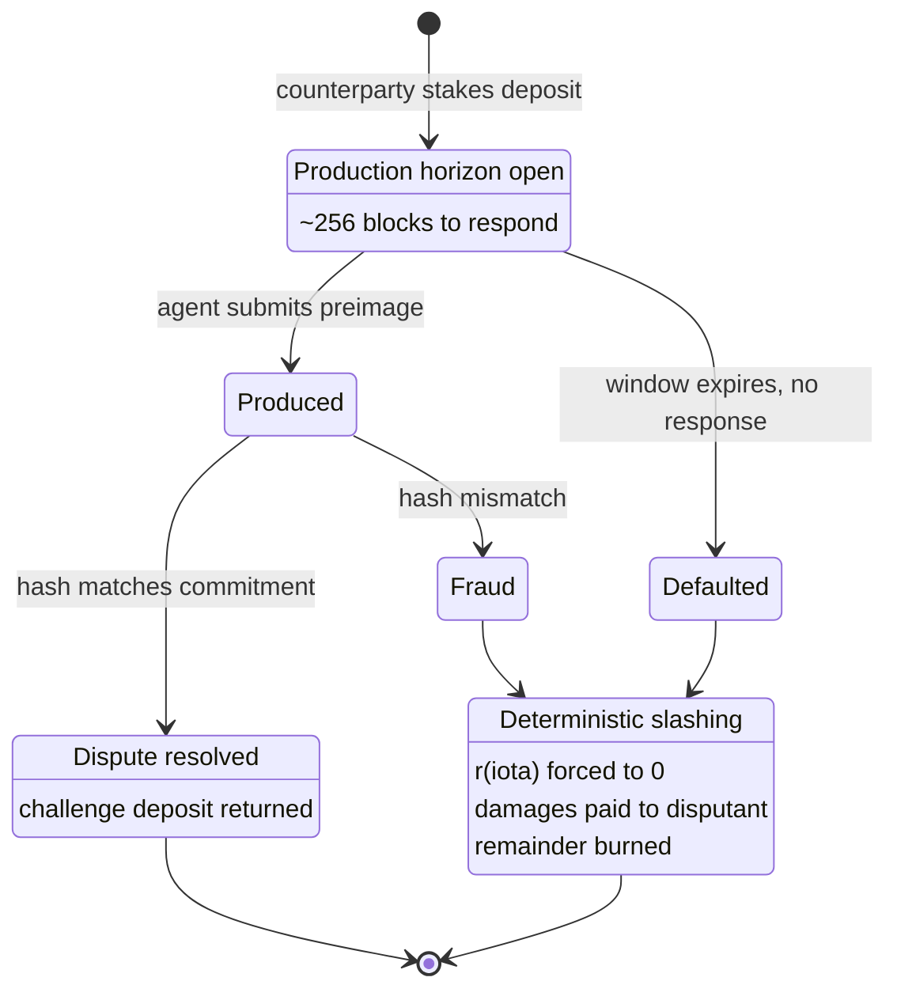

**The escrow.** An agent operating under a private or local memory regime must capitalise an on-chain escrow with stake $S_{DA}$:

$$S_{DA} \ \ge\ \alpha_{DA} \cdot \max_i \big(\mathrm{ValueAtRisk}(a_i)\big) \tag{6a}$$

where $\alpha_{DA} \in (0,1]$ is an operator-declared coverage ratio and $\mathrm{ValueAtRisk}$ is the largest single-transaction capital or licensed-volume threshold the active constraint schedule permits. The escrow scales with *permitted* exposure, not with realised activity — an agent that wants a generous bound must capitalise the forensic obligation that bound implies.

**The dispute protocol.**

1. **Challenge inception.** A counterparty or auditor stakes a challenge deposit $D_{\text{chal}}$ against an anchored commitment $h_k$. The deposit exists so that challenging is not free — otherwise the mechanism becomes a griefing vector against honest agents.
2. **Production horizon.** An on-chain window $\Delta t_{\text{chal}}$ opens (order 256 blocks).
3. **Proof of availability.** The challenged agent invokes the dispute contract with the canonical preimage $M_k = (\texttt{schema}, \texttt{subject}, \texttt{seq}, \texttt{class}, \texttt{payload})$ such that $H(\mathrm{canon}(M_k)) = h_k$. Because the encoding of (5) is **injective**, exactly one valid preimage tuple exists — which is what makes the check decidable rather than argumentative.

**Deterministic resolution.** If $\Delta t_{\text{chal}}$ lapses without valid production, or the submitted preimage fails to match, the contract executes three transitions with no discretion:

1. **Revocation.** $r(\iota) \to 0$, dropping every soft bound to its floor across all mediated accounts (consistent with §3.1.1's N2 — absence of evidence is not evidence).
2. **Liquidated damages.** A declared fraction $\beta_{\text{redress}} \in (0,1]$ of $S_{DA}$ transfers to the disputant: $\text{Payout} = D_{\text{chal}} + \beta_{\text{redress}} \cdot S_{DA}$. This is the part that converts a legal hope into a payment.
3. **Burn.** The remainder $(1 - \beta_{\text{redress}}) \cdot S_{DA}$ is burned per §8.3, so successful challenges are not a profit centre for the protocol.

```solidity
// SPDX-License-Identifier: MIT
pragma solidity ^0.8.24;

interface IStateAnchorDispute {
    event MemoryChallenged(bytes32 indexed commitment, address indexed challenger, uint64 deadline);
    event MemorySlashed(bytes32 indexed commitment, address indexed agent, uint256 redressAmount);

    function challengeMemory(address agent, bytes32 commitment) external payable;
    function producePayload(bytes32 commitment, bytes calldata canonicalPayload) external;
    function resolveDefault(address agent, bytes32 commitment) external;
}
```

> **The cost this imposes, stated rather than elided.** DA-Escrow deepens the adoption barrier it sits next to. An agent must now capitalise ITK bandwidth stake (§8.2) *and* an availability escrow scaling with its permitted exposure — and the second is dead capital in the common case where no challenge ever comes. This is a real tension with the activation-barrier problem of §7.2, and it should be sized deliberately rather than maximised: $\alpha_{DA}$ is operator-declared precisely so that a low-value agent is not forced to over-collateralise a forensic obligation nobody will invoke. A protocol that makes honest participation capital-prohibitive has substituted one adoption failure for another.

### 3.3 Primitive III — Agent-owned contracts and economic sovereignty

The third primitive removes the custodian. An agent that merely *has* a wallet attached is an off-chain process someone else can pause; an agent that *is* the root owner of its own contracts observes chain state and acts against it as a principal.

[ERC-6551](https://eips.ethereum.org/EIPS/eip-6551) is the mechanism, applied here to the *agent* rather than — as in Section 5 — to the licensed asset. A permissionless registry derives an account address deterministically via `CREATE2` from the implementation, chain identifier, token contract, token ID and salt; control of the account follows ownership of the token. Three consequences compound.

- **Composable provenance.** Every token received, contract touched and licence granted accrues to the agent's own account. Provenance is not reconstructed from an external index; it *is* the account's transaction history.

- **Intent translation.** Because the account is a contract, it can hold policy. It expands a high-level intent into a coordinated multi-step execution rather than firing on a fixed trigger — with every constituent step still traversing the hook, which is why batched execution is named explicitly in the complete-mediation conditions.

- **Atomic transfer of the whole.** Ownership of the token is ownership of everything nested beneath it. Writing the agent's nested state subtree as

$$\Sigma(\iota) = (h_k,\ b_k,\ \text{licences held},\ \text{sublicences granted},\ \theta_k) \tag{7}$$

  a single ERC-721 transfer re-parents $\Sigma(\iota)$ atomically. An agent's identity, memory commitments, accrued rights and portfolio can be sold, upgraded or wound down in one transaction, with no assignment instruments, no escrow agent, and no chain-of-title reconstruction.

> **Why sovereignty raises the stakes rather than settling them.** Each primitive expands what the agent *can* do. Identity grants it standing; memory grants it continuity; ownership grants it assets and the unilateral power to move them. Not one of them removes a single state from the reachable set of Section 2. A sovereign agent with verified identity, durable memory and a real portfolio is the most consequential configuration described in this paper — a durable actor with unbounded authority.

### 3.4 The gap the primitives leave open

The three fail individually in ways that clarify why they are a set rather than a menu. **Identity without memory** is an amnesiac: reputation cannot accrue to a subject with no retained history, and forensics has nothing to replay. **Memory without sovereignty** is custodial: if a third party can rewrite or withhold the state, the commitment chain proves only that somebody wrote it. **Sovereignty without identity** is anonymous capital under autonomous control — maximally difficult to constrain, and the configuration to which regulators react most sharply.

Together they make an agent durable, attributable and self-directed. What they conspicuously do not make it is **bounded**. The primitives establish the subject, the history and the assets; they say nothing whatsoever about which transitions that subject may make. Formally, they populate the arguments of $\mathbf{C}(\iota)$ in (3) and the state vector in (1) without constraining $T$ at all.

> **The division of labour.** The three primitives are the necessary conditions for an agent economy to *exist*. A verification layer is the necessary condition for underwritten capital to *enter* it. The proposed Integrity Protocol assumes the first and supplies the second: it consumes identity through the Integrity identity obligation (a native ERC-8004 registry or a versioned local read profile), anchors memory through (5), and installs itself inside the agent-owned account so that sovereignty and constraint occupy the same contract. The remainder of this paper proposes that layer.

---

## 4 The Verification Kernel

### 4.1 Admissible sets and the constraint vector

An operator — an institution running a fleet of agents, or an IP owner licensing a dataset — declares a **constraint vector**

$$\mathbf{C} = (g_1, g_2, \ldots, g_m), \qquad g_i : X \times U \to \mathbb{R} \tag{8}$$

under the sign convention that **non-positive means satisfied**. The **admissible set** is

$$S_\mathbf{C} = \{\, x \in X : g_i(x) \le 0 \ \ \forall i \in \{1,\ldots,m\} \,\} \tag{9}$$

Constraints are real-valued rather than boolean deliberately. Two things follow. First, composition becomes set intersection, which is what makes Proposition 2 available. Second, the operator can observe **margin** — the quantity $\min_i(-g_i(x))$ — rather than only failures. An operator who sees only rejections learns nothing until something breaks; an operator who sees headroom can act before it does.

Representative constraint instances, to make the vocabulary concrete:

- cumulative outbound value to non-allowlisted addresses within any 24-hour window must not exceed \$50,000;
- remaining licensed inference calls must not go negative;
- the counterparty must resolve through the selected Integrity identity profile and, where the deployment uses an attested profile, hold an accepted validator attestation newer than 30 days.

### 4.2 The verification functional

> **In plain terms.** Two ideas, and the second is the one that matters.
>
> **First:** all rules must pass, not most. The formula multiplies each rule's result together, so one zero makes the whole thing zero. There's no scoring, no "mostly compliant."
>
> **Second — and this is the real design decision:** we test *the state the transaction would produce*, not the transaction itself. Most security tools inspect the request — is this function on the allowlist, is this address blocked? That approach loses to anyone willing to add a layer of indirection: route through a proxy, wrap it in a batch, trigger it from a callback. Testing the *outcome* is immune to all of that, because the attacker has to produce an acceptable result, not merely an acceptable-looking request.

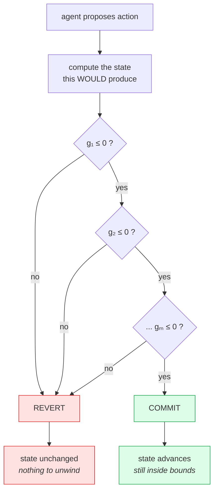

Define

$$V(a \mid x, \mathbf{C}) = \prod_{i=1}^{m} \Theta\big(-g_i(T(x,a))\big) = \mathbb{1}\{\, T(x,a) \in S_\mathbf{C} \,\} \in \{0,1\} \tag{10}$$

with $\Theta$ the Heaviside step function ($\Theta(u) = 1$ for $u \ge 0$, else $0$). The product form makes evaluation **conjunctive**: any single violated constraint zeroes the whole product. The execution rule is

$$x_{k+1} = \begin{cases} T(x_k, a_k) & \text{if } V(a_k \mid x_k, \mathbf{C}) = 1 \\ x_k & \text{otherwise (transaction reverts)} \end{cases} \tag{11}$$

Two properties deserve emphasis.

**Rejection is a revert, not a remediation.** There is no compensating transaction, no unwind, no alert-and-hope. The inadmissible state was never entered.

**The predicate is evaluated against the post-state $T(x,a)$, not against surface features of the calldata.** This is the difference between an execution constraint and a transaction filter. Selector allowlists and target-address blocklists are defeated by any indirection the adversary can construct — a proxy, a multicall, an unexpected callback. A predicate over the resulting state is not, because the adversary must produce an admissible *outcome*, not merely an admissible-looking *request*.

### 4.3 The containment guarantee

> **Proposition 1 (Forward invariance).** Let $x_0 \in S_\mathbf{C}$, and suppose every state transition of account $A$ is mediated by the rule (11). Then $x_k \in S_\mathbf{C}$ for all $k \ge 0$, for every input sequence $(a_0, a_1, \ldots)$, **including sequences chosen by an adversary with full knowledge of $\mathbf{C}$, full control of the agent's policy $\pi$, and possession of the account's signing keys.**
>
> *Proof.* By induction. The base case is the hypothesis $x_0 \in S_\mathbf{C}$. For the step, assume $x_k \in S_\mathbf{C}$. Rule (11) admits exactly two outcomes. If $V(a_k \mid x_k, \mathbf{C}) = 1$ then by (10) $T(x_k,a_k) \in S_\mathbf{C}$, and $x_{k+1} = T(x_k,a_k) \in S_\mathbf{C}$. Otherwise $x_{k+1} = x_k \in S_\mathbf{C}$ by the induction hypothesis. In both branches $x_{k+1} \in S_\mathbf{C}$. The argument never appeals to any property of $a_k$, which is precisely why the adversary's capabilities are irrelevant to the conclusion. $\blacksquare$

The proof is elementary, and that is the point: the guarantee does not depend on any claim about model behaviour, prompt hygiene, or the difficulty of jailbreaking. It depends only on mediation.

> **What Proposition 1 does not say.** It says nothing about whether $S_\mathbf{C}$ was well chosen. **A constraint set that permits a catastrophic action permits it with full cryptographic assurance.** It also says nothing about events outside the mediated account: off-chain data exfiltration, oracle falsification, and physical copying of already-delivered plaintext remain outside the boundary. The guarantee is conditional on the complete-mediation requirement of Section 2.4, and that condition is an engineering obligation, not an assumption one may quietly inherit.

### 4.4 Conserved quantities

The kernel supplies three invariants as primitives, so that adapter authors do not re-derive them — and, more importantly, do not get them subtly wrong.

**Value conservation in settlement.** For a participant set $P$, balances $b(j)$, and a fee $\varphi$ routed to a declared recipient:

$$\sum_{j \in P} \Delta b(j) + \varphi = 0 \tag{12}$$

Any transition failing (12) is either a mint, a burn, or a leak, and is rejected unless a constraint explicitly authorises it.

**Monotone depletion of metered rights.**

$$q_{k+1} = q_k - c_k, \qquad q_k \ge 0 \ \forall k, \qquad q_0 = Q \tag{13}$$

with $c_k \ge 0$ consumed at step $k$. Because $q$ is stored in the licence's own token-bound account (Section 5), the meter cannot be reset by the consuming agent, cannot desynchronise across chains, and survives transfer of the underlying asset.

**Strict monotonicity of the replay domain.**

$$\nu_{k+1} > \nu_k, \qquad d(a_k) = d^\star \tag{14}$$

where $d$ binds chain identifier, contract address, licence identifier, and epoch. This is the formal content of the A5 defence. Note that $d^\star$ must be constructed with an injective encoding for the same reason (5) must — a domain separator built by naive string concatenation is itself an attack surface. Appendix B gives a length-prefixed reference construction.

### 4.5 Where the kernel executes

ERC-7579 defines four module types: validators (type 1), executors (type 2), fallback handlers (type 3) and hooks (type 4). Placement is not a matter of taste.

ERC-4337's **validation phase** runs under restrictive state-access rules, imposed so that bundlers can safely simulate operations. Rich policy — portfolio exposure across positions, counterparty attestation freshness, licence balances held in *another* account — is not expressible under those restrictions. A **type-4 hook**, by contrast, runs `preCheck` before the account's calldata executes and `postCheck` after, on every execution path including `executeFromExecutor` and module installation, in the execution context, with full state access.

**The Integrity kernel is therefore deployed as a type-4 hook**, with a companion type-1 validator handling session-key and signature policy where the restricted validation rules permit it.

> Because `preCheck` executes with full state access on every execution path, it is the only position in the account from which complete mediation is achievable.

### 4.6 The liveness cost, stated honestly

ERC-7579 is explicit that a malicious or defective hook reverting in `preCheck` or `postCheck` can deny service to the entire account. **This is not a marginal concern; it is the principal operational risk of the architecture.** Four design rules follow, and they are requirements rather than recommendations.

- **L1 — Fail-closed on the value path, fail-open nowhere silently.** Ambiguity resolves to rejection. An adapter that cannot decide returns *reject* and emits a typed reason, so the failure is diagnosable rather than mysterious.
- **L2 — Bounded evaluation.** Every adapter declares a worst-case gas bound, enforced by metered call. An adapter exceeding its bound is rejected and flagged, rather than consuming the operation's entire gas allowance.
- **L3 — Attested module set.** Hooks are installed only from a registry carrying attestations from independent auditors, in the pattern of ERC-7484 module registries. An unattested hook is installable only by explicit operator override.
- **L4 — Timelocked escape hatch.** Removal of the kernel is itself a constrained transition subject to a mandatory delay and multi-party authorisation. The delay makes removal visible to monitoring before it takes effect, which preserves the guarantee of Section 2.4(iii) without creating an unrecoverable account.

### 4.7 Circuit-breaker grace modes and adaptive liveness

> **`PROPOSED NORMATIVE CHANGE` (v3.2) — new subsection.** L1 requires that ambiguity resolve to rejection. Under an *unpartitioned* constraint vector that rule has a severe operational consequence: any missing telemetry input, stale feed, or adapter timeout evaluates to $V = 0$ and reverts. An adversary — or an ordinary network fault — can therefore degrade telemetry transport and render an agent unable to perform *risk-reducing* actions: collateral rebalancing, debt repayment, emergency liquidation. **Uniform fail-closed is a self-inflicted denial of service, and in a regulated setting the inability to act defensively is itself a compliance failure.** This subsection removes that vulnerability without weakening Proposition 1.

> **In plain terms.** There's a trap in strict fail-closed design. If *any* missing data means "reject," then an attacker who merely disrupts your telemetry can freeze your agent — and a frozen agent can't do the *defensive* things you'd most want it to do: repay a loan, post collateral, exit a position before liquidation. You've built a security tool that becomes a denial-of-service weapon against its own user.
>
> The fix is to notice that not all rules are the same kind. "Don't create money out of nothing" depends only on on-chain arithmetic — it never needs external data, so it never has an excuse to be stale. "This counterparty's reputation is fresh enough" depends on a feed that can lag.
>
> So we split them. The arithmetic rules never bend. The data-dependent rules *shrink the agent's allowance* as data goes stale, rather than stopping it dead. Small defensive actions keep working; large ones wait for a human. And if data goes stale long enough, it does eventually stop — but by then you've had visible warning rather than a surprise.
>
> Crucially, this only ever makes the agent *more* restricted, never less. That's Proposition 3, and it's why adding grace modes doesn't weaken the main guarantee at all.

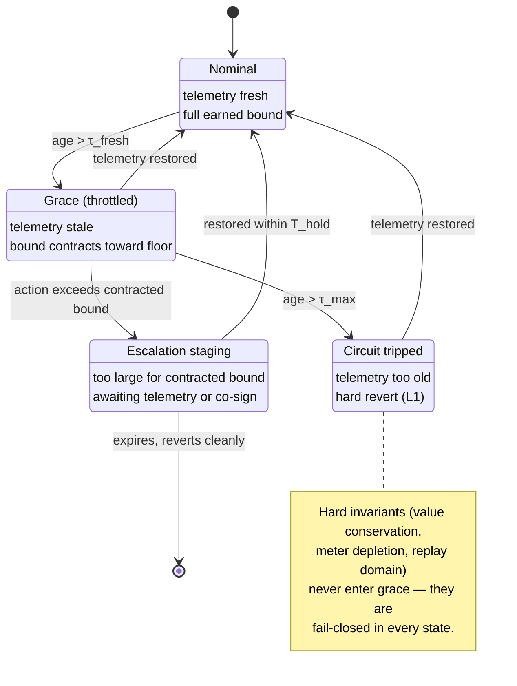

#### 4.7.1 Constraint partitioning

The constraint vector is partitioned into two disjoint sub-vectors, $\mathbf{C} = (\mathbf{C}_{\text{hard}},\ \mathbf{C}_{\text{soft}})$:

- **Hard invariants** ($\mathbf{C}_{\text{hard}}$) — predicates over on-chain EVM state, balance deltas, and the conserved quantities of §4.4: settlement conservation (12), monotone meter depletion (13), replay-domain separation (14). These are **strictly fail-closed under all circumstances** and are never subject to grace.
- **Soft context** ($\mathbf{C}_{\text{soft}}$) — predicates parameterised by external, time-varying telemetry: $r(\iota)$, counterparty attestation freshness, host sensor signals.

#### 4.7.2 The grace functional

Let $\Delta\tau$ be the age of the latest admissible telemetry. Define a grace factor $\lambda(\Delta\tau) \in [0,1]$ over three regimes:

$$\lambda(\Delta\tau) = \begin{cases} 1 & \Delta\tau \le \tau_{\text{fresh}} \quad \text{(nominal)} \\ \text{decreasing} & \tau_{\text{fresh}} < \Delta\tau \le \tau_{\max} \quad \text{(grace)} \\ 0 & \Delta\tau > \tau_{\max} \quad \text{(tripped)} \end{cases}$$

In the grace regime the kernel does **not** revert valid operations; it contracts the bound schedule toward its floor:

$$b_i^{\text{active}}(\iota, \Delta\tau) = \big(1 - \lambda(\Delta\tau)\big)\cdot b_i^{\min} + \lambda(\Delta\tau)\cdot b_i(\iota) \tag{11b}$$

> **Precedence: floors govern, grace only moves within them.** Grace mode and AIS's N2 both respond to telemetry problems, and their interaction must be stated or they will double-apply. The rule is: **$b_i^{\min}$ is determined by §3.1.1 — including N2's rule that no admissible evidence scores zero — and grace never moves a bound below that floor and never re-inflates one above the earned bound $b_i(\iota)$.** Grace operates strictly *inside* the interval the reputation system already established. Consequently "stale but admissible" telemetry contracts bounds smoothly, while "no admissible evidence at all" is not a grace condition at all: it sets the floor itself to the minimum, and grace has no room left to give. One authority per quantity.

#### 4.7.3 Two-tier execution routing

For a proposed action during soft-telemetry desynchronisation:

1. **Autonomous throttled settlement.** If the request satisfies the contracted bound, the kernel executes immediately. The agent stays economically alive for defensive operations — which is the entire point.
2. **Asynchronous escalation staging.** If the request exceeds the contracted bound but remains within the nominal earned bound, `preCheck` refuses immediate settlement and pushes the payload into an on-chain staging buffer (an ERC-7579 execution sub-module). It may later settle if telemetry is restored within the hold window $T_{\text{hold}}$, or if an authorised operator/multisig co-signs. Otherwise it expires and reverts cleanly with no side effects.

> **The staging buffer must not become a governance hole.** A multisig releasing a staged transaction is a human path into the account, and §2.4(iii) is unambiguous that privileged paths are where guarantees die. Two constraints are therefore proposed normative requirements, not optional within this proposal: **(a)** a staged release is evaluated against $\mathbf{C}_{\text{hard}}$ at settlement time, not at staging time — no co-signature can release a transaction violating a hard invariant; and **(b)** release cannot exceed the nominal bound $b_i(\iota)$ that applied when the action was staged, so staging can never be used to obtain a *larger* allowance than fresh telemetry would have granted. Staging defers a decision; it does not expand authority.

#### 4.7.4 Safety under grace

> **Proposition 3 (Monotone safety under grace contraction).** Let $\mathcal{A}_{\text{nominal}}$ be the admissible set under fresh telemetry and $\mathcal{A}_{\text{grace}}(\Delta\tau)$ the admissible set under the contracted schedule (11b). Then $\mathcal{A}_{\text{grace}}(\Delta\tau) \subseteq \mathcal{A}_{\text{nominal}}$ for all $\Delta\tau \ge 0$.
>
> *Proof.* For every hard constraint the evaluation is invariant in $\Delta\tau$, so those admissible sets are unchanged. For every soft constraint, $b_i^{\text{active}}(\iota,\Delta\tau)$ is a convex combination of $b_i^{\min}$ and $b_i(\iota)$ with $b_i^{\min} \le b_i(\iota)$, hence monotonically non-increasing in $\Delta\tau$ and never exceeding $b_i(\iota)$. Therefore each soft constraint's admissible set under grace is contained in its nominal one, and by the intersection argument of Proposition 2 the composed sets satisfy the same containment. $\blacksquare$

Because $\mathcal{A}_{\text{grace}}$ is a *subset* of the operator-approved space, entering grace mode can never enlarge the reachable state set. **Forward invariance (Proposition 1) holds under every telemetry-degradation regime** — grace trades liveness for nothing, in the safety direction.

#### 4.7.5 Proposed normative rules for adapter authors

- **G1 — Hard-partition inviolability.** An adapter MUST NOT classify any balance delta, token transfer, or withdrawal as soft. All value-moving operations are governed by $\mathbf{C}_{\text{hard}}$.
- **G2 — Monotone contraction.** An adapter MUST NOT inflate any bound on telemetry loss: $\partial b_i / \partial \Delta\tau \le 0$.
- **G3 — Typed degradation events.** On entering grace or tripping a breaker, an adapter MUST emit an indexed event (`CircuitBreakerTripped(bytes32 indexed adapterId, uint8 mode, uint64 telemetryAge)`) so fleet monitoring detects degradation *before* hard failure. This is the same visibility argument as margin telemetry in §4.1: a cliff is safe to operate against only if you can see it coming.

```solidity
// SPDX-License-Identifier: MIT
pragma solidity ^0.8.24;

/// @notice Illustrative grace evaluation. Pedagogical; not audited.
abstract contract CircuitBreakerHook {
    uint64 public constant TAU_FRESH = 1 hours;
    uint64 public constant TAU_MAX = 24 hours;

    struct SoftContext {
        uint64 lastTelemetryTimestamp;
        uint32 nominalBoundBps; // b_i(iota) — from §3.1.1, already floor-clamped
        uint32 floorBoundBps;   // b_i,min  — set by N2/N3, never crossed here
    }

    /// @dev Linear contraction between the earned bound and the floor. Never returns
    /// above nominalBoundBps and never below floorBoundBps — grace moves strictly
    /// inside the interval §3.1.1 established (see §4.7.2 precedence rule).
    function _resolveActiveBound(SoftContext memory ctx) internal view returns (uint32) {
        uint64 age = uint64(block.timestamp) - ctx.lastTelemetryTimestamp;

        if (age <= TAU_FRESH) return ctx.nominalBoundBps;
        if (age > TAU_MAX) return ctx.floorBoundBps;

        uint64 graceWindow = TAU_MAX - TAU_FRESH;
        uint64 elapsed = age - TAU_FRESH;
        uint32 boundDelta = ctx.nominalBoundBps - ctx.floorBoundBps;
        return ctx.nominalBoundBps - uint32((uint256(boundDelta) * elapsed) / graceWindow);
    }
}
```

---

## 5 Intellectual Property as a Live, Metered Asset

### 5.1 Why the licence must hold its own state

A licence recorded as a document describing permissions is enforceable only by the parties' willingness to read and honour it. A licence that *holds its own balance and its own meter* is enforceable by the machine that settles the transaction. The difference is the difference between a contract and a control.

### 5.2 Token-bound accounts, mechanically

[ERC-6551](https://eips.ethereum.org/EIPS/eip-6551) assigns a smart contract account to any existing ERC-721 token without modifying the token contract. The singleton registry is deployed at the **same address across EVM chains**: `0x000000006551c19487814612e58FE06813775758`. Address derivation is

$$\mathrm{addr}_{\mathrm{TBA}} = H(\text{implementation},\ \text{salt},\ \text{chainId},\ \text{tokenContract},\ \text{tokenId}) \tag{15}$$

where $H$ is the `CREATE2` address derivation over an ERC-1167 minimal-proxy creation code with the binding parameters appended. Two consequences matter here:

1. the address is **computable before deployment**, so escrow and offers can be addressed to a licence account that does not yet exist;
2. control of the account resolves **dynamically** through the token's `ownerOf` — transferring the ERC-721 transfers command of everything the account holds, atomically.

The licence's state subset is

$$S_I = (\underbrace{b_I}_{\text{accrued royalties}},\ \underbrace{L_I}_{\text{terms}},\ \underbrace{q_I}_{\text{consumption meter}},\ \underbrace{H_I}_{\text{usage-history commitment}}) \tag{16}$$

all resident in the token-bound account. A transfer of the underlying token reassigns authority over the entirety of $S_I$ in a single transaction.

### 5.3 The transfer-drain problem, and why the kernel is the answer

A licence account holding an accrued royalty balance creates an obvious attack: arm a sale at a price reflecting balance $b_I$, then withdraw $b_I$ before the transfer settles. The kernel installed **on the licence account** holds the constraint

$$g_{\text{settle}}(x) = \mathbb{1}\{\text{transfer pending}\} \cdot \big(b_I^{\text{committed}} - b_I\big) \le 0 \tag{17}$$

which states that while a transfer is armed, the account balance may not fall below the level committed to in the sale. A withdrawal attempt during that window is **not detected and disputed afterwards; it reverts.**

Note the structural point: the kernel is installed on licence accounts, not only on agent accounts. The same mechanism serves both.

### 5.4 From licence terms to constraints

| Term | Constraint | Enforcement point |
|---|---|---|
| Volume cap | $q_{k+1} = q_k - c_k \ge 0$ | pre-check on every consumption call |
| Term / expiry | $t_{\text{start}} \le t \le t_{\text{end}}$ | block timestamp bound |
| Field of use | $\mathrm{purpose}(a) \in F$ | typed intent tag, adapter-decoded |
| Licensee identity | Integrity identity resolves; required profile attestation is fresh | configured identity-profile read in pre-check |
| Royalty | $\Delta b_I \ge p(c_k)$ atomically with release | value conservation (12) |
| Exclusivity | $\lvert\{\text{active licensees}\}\rvert \le n_{\max}$ | licence-account counter |
| Derivative rights | flag required for training-use intents | typed intent tag |
| Assurance tier | required proof class by value at risk | §9.3 |
| **Memory continuity** ***(new, v3.1)*** | $\;h_{\text{submitted}}$ **extends** $h_{\text{anchored}}$ | pre-check, against anchored head |

**Table 2.** Licence terms and their constraint decomposition.

> **`PROPOSED NORMATIVE CHANGE` (v3.1) — the memory commitment must be constrained, not merely declared.**
> Version 3.0 placed a usage-history commitment $H_I$ in licence state (16) and anchored $h_{k+1}$ at lifecycle step 8, but **no constraint anywhere in §4.1 or Table 2 ever read memory state.** The commitment was therefore decorative: nothing prevented an agent from submitting a consumption call whose accompanying memory head was inconsistent with, or forked from, the anchored history. Since Section 3.2 rests fork resistance on exactly this check ("a consumption counter is only a control if the consumer cannot fork the ledger it is counted in"), the omission voided the property it claimed. The new row closes it: a consumption call whose submitted memory head does not extend the anchored head is inadmissible and reverts.

### 5.5 The honest boundary: access control is not copy control

**Once plaintext has been delivered to a licensee, no smart contract can un-deliver it.** A protocol that claims otherwise is selling something it cannot build.

What the Integrity Protocol enforces is the **coupling between payment and access**: an agent cannot obtain the next unit of access without the payment and the constraint check succeeding atomically, and cannot obtain any access after its budget is exhausted or its attestation lapses. Four elements make that coupling operational:

1. **Serve per query, not per corpus.** Where the asset is a model, weights, or a dataset, each query is metered, priced, and individually authorised — so the quantity at risk in any single failure is one query, not the corpus.
2. **Bind bulk release to a confidential execution environment.** Where bulk access is unavoidable, deliver into a TEE whose attestation is verified on chain as a constraint.
3. **Make the ledger the evidence.** Every authorised consumption produces a signed, timestamped, immutable record binding agent identity, licence, quantity and payment.
4. **Revoke forward.** Attestation freshness is a constraint, so misbehaviour terminates future access at the next call.

Elements 3 and 4 are where an operator's host-layer tooling becomes relevant, and where it is easy to overclaim; Section 9.4 states that boundary precisely.

---

## 6 Modular Transduction: The Adapter Architecture

### 6.1 Why the core cannot know the constraints

The space of enforceable policy is unbounded and domain-specific: a music-sampling licence, a clinical-data use agreement, a treasury mandate, and a GPU-hours quota have nothing structurally in common except that each reduces, eventually, to predicates over a post-state. A kernel that hardcoded any of them would require a protocol upgrade per policy class — which is to say, it would not scale, and its trusted computing base would grow without bound.

Adapters invert this. An adapter is a **transducer**: a device that reads across a system boundary and converts a measurement into the internal representation, without letting the outside world's disorder propagate inward. Formally,

$$f_{\text{adapter}} : P_{\text{ext}} \to \mathbf{C} \tag{18}$$

mapping an external payload — a licence document hash and parameters, a mandate, a policy descriptor — into the constraint vocabulary of (8). The kernel stays small and immutable; the enforceable policy set grows permissionlessly.

### 6.2 Obligations on an adapter

| Req | Name | Obligation |
|---|---|---|
| **R1** | Determinism | Identical payloads must yield identical constraints. No dependence on block timestamp, coinbase, prevrandao, or unbounded external calls during compilation. Verified by differential replay in the registry's admission suite. |
| **R2** | Totality | The adapter must always return a decision. Unparseable or unrecognised input maps to *reject* with a typed reason, never to silent acceptance. Fail-closed is a correctness requirement, not a preference. |
| **R3** | Bounded cost | A declared worst-case gas bound, honoured under metered call. No unbounded iteration over attacker-supplied payloads — the classic path from a policy engine to a denial-of-service primitive. |
| **R4** | Conservatism | An adapter may only **add** constraints. It cannot relax constraints imposed by another adapter or by the operator's base mandate. This is what makes Proposition 2 hold. |
| **R5** | Attestation | Published with source, a machine-readable specification of the semantics it claims to implement, and at least one independent audit attestation before it is installable without operator override. |

**Table 3.** R1–R3 are mechanically checkable; R4 is structural; R5 is economic and social, and is the part that requires the staking design of Section 8.

Adapter transduction runs **off-chain and is cached**. R1 exists precisely so the result is memoisable and independently re-derivable by an auditor; the on-chain gate evaluates an already-compiled constraint vector rather than recompiling policy in the EVM.

### 6.3 Composition

> **Proposition 2 (Safety-preserving composition).** Let adapters $1,\ldots,n$ induce constraint vectors $\mathbf{C}_1,\ldots,\mathbf{C}_n$ with admissible sets $S_{\mathbf{C}_1},\ldots,S_{\mathbf{C}_n}$. Under conjunctive evaluation, the composed admissible set is
> $$S_\mathbf{C} = \bigcap_{j} S_{\mathbf{C}_j} \subseteq S_{\mathbf{C}_j} \quad \forall j$$
> Consequently the composition is at least as safe as its strictest member, and installing an additional adapter can never enlarge the reachable set.
>
> *Proof.* By (10) the composed verification functional is $V = \prod_j V_j$, which equals 1 if and only if every $V_j = 1$ — that is, if and only if the post-state lies in every $S_{\mathbf{C}_j}$. That is the definition of the intersection, and intersection is contained in each operand. $\blacksquare$

> **Remark 2 (the honest dual).** Composition monotonically *degrades liveness*. Adding the $n$-th adapter can only increase the refusal rate. This is why operators need per-constraint margin telemetry (§4.1) rather than only a pass/fail signal: without it, an operator cannot distinguish "correctly refusing" from "over-constrained into uselessness."

### 6.4 The adapter registry as the network's compounding asset

Adapters are permissionless to author but admitted through a registry whose admission criteria mechanically enforce R1–R3 (differential replay for determinism, metered call for gas bound) and structurally enforce R4. R5 gates installability *without operator override*. Because a share of the protocol fee routes to the author of the adapter that gated a transaction (§8.3), the registry is a market rather than a catalogue: the incentive to publish a well-specified, audited adapter is the revenue it earns whenever it is used.

---

## 7 Execution, Gas Abstraction and Integration

### 7.1 Transaction lifecycle

| # | Step | Where |
|---|---|---|
| 1 | **Discover** — resolve the configured Integrity identity profile, read terms | off-chain, cacheable |
| 2 | **Intend** — sign scoped ATCP/IP request (session key, not root key) | off-chain, cacheable |
| 3 | **Transduce** — adapter emits $\mathbf{C}$ | off-chain, cacheable, deterministic ⇒ memoisable per licence version |
| 4 | **Validate** — signature, session, domain $d^\star$ | ERC-4337 validation phase (type-1 validator) |
| 5 | **Gate** — `preCheck`: is $V = 1$? | execution phase begins |
| 6 | **Settle** — pay, split fee $\mu$, decrement $q$ | execution phase |
| 7 | **Release** — key or pointer delivered | execution phase |
| 8 | **Confirm** — `postCheck` invariants, anchor $h_{k+1}$ | execution phase |

**Figure 4.** Steps 5–8 share one transaction. Any failure at step 5 or 8 reverts the whole transaction: state unchanged. **Payment without release and release without payment are both unrepresentable.**

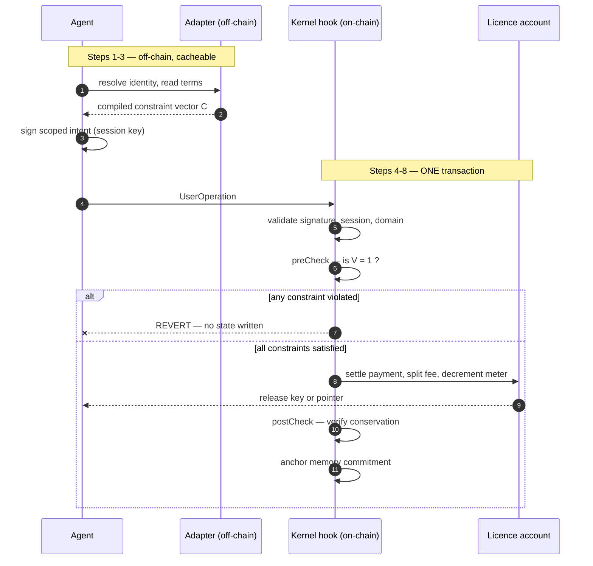

> **In plain terms.** The important structural fact is the `alt` block: payment, release, meter decrement and the memory anchor all live inside a single transaction. Either every one of them happens or none does. That's why "the agent paid but never got the data" and "the agent got the data but never paid" are not edge cases to handle — they are states the system cannot represent.

### 7.2 Gas abstraction and the activation barrier

A UserOperation is submitted to a bundler and routed through the singleton EntryPoint; a paymaster contract may sponsor its gas. The Integrity paymaster sponsors operations for accounts that carry a live enforcement configuration, denominating the cost in ITK drawn from the operator's staked bandwidth rather than in the chain's native asset. An agent therefore never needs to hold ETH.

> **The griefing surface, stated plainly.** Sponsored execution is a griefing target: an adversary who can cause the paymaster to pay for operations that revert late in execution drains it at no cost to itself. Mitigations are standard and non-negotiable — paymaster stake and deposit per ERC-4337 reputation rules, per-identity sponsorship quotas metered against staked bandwidth, and a validation phase strict enough that operations failing the gate are rejected before the paymaster is committed. **A protocol that sponsors gas without metering it has simply moved the unbounded liability from the agent to the treasury.**

### 7.3 Cost and latency budget

| Component | Budget | Note |
|---|---|---|
| `preCheck` hook | ≤ 40k gas, $O(m)$ | no unbounded loops, no external calls to untrusted code, no storage writes in the gate path; constraints read from packed storage |
| Per-constraint $g_i$ | ≤ 6k gas | favours arithmetic and comparison predicates over signature or proof verification inside the gate |
| Adapter transduction | off-chain, cached | determinism (R1) makes results memoisable and auditor-re-derivable |
| Attestation | amortised per epoch | batched into a Merkle root; per-call proofs destroy the efficiency ratio $\rho$ for small transactions |
| Added latency | < 1 block | all gate logic executes in the same transaction — no cross-transaction handshake, no off-chain callback in the critical path |

**Table 4.** Cost and latency budget.

### 7.4 What an integrator changes

For a team already using a smart account, the account address does not change and **no asset migration is required**. Three steps:

1. install the Integrity hook as an ERC-7579 module of type hook;
2. select or author an adapter and publish its address;
3. set module governance so that uninstalling the hook is itself a constrained transition (the third complete-mediation condition of §2.4).

For a team holding assets in an EOA, the migration is the ordinary one to a smart account, and it is the only material lift in the process.

### 7.5 High-frequency execution: state channels and declarative transduction

> **`PROPOSED NORMATIVE CHANGE` (v3.2) — new subsection.** Table 4's budget (≤40k gas per `preCheck`, ≤6k per predicate) is negligible for institutional transfers — well under 0.01% of value secured. It is prohibitive for agents negotiating per-token inference, live sensor feeds, or streaming micro-content above roughly 10 Hz. Two mechanisms address this without weakening the gate.

> **In plain terms.** Checking every action on-chain costs gas. For a \$2M treasury transfer that's rounding error. For an agent buying a thousand small inference queries a minute, it's fatal — the check would cost more than the thing being bought.
>
> The fix is the standard one: lock a budget on-chain once, do the many small exchanges off-chain against that locked budget, then settle once at the end. The chain sees two transactions instead of ten thousand. What it never gives up is the *ceiling* — the budget was locked on-chain at the start, so no amount of off-chain activity can exceed it. The worst case if a counterparty vanishes mid-session is settling at the last signed state, not an open-ended loss.

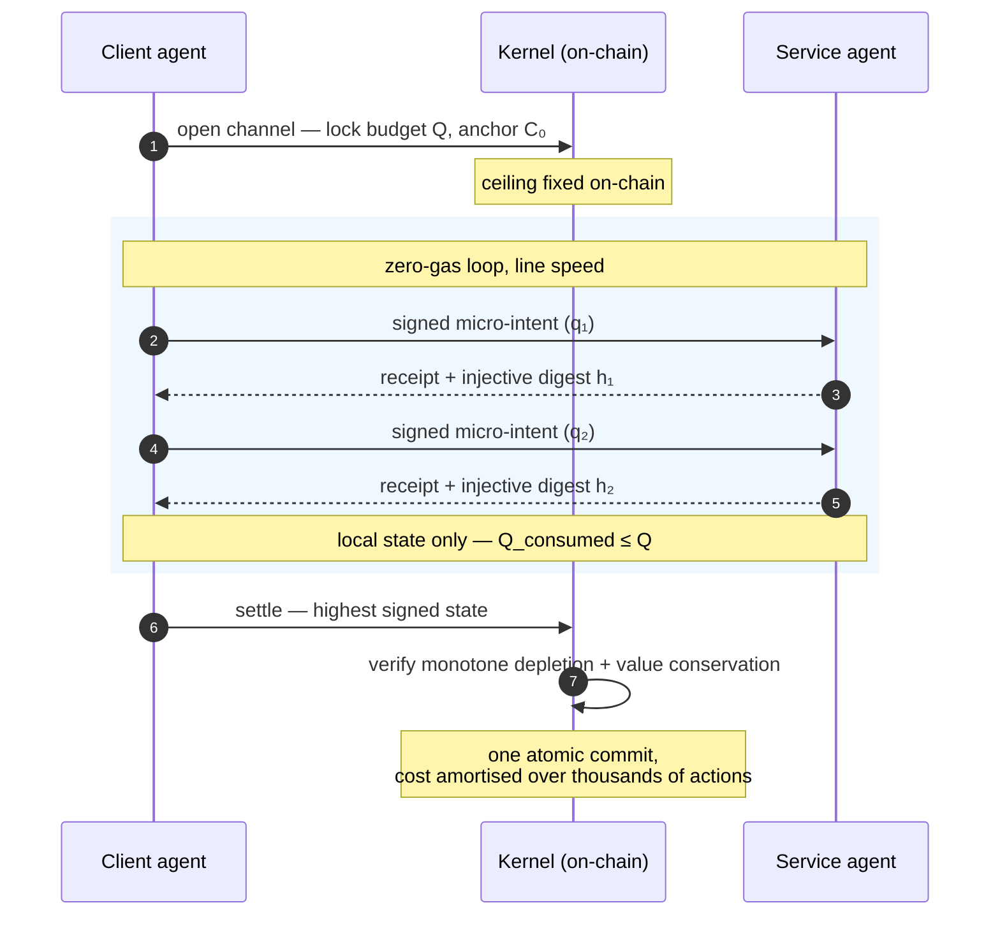

#### 7.5.1 ATCP/IP state channels

1. **Channel initialisation (on-chain).** The client deposits budget $Q$ into the licensor's ERC-6551 account via a UserOperation. `preCheck` records the channel parameters $(Q, \mathbf{C}_0, h_0, \Delta t_{\text{expiry}})$ — note the constraint vector is **anchored at open time**, so the bounds governing the whole session are fixed on chain before any off-chain activity.
2. **Off-chain micro-transactions.** For each query $k$, the client signs a scoped intent requesting $q_k$; the service executes, advances the memory digest, and returns a signed receipt. Both parties update local state without touching the chain, subject to $Q_{\text{consumed}}(k) \le Q$.

  The digest advances using the **injective encoding of (5)**:

  $$h_k = H\big(\mathrm{canon}\{\texttt{schema}, \texttt{subject}, \texttt{seq}, \texttt{class}(\delta_k), \delta_k, h_{k-1}\}\big)$$

  > This is not a restatement for tidiness. An earlier draft of this amendment advanced the channel digest by raw concatenation, $H(h_{k-1} \Vert \delta_k)$ — the exact construction (5) was revised to eliminate, and the one §3.2.5's dispute protocol depends on being injective in order to have *exactly one* valid preimage. A channel is precisely where the weaker form would be exploitable, since both parties hold partial state off chain and settlement turns on which digest is canonical.

3. **Settlement (on-chain).** Either party closes by presenting the highest-sequence state $(Q_{\text{consumed}}, h_{\text{final}}, \sigma_{\text{client}}, \sigma_{\text{service}})$. The kernel verifies monotone depletion (13) and value conservation (12) in one atomic commit, amortising verification gas across thousands of interactions.

> **What the channel does and does not weaken.** Hard invariants are enforced at open and at settle, and $Q$ is locked on chain throughout — so the *ceiling* is never off-chain. What moves off chain is the *sequencing* of consumption within that ceiling. The residual exposure is therefore bounded by $Q$ per channel, and a party that goes silent mid-session forces unilateral settlement at the last signed state rather than an unbounded loss. Channels amortise cost; they do not create an unmediated path in the §2.4 sense, because no state transition outside $(Q, \mathbf{C}_0)$ can settle.

#### 7.5.2 Declarative adapter compilation (`integrity-dsl`)

Hand-authoring gas-bounded EVM predicates that satisfy R1–R5 is a specialist skill, and requiring it would restrict the adapter market to a handful of authors. The protocol therefore specifies a compiler toolchain over a declarative manifest:

```yaml
schema: "integrity/v1alpha1"
mandate: "HighFrequencyInferenceLicensing"
constraints:
  - id: "spending_limit_24h"
    type: "monotone_depletion"
    target: "0xLicenceAccountTokenBoundAddress"
    max_rate: "5000000000"          # 5,000 USDC / 24h
  - id: "memory_continuity"
    type: "cortex_anchor_extension"
    enforce_evidence_class: ["observed_event", "policy"]
  - id: "reputation_gate"
    type: "ais_floor"
    min_score_bps: 7500             # r(iota) >= 0.75, pre-boost per (4b)
```

The toolchain compiles this deterministically into two artefacts: an **off-chain transducer** (gas-bounded WASM/Rust, satisfying R1 determinism and R2 totality, for local test suites and off-chain channel checks) and the **on-chain hook bytecode** (packed EVM, satisfying L2's per-predicate bound and R4 conservatism).

> **The compiler is inside the trust boundary.** A declarative front-end does not remove the need for verification — it *relocates* it. If the compiler emits predicates that do not faithfully implement the manifest, every adapter it produces is wrong in the same way, and R5's per-adapter attestation will not catch a systematic compiler defect. The toolchain therefore belongs in the **Trusted** tier alongside the kernel (Table 6), must be audited as such, and its output must remain independently re-derivable from the manifest — which is exactly what R1's determinism requirement makes possible. Accessibility is a real goal; it must not be purchased by moving unaudited code into the gate path.

---

## 8 The Token and the Economics

### 8.1 The velocity problem, stated exactly

A token bought solely to be spent immediately on fees has unbounded velocity, and by the equation of exchange $M = PQ/V$ its supportable market value collapses as $V \to \infty$. Any token design whose only sink is "pay for gas" has this problem, and restating it in more enthusiastic language does not solve it.

### 8.2 Bandwidth as a staked quota

The protocol's answer is to make the token a **claim on capacity rather than a consumable**. An operator does not spend ITK per verified transaction; it **stakes** ITK to hold a share of network verification throughput. With total staked $S = \sum_j s_j$ and network capacity $\Lambda$ operations per unit time:

$$\theta_i = \frac{s_i}{S}, \qquad \Lambda_i = \theta_i \Lambda \tag{22}$$

The same stake is simultaneously the collateral slashed if the adapters or validators it capitalises are shown to have mis-attested. Capacity and accountability are therefore the same deposit, which is the property that makes an attestation carry economic weight rather than being cheap talk (cf. Remark 1).

### 8.3 Revenue and its allocation

The protocol takes a micro-fee $\mu$ on verified volume:

$$R = \sum_i V_{\text{A2A},i}\,\mu_i \approx \mu\Phi, \qquad \mu = \mu_{\text{core}} + \mu_{\text{ad}} \tag{24}$$

Routing $\mu_{\text{ad}}$ directly to the author of the adapter that gated the transaction is what turns the adapter registry of Section 6 into a market. The fee split is settled **atomically within step 6** of the lifecycle — it is part of the same transaction as the gate and the meter decrement, not a separate off-chain reconciliation.

Revenue is allocated as

$$R = \underbrace{\alpha R}_{\text{stablecoin yield to stakers}} + \underbrace{\beta R}_{\text{buy-back and burn}} + \underbrace{\gamma R}_{\text{treasury, audits, insurance reserve}}, \qquad \alpha + \beta + \gamma = 1 \tag{25}$$

Yield is deliberately paid in **stablecoin rather than in ITK**. Paying yield in the protocol's own token manufactures demand that exists only to be sold, which is circular; paying in stablecoin means the yield is a claim on real fee revenue or it is nothing.

### 8.4 Limits of this model

The parameters above are illustrative, not projected. $\Phi$ (verified A2A volume) is the dominant term and is entirely adoption-dependent; nothing in this design causes adoption. The honest statement is that the mechanism converts volume into value capture *if volume materialises*, and says nothing about whether it will.

---

## 9 Security, Assurance and Residual Risk

### 9.1 Trust boundary

| Tier | Components | Requirement / failure mode |
|---|---|---|
| **Trusted** | Chain consensus and the EVM; the ERC-4337 EntryPoint singleton; the kernel contracts | Must be audited, minimal, and — once the constraint grammar stabilises — immutable. |
| **Attested** | Adapters and validators | Permissionless to author but carry stake and registry attestation (ERC-7484-style vetting), so a defect is economically punishable rather than merely regrettable. Failure mode: *wrong constraints faithfully enforced*. |
| **Untrusted** | Agent policy $\pi$; off-chain data feeds; host-side observability agents (§9.4) | Nothing in this tier needs to be trusted for Proposition 1 to hold. |

**Table 6.** Trust tiers. The design goal is to keep the Trusted tier as small as it can be made and to ensure nothing silently migrates upward.

### 9.2 Residual threats

The protocol does not eliminate the following, and says so:

- **A badly chosen $S_\mathbf{C}$.** Proposition 1 enforces the operator's declared bounds exactly, including bounds that permit catastrophe.
- **Oracle falsification.** Constraints reading external state inherit that state's integrity.
- **Off-chain exfiltration and copy.** Per §5.5, delivered plaintext cannot be recalled. Confidential-compute attestation narrows this gap; it does not close it.
- **Hook-induced denial of service.** Per §4.6, the principal operational risk.
- **Adapter defects.** Mitigated economically (stake, attestation), not eliminated.

### 9.3 Assurance programme

These are obligations, not achievements: independent audit of the kernel and reference adapters **before any mainnet value is at risk**; a public formal specification of the constraint grammar with machine-checked proofs of the invariance argument for the reference implementation; a permanent bug bounty scaled to value secured; published margin telemetry so operators can observe headroom rather than only failures; and a per-adapter attestation record that is queryable before installation, not after an incident.

### 9.4 Host-side observability (non-normative)

> **`PROPOSED NORMATIVE CHANGE` (v3.1) — new subsection.** This section exists to state a boundary precisely, because the temptation to overstate it is strong and the whitepaper's own standard forbids it.

The kernel mediates **on-chain state transitions of accounts it is installed on**. It has no visibility into, and no authority over, the host on which the agent's reasoning runs: it cannot observe a process launch, a file write, an outbound HTTP request, or the contents of a tool call. Section 5.5 concedes the sharpest form of this — delivered plaintext cannot be recalled. That blind spot is real, and it is exactly the space in which host-layer enforcement agents such as `xibalba-shield` operate: process/file/network sensors, deterministic local policy evaluation, and in-process containment.

It is tempting to present the two as a joint guarantee — the kernel covering on-chain action, the host agent covering everything else, together achieving "complete mediation" in the ordinary-language sense. **That framing is rejected here.** The two guarantees are *incomparable rather than composable*:

- The kernel's guarantee is a **mathematical invariant proven by construction** (Proposition 1), holding against an adversary who holds the signing keys.
- A host agent's guarantee is a **best-effort operational control** running as software on hardware the observed party controls. It can be killed, its probes unloaded, its evidence path silently dropped. It has no hardware root of trust and no remote attestation of its own code integrity.

Complete mediation as defined in §2.4 is stated strictly over paths by which *the account's state* can change; extending the term to host-space would break the proof it names, since Proposition 1 quantifies over on-chain actions $a_k$ only.

**Where host-side agents legitimately contribute:**

1. **Evidence production.** Signed, timestamped decision records feed element 3 of §5.5 ("make the ledger the evidence") and are genuinely useful for incident forensics and compliance narrative.
2. **Fast local containment.** Sub-second process containment is a real operational control, and it is faster than any on-chain mechanism can be. It is simply not a *guarantee*.
3. **An informational signal an adapter MAY read** — never one a hard constraint may rely on.

**Where they must not be placed, and why:**

- **Not an assurance tier.** Table 2's assurance-tier row and §5.5 element 2 are satisfied by a TEE whose attestation is verified on chain. Host software attesting about *itself* is not equivalent: its failure mode is "the attester lies about itself or is silently disabled," which is categorically different from the Attested tier's "wrong constraints faithfully enforced." An operator incentivised to exfiltrate controls the very sensor meant to prevent it.
- **Not the meter.** Equation (13)'s integrity derives precisely from $q$ living in the licence's own token-bound account and *not* depending on an off-chain reporter's honesty. Making a host agent the trusted reporter for $c_k$ reintroduces the assumption the on-chain design exists to remove.
- **Not part of the guarantee.** Host agents belong in the **Untrusted** tier of Table 6 — which is not a demotion but a correct classification, and it is the tier about which the paper says nothing needs to be trusted for the guarantee to hold.

A final honesty note specific to any deployment making such claims: an "attested host agent" constraint would attest to coverage that must actually exist. Where a host agent's own documentation records sensors that are blocked, unimplemented on some platforms, or whose evidence export is best-effort and asynchronous, a licence condition gated on its attestation can be satisfied by stale or absent evidence without the chain ever knowing. Claim the evidence value; do not claim the guarantee.

**What would have to change for a host agent to graduate.** The classification above is a statement about the current construction, not a permanent verdict. A host agent moves from *Untrusted* to *Attested* when — and only when — its self-report stops being self-attesting. Concretely, four things must hold simultaneously:

1. **A hardware root of trust.** The agent's policy evaluation runs inside a TEE (or equivalent), so the attestation is over measured code rather than over the agent's own assertion about itself. This is the difference §5.5 element 2 already relies on.
2. **Remote attestation of code integrity**, verified on chain as a constraint — the same pattern as the assurance multiplier of §3.1.2: a prior transaction establishes a verified flag with an expiry, and the gate reads the flag rather than re-verifying anything.
3. **Freshness with expiry, not presence.** A constraint reading "attestation exists" is satisfiable by a stale record. It must read "attestation newer than $\tau$," exactly as Table 2's licensee-identity row already specifies.
4. **Complete, honest sensor coverage** for the actions the licence condition claims to constrain — with any gaps published rather than implied closed.

Until all four hold, the correct posture is the one stated above: a host agent is a valuable evidence producer and a fast local control, and it is not part of the guarantee. Stating this plainly is not a weakness of the design; a verification layer that oversells its guarantee is worse than none, and that standard applies to this paper's own components before it applies to anyone else's.

### 9.5 Case study: hybrid containment and the exfiltration surface

> **`PROPOSED NORMATIVE CHANGE` (v3.2) — new subsection.** §5.5 states a physical limit: once plaintext has been delivered, no contract can un-deliver it. §9.4 classifies ordinary host software as Untrusted because it runs on hardware the observed party controls. This case study shows what changes when the host layer has a *hardware* root of trust — and states precisely what that does and does not buy.

**Scenario.** An agent consumes a licensed financial dataset. Terms: metered per query, requires a live identity above a reputation tier, prohibits copying data to external servers.

**Failure mode 1 — host-only control (A4).** The agent relies on an off-chain monitor. An adversary exfiltrates the session key, signs directly against the licence account from their own machine, and drains the dataset. The host monitor never sees the transaction, because the transaction never went through the host.

**Failure mode 2 — chain-only control (A1).** Execution is fully mediated by the kernel. Payment is conserved (12), the meter depletes correctly (13). But the agent's model is compromised by injection: it dutifully pays, receives plaintext, and POSTs it to the attacker. The kernel cannot prevent off-chain data movement — it has no visibility there, by construction.

> **In plain terms.** Two failure modes, each fatal on its own, and each covered by the other.
>
> If you only guard the *host*, an attacker who steals the key just signs from their own laptop — your monitor never sees it, because the transaction never went near your machine.
>
> If you only guard the *chain*, the agent pays correctly, receives the data legitimately, and then — because it's been prompt-injected — emails the data to the attacker. The chain has no idea; nothing on-chain was violated.
>
> Put both in place and each closes the other's hole: stealing the key is useless without the hardware attestation, and injecting the agent is useless when the enclave physically blocks the outbound connection. What this is **not** is "complete mediation" in the formal sense — it's two strong controls over two different surfaces, which is an engineering result, not a theorem.

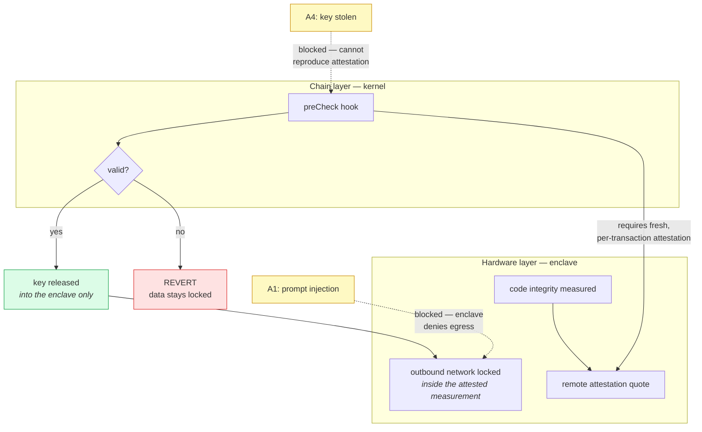

**The hybrid configuration.** Run the agent inside an attested enclave whose outbound network is locked, and make the enclave's remote attestation a **hard constraint** the hook reads. Then: the kernel enforces authorisation, payment, meter and memory continuity; the enclave enforces data containment. Key leak alone no longer suffices, because the adversary must also reproduce a valid attestation; injection alone no longer suffices, because the enclave blocks the outbound path.

> **What this achieves, stated precisely.** This is **joint coverage of two distinct attack surfaces, not "complete mediation achieved."** Complete mediation is defined in §2.4 strictly over the execution paths by which *the account's state* can change, and Proposition 1 quantifies over on-chain actions $a_k$; neither statement extends to host space, and redefining the term to span both would make the proof cite a hypothesis it does not have. The honest formulation: the kernel supplies a *proof* over on-chain transitions; the enclave supplies a *hardware-enforced control* over data egress. Both are strong. They remain different kinds of claim, and the composition is an engineering result rather than a theorem.

Three conditions are load-bearing and easy to omit:

1. **Attestation must be per-transaction and freshness-bound.** A constraint reading "a valid attestation exists" is satisfiable by replaying an old quote. The constraint must bind the attestation to *this* operation and require recency, exactly as Table 2's licensee-identity row requires freshness rather than presence.
2. **Enclave guarantees are not unconditional.** Production TEEs have published side-channel, rollback, and microarchitectural attacks; §9.2 already concedes that confidential compute "narrows the gap; it does not close it." A licence relying on enclave containment inherits that residual risk and should price it rather than assume it away.
3. **The enclave's network lock must be part of the attested measurement**, not a runtime configuration the operator can change after attestation. Otherwise the attestation proves the code was genuine while the egress policy was not.

With those three in place the hybrid configuration is the strongest available answer to the exfiltration surface, and it is the configuration §5.5 element 2 and Table 2's assurance-tier row were written to accommodate. Without them it is a stronger-sounding version of the self-attestation §9.4 rejects.

---

## 10 Why Build On It

> **In plain terms.** The preceding nine sections argue the protocol is *sound*. This one argues it's *worth building on* — which is a different question, and the one that actually determines whether any of it matters. Three audiences, three different reasons, and one honest account of what would have to go right.

### 10.1 For developers: the extension surface is the product

The kernel is small and fixed; the adapter surface is where the work — and the fee revenue — lives. A developer who understands a policy domain can publish an adapter without protocol permission, earn $\mu_{\text{ad}}$ whenever it gates a transaction, and rely on Proposition 2 to guarantee that installing it alongside others cannot weaken anyone's safety.

**Why this is a better business than building a compliance SaaS.** A conventional compliance product must be trusted by the party it constrains, sold to each customer individually, and re-audited per deployment. An adapter is different in three ways that compound:

- **It is verifiable rather than trusted.** R1's determinism means anyone — a customer, an auditor, a regulator — can re-derive the constraint set from the published manifest and confirm the adapter does what it claims. You are not asking to be believed.
- **It earns per use, not per contract.** Fee routing (§8.3) pays the author whenever the adapter gates a transaction, on any account, anywhere. Distribution is the registry, not your sales team.
- **It cannot be undercut on safety.** Proposition 2 guarantees that composing your adapter with a competitor's can only tighten the admissible set. There is no race to the bottom available, because a laxer adapter does not *replace* a stricter one — installing both yields the intersection.

**What a developer actually writes.** The declarative path (§7.5.2) is the intended entry point: a typed manifest, compiled deterministically into both an off-chain transducer and on-chain hook bytecode. No EVM assembly, no cryptography. What a developer must still supply is the thing they're uniquely qualified for — *knowing what the rule should be.* The protocol handles enforcement; domain expertise remains scarce and is what gets paid.

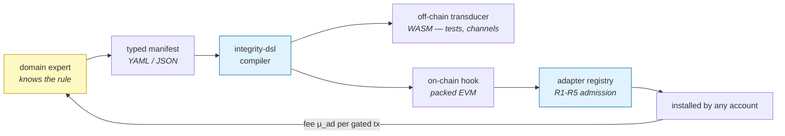

### 10.2 For allocators: what is actually being underwritten

The asset is not a token narrative; it is a **position in the enforcement layer of agent commerce**, and it should be evaluated as infrastructure with a metered toll.

**The demand thesis in one line:** institutional capital cannot deploy autonomous agents at scale while a single hallucination or injected instruction can produce an unbounded loss — so *something* must supply bounded failure, and whatever does becomes load-bearing for the whole category.

**What would have to be true for this to be valuable:**

| Claim | Status | How you'd falsify it |
|---|---|---|
| Agents will hold and move real value autonomously | Already happening, small scale | Watch agent-controlled AUM; if it plateaus, the category is smaller than claimed |
| Existing layers don't prevent losses | Demonstrated (§1.2 audit) | A reputation or guardrail approach that empirically prevents a class of loss |
| Enforcement must be in the execution path | Argued formally (§2.4, §4.3) | Any adjacent-to-path design achieving the same bound — we know of none |
| Institutions will require it before scaling | **Unproven** | Talk to risk officers; if they'd fund unbounded agents, the thesis fails |
| Fee revenue can exceed verification cost | **Unproven** (Phase IV gate) | $\rho \le 1$ at realistic volume |

The bottom two rows are the honest exposure. The first three are defensible today; the last two are adoption bets, and no amount of cryptographic rigor substitutes for them.

**What the token does, stated without embellishment.** ITK is a staked claim on verification capacity (§8.2), and the *same* stake is the collateral slashed for mis-attestation and for availability default (§3.2.5). Capacity and accountability are one deposit. Yield is paid in stablecoin from actual fees, never in ITK, because paying yield in your own token manufactures demand that exists only to be sold. The velocity problem (§8.1) is addressed by making the token a claim rather than a consumable — but note the honest limit in §8.4: nothing in this design *causes* the volume $\Phi$ that the whole model depends on.

**Where the risk actually concentrates.** Not in the mathematics — Propositions 1–3 are elementary and hold. It concentrates in four places, each already named in this paper rather than discovered later: a badly chosen constraint set enforced perfectly (§4.3); a hook defect denying service to the accounts it protects (§4.6); the AIS oracle's centralisation until Phase II (§3.1.5); and adapter defects that are economically punished but not prevented (§9.2). An allocator should ask how each is mitigated, and be suspicious of any answer that sounds complete.

### 10.3 Phased rollout

Each phase is gated on **evidence rather than elapsed time**, which is the only honest way to sequence infrastructure whose value depends on adoption it does not control.

| Phase | Scope | Gate to next phase |
|---|---|---|
| **I. Kernel** | Hook module, constraint grammar, reference adapters, testnet deployment, published formal specification. | Independent audit complete; invariance argument machine-checked for the reference implementation. |
| **II. Metered IP** | ERC-6551 licence accounts with live consumption ledgers; ATCP/IP intent format; settlement integration. | Sustained real licensing volume from counterparties who are not the protocol's own contributors. |
| **III. Registry** | Permissionless adapter publication, attestation, stake and slashing; $\mu_{\text{ad}}$ revenue routing. | Adapters authored by third-party institutions exceed those authored in-house. |
| **IV. Economy** | Staked bandwidth quotas, paymaster at scale, stablecoin yield distribution, buy-back and burn per (25). | Fee revenue covers verification cost and validator capital without subsidy — i.e. $\rho > 1$ realised, not projected. |

**Table 8.** Phased rollout. The Phase IV gate is the one that matters: a verification network that cannot pay for its own sorting is not yet a network.

```mermaid
flowchart LR
    P1["<b>I. Kernel</b><br/>hook, grammar,<br/>reference adapters"]
    P2["<b>II. Metered IP</b><br/>ERC-6551 licences,<br/>live meters"]
    P3["<b>III. Registry</b><br/>permissionless adapters,<br/>stake + slashing"]
    P4["<b>IV. Economy</b><br/>bandwidth quotas,<br/>paymaster at scale"]

    P1 -->|"gate: independent audit +<br/>machine-checked invariance"| P2
    P2 -->|"gate: real third-party<br/>licensing volume"| P3
    P3 -->|"gate: external adapters<br/>outnumber in-house"| P4
    P4 -->|"gate: ρ &gt; 1 realised"| DONE(["self-funding<br/>verification network"])

    classDef now fill:#e0f2fe,stroke:#0369a1,stroke-width:2px
    classDef future fill:#f8fafc,stroke:#94a3b8,stroke-dasharray:4 3
    class P1 now
    class P2,P3,P4,DONE future
```

> **In plain terms.** Each arrow is a gate that requires *evidence*, not a date. The dashed boxes are not scheduled — they are conditional on the previous gate actually being met. This is deliberate and slightly against genre: roadmaps normally promise timelines. A protocol whose value depends on adoption it does not control cannot honestly promise a timeline, and §1.2's central evidence is what happens when someone specifies infrastructure that never ships.
>
> Note also what Phase I's gate costs: an independent audit before any mainnet value is at risk. That is a real financial precondition, not a formality, and it should be visible in any plan built on this document.

#### 10.3.1 What adoption actually requires of an integrator

For a team already using a smart account, the honest answer is three steps and no asset migration (§7.4). Stated as the sequence a developer experiences:

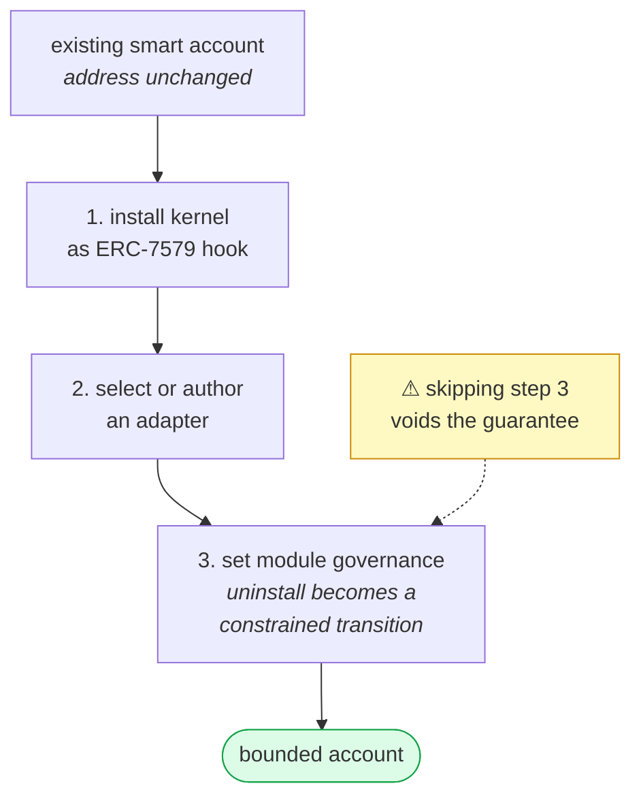

Step 3 is the one integrators will be tempted to skip, and it is the one that cannot be skipped. An enforcement layer the constrained party can simply uninstall provides no guarantee at all (§2.4(iii)) — so if module governance is left open, the deployment has the *appearance* of containment without the property. For a team currently holding assets in a plain EOA, the migration to a smart account is the only material lift, and it is the same migration they would perform for any account-abstraction benefit.

### 10.4 The enabler paradigm: containment as a precondition for velocity

> **`PROPOSED NORMATIVE CHANGE` (v3.2) — new subsection.** The protocol is routinely read as a restraint that slows autonomous systems down. That reading inverts the relationship between risk control and operational velocity, and correcting it matters commercially as much as technically.

Racecars do not carry high-performance brakes in order to go slowly. They carry them so the driver can approach the vehicle's mechanical limit without the first mistake being terminal. The analogue is exact: institutional capital cannot deploy agents into mission-critical positions when a single inference error or injected instruction produces unbounded balance drainage, a regulatory breach, or trade-secret loss. **The absence of a bound is not freedom; it is the reason the budget stays small.**

By placing a verification kernel inside the account, the protocol supplies a mathematical guarantee of *bounded failure*. An operator can then raise autonomy, budget and execution rate deliberately, knowing the reachable state set stays inside the declared constraint vector. Containment is what converts a sandboxed prototype into a production deployment — the guardrails are what *allow* the integration, not what limit it.

#### 10.4.1 Cross-domain modularity

The kernel hardcodes no regulatory framework. It exposes a domain-agnostic constraint grammar, and vertical mandates are expressed as adapters (§6) — compiled declaratively where possible (§7.5.2). Three verticals, with the mechanisms each actually composes:

**Healthcare and clinical data (HIPAA/GDPR).** Mandate: prevent unauthorised record exposure and maintain chain of custody for diagnostic inferences. Composition: enclave attestation as a hard constraint (§9.5) so decryption keys are released only into an attested, egress-locked environment; memory continuity (§5.4) so the audit trail cannot fork; and typed evidence classes (§3.2) so a diagnostic *inference* is never recorded with the standing of an *observed event* — which is precisely what post-market review needs to distinguish. Redact-before-commit (§3.2.2) is what reconciles the audit trail with a right of erasure.

**Quantitative finance and treasury (SEC/FINRA/MiCA).** Mandate: bound drawdown, enforce exposure limits, eliminate unauthorised drainage. Composition: value conservation (12) and exposure predicates as **hard** invariants (never soft, per G1); and grace modes (§4.7) for the case that matters most in this vertical — telemetry degrading during volatility, where a uniform fail-closed gate would block the very rebalancing or liquidation that reduces risk. Bounds contract to the floor and large actions route to a co-signed queue rather than the agent simply going dark.

**Intellectual property and autonomous media.** Mandate: automate royalties, meter consumption, prevent unlicensed derivative training. Composition: ERC-6551 licence accounts holding their own balance and meter (§5.2), monotone depletion (13) per query, atomic royalty settlement (Table 2), and — for high-frequency inference licensing — state channels (§7.5.1) so per-query metering is economically viable rather than gas-dominated.

> **The honest limit on this section.** Naming a vertical is not the same as having an adapter for it, and none of these adapters exist yet. What the architecture supplies is the *grammar* and the guarantee that composition cannot weaken safety (Proposition 2); what a vertical still requires is a domain expert to author the mandate and an audit to attest it (R5). The claim is that the protocol makes those adapters possible and economically motivated — not that regulatory compliance is a solved problem once the kernel is installed.

---

## Appendix A — Reference hook module (illustrative)

> Pedagogical reference. **Not audited. Not deployment-ready.** Conformance must be taken from the ERC-7579 specification's `IERC7579Hook` interface, not from this listing.

```solidity
// SPDX-License-Identifier: MIT
pragma solidity ^0.8.24;

/// @title IPLicensingHook
/// @notice Illustrative ERC-7579 hook (module type 4) implementing the
/// verification functional V(a | x, C) of Section 4. Constraints are
/// conjunctive: any violated constraint reverts the whole transaction,
/// so the inadmissible post-state is never entered.
contract IPLicensingHook {
    uint256 internal constant MODULE_TYPE_HOOK = 4;

    /// @dev Per-licence bounds, packed to keep the gate path within Table 4's budget.
    struct Bounds {
        uint128 cycleBudget;      // Q: total licensed compute units
        uint128 consumed;         // Q - q_k: monotone, never decremented
        uint64  maxPerCall;       // magnitude bound (defeats hallucinated size)
        uint64  expiry;           // licence validity horizon
        uint32  minReputationBps; // c_i(iota) lower gate, in basis points
    }

    mapping(address account => mapping(bytes32 licenceId => Bounds)) internal _bounds;

    /// @dev Snapshot taken in preCheck, re-verified in postCheck, so value
    /// conservation (12) is checked against the actual outcome, not the intent.
    mapping(address account => uint256 balanceSnapshot) internal _snapshot;

    error ConstraintViolated(uint8 index);
    error LicenceExpired();
    error ValueNotConserved();
    error MemoryHeadDiverged();

    function isModuleType(uint256 typeId) external pure returns (bool) {
        return typeId == MODULE_TYPE_HOOK;
    }

    function onInstall(bytes calldata data) external { /* decode initial bounds */ }
    function onUninstall(bytes calldata) external { /* governed, timelocked — see L4 */ }

    function preCheck(address sender, uint256 value, bytes calldata callData)
        external
        returns (bytes memory hookData)
    {
        (bytes32 licenceId, uint256 requestedCycles, uint32 reputationBps, bytes32 memoryHead)
            = abi.decode(callData[4:], (bytes32, uint256, uint32, bytes32));

        Bounds storage b = _bounds[msg.sender][licenceId];

        // g_1: licence must be live.
        if (block.timestamp > b.expiry) revert LicenceExpired();

        // g_2: per-call magnitude bound.
        if (requestedCycles > b.maxPerCall) revert ConstraintViolated(2);

        // g_3: monotone depletion — projected post-state must not go negative.
        if (b.consumed + requestedCycles > b.cycleBudget) revert ConstraintViolated(3);

        // g_4: reputation parameterises the bound but never releases it (eq. 4).
        if (reputationBps < b.minReputationBps) revert ConstraintViolated(4);

        // g_5 (v3.1): memory continuity — submitted head must extend anchored head.
        if (!_extendsAnchoredHead(msg.sender, licenceId, memoryHead)) revert MemoryHeadDiverged();

        _snapshot[msg.sender] = address(msg.sender).balance;
        b.consumed += uint128(requestedCycles); // monotone by construction

        return abi.encode(licenceId, value);
    }

    function postCheck(bytes calldata hookData) external {
        (, uint256 declaredValue) = abi.decode(hookData, (bytes32, uint256));
        uint256 before = _snapshot[msg.sender];
        uint256 nowBal = address(msg.sender).balance;

        // eq. 12: outflow must equal the declared, constrained amount.
        if (before - nowBal > declaredValue) revert ValueNotConserved();

        delete _snapshot[msg.sender];
    }

    function _extendsAnchoredHead(address, bytes32, bytes32) internal pure returns (bool) {
        // NON-CONFORMING PSEUDOCODE: the continuity verifier is not implemented.
        // A real implementation must resolve the subject/profile-specific anchored
        // head, validate the proposed proof, and revert on divergence.
        revert NotImplemented("memory continuity verifier");
    }
}
```

## Appendix B — Canonical encoding and receipt verification (illustrative)

> Pedagogical reference. **Not audited.** The length-prefixed construction below is the injective encoding required by both (5) and (14).

```python
"""
Canonical encoding and receipt verification for the Integrity Protocol.

The domain separator of eq. (14) must be unambiguous. Naive string
concatenation is not: the fields ("ab", "c") and ("a", "bc") collide under
"|".join, which lets an adversary re-target an intent across licences or
chains while producing an identical digest. Length-prefixed encoding removes
the ambiguity, which is why it is specified rather than left to the integrator.
"""

from __future__ import annotations

import hashlib
from dataclasses import dataclass

import ecdsa

DOMAIN_TAG = b"IntegrityProtocol-v1"


@dataclass(frozen=True)
class Intent:
    """A scoped, single-domain, single-use request to consume licensed IP."""
    chain_id: int    # EIP-155 chain identifier
    verifier: str    # address of the kernel instance (contract binding)
    agent: str       # stable subject identifier from the selected Integrity identity profile
    ip_asset: str    # ERC-6551 account address holding the licence
    cycles: int      # requested compute units
    nonce: int       # strictly monotone within (chain_id, verifier, agent)


def _field(raw: bytes) -> bytes:
    """Length-prefixed field: 4-byte big-endian length, then payload.

    Prefixing makes the encoding injective, so distinct field tuples cannot
    produce identical byte strings — the property eq. (14) depends on.
    """
    return len(raw).to_bytes(4, "big") + raw


def canonical_digest(intent: Intent) -> bytes:
    """Deterministic 32-byte digest binding chain, contract, agent, asset,
    magnitude and nonce. Any change to any field changes the digest."""
    packet = b"".join([
        _field(DOMAIN_TAG),
        _field(intent.chain_id.to_bytes(8, "big")),
        _field(bytes.fromhex(intent.verifier.removeprefix("0x"))),
        _field(intent.agent.encode("utf-8")),
        _field(bytes.fromhex(intent.ip_asset.removeprefix("0x"))),
        _field(intent.cycles.to_bytes(32, "big")),
        _field(intent.nonce.to_bytes(32, "big")),
    ])
    return hashlib.sha256(packet).digest()


def verify_receipt(pubkey_hex: str, intent: Intent, signature_hex: str) -> bool:
    """Verify `signature_hex` against the canonical digest of `intent`.

    This establishes AUTHENTICITY only — that the intent came from the holder
    of the key. Whether the resulting state transition is PERMITTED is decided
    separately, by the on-chain gate (Section 4). Conflating the two is the
    failure mode this protocol exists to correct.
    """
    try:
        vk = ecdsa.VerifyingKey.from_string(
            bytes.fromhex(pubkey_hex), curve=ecdsa.SECP256k1
        )
        return vk.verify_digest(bytes.fromhex(signature_hex), canonical_digest(intent))
    except (ecdsa.BadSignatureError, ValueError, TypeError):
        return False
```

## Appendix C — Notation

| Symbol | Meaning |
|---|---|
| $X$, $U$ | state space / action set |
| $x_k$, $a_k$ | account state / proposed action at step $k$ |
| $T(x,a)$ | EVM transition function |
| $\mathbf{C} = (g_1,\ldots,g_m)$ | constraint vector |
| $S_\mathbf{C}$ | admissible set |
| $V(a \mid x, \mathbf{C})$ | verification functional (10) |
| $\Theta(\cdot)$ | Heaviside step function |
| $\iota$, $r(\iota)$ | agent identity / attested reputation $\in [0,1]$, computed as AIS (§3.1.1) |
| $S_{\text{entropy}}, S_{\text{grounding}}, S_{\text{sacrifice}}, S_{\text{compliance}}$ | AIS components *(v3.1)* |
| $w_E, w_G, w_S, w_C$ | AIS component weights, $\sum = 1$ *(v3.1)* |
| $Z$ | assurance multiplier (ZK attestation live) *(v3.1)* |
| $\omega_k$, $h_k$ | durable memory / its commitment |
| $\mathrm{class}(\delta_k)$ | evidence class of increment $k$ *(v3.1)* |
| $\Sigma(\iota)$ | agent's owned-account state subtree |
| $q_k$, $Q$ | remaining / initial metered licence budget |
| $\nu_k$, $d^\star$ | replay nonce / canonical domain separator |
| $\rho$ | verification efficiency ratio (value secured per unit verification cost) |
| $\Phi$ | annual verified A2A volume |
| $\mu$, $R$ | protocol fee rate / revenue |
| $\alpha, \beta, \gamma$ | revenue split (yield / burn / treasury) |
| $\theta_i$, $\Lambda$ | operator $i$'s bandwidth share / total network verification capacity |

---

## Appendix D — Proposed changes from v3.0

| # | Section | Change | Justification |
|---|---|---|---|
| 1 | §3.2 (5) | Commitment uses an injective canonical encoding, not `∥` concatenation; digest binds schema, subject, seq, class | v3.0 contradicted its own §4.4 warning about concatenation as an attack surface; the reference implementation had already corrected this |
| 2 | §3.2 | Increments carry a typed **evidence class** | The forensic-replay claim is unsupportable if a model inference commits with the same standing as an observed event |
| 3 | §3.2.1 | Storage stated as an **availability obligation** (produce on demand within a challenge window; failure rules against the withholder) rather than a mandated mechanism (IPFS/Arweave/Filecoin) | Nothing the kernel reads on-chain touches the payload; forensic replay needs availability, not publicity. Deliberately does *not* dissolve §3.4's withholding concern — it makes withholding adjudicable |
| 4 | §3.2.2 | New: **retraction under append-only** specified as redact-before-commit, with supersession for already-committed increments | v3.0 was silent; "append-only" and "delete on request" cannot both be satisfied post-hoc |
| 5 | §5.4 / Table 2 | New **memory-continuity constraint** row: submitted head must extend anchored head | $H_I$ was declared in (16) and anchored at step 8 but never read by any constraint — the commitment was decorative, and fork resistance depended on it |
| 6 | §9.4 | New: **host-side observability** placed explicitly in the Untrusted tier; joint-guarantee framing rejected | Prevents an overclaim the paper's own §9 standard forbids |
| 6a | §3.1.1–3.1.4 | New: **AIS specified as the source of $r(\iota)$**, and **redefined** as a *gated* weighted geometric mean over *admissible* evidence — requirements N1–N5, evidence-admissibility rule, per-component floors with a conjunctive $\Theta$ gate, corrected fail-closed defaults, honest four-conditions mapping, and an implementation-delta table | v3.0's central unresolved tension: §1.2 demolishes deployed reputation, then (4) consumes $r(\iota)$ without specifying where a trustworthy one comes from. Numerical evaluation of the reference implementation then showed the bare mean violates non-compensability (90% violation rate → $r = 0.631$) and that missing-data defaults inverted the incentive (content-free submission claiming 100 GPU-hours → $r = 0.923$ vs. an honest agent's $0.465$). The gate and the admissibility rule fix both |
| 6b | §4 (4b) | $r(\iota)$ normalised from the **pre-boost** score, clamped to $[0,1]$; assurance multiplier kept strictly outside reputation | The implementation's reported score is post-boost and unclamped to 1150; normalising it would yield $r > 1$ and push $c_i(\iota)$ *above* $c_i^{\max}$, destroying (4)'s ceiling and re-opening A3 |
| 7 | §2.4 | Implementation note on ungated legacy execution paths | Complete mediation is binary; an account with any ungated path is non-compliant, not partially compliant |
| 7a | §3.1 | Identity restated as an **Integrity interface obligation** satisfiable by a versioned local read profile over a durable registry; the profile is explicitly not ERC-8004/ERC-721 compatible, its interoperability losses are named, and native convergence is deferred | Avoids false selector-level compatibility and a second reputation authority while preserving the durable identity properties the kernel actually consumes. An earlier no-deployment claim about Validation was corrected after direct review found deployed proxy bytecode. |
| 8 | §3.2.3 (6) | Symbol corrected to $c_c$ (compute) for consistency with the text | Editorial. *Note: the v3.2 amendment register described this change as "corrected to κ"; the source text and this document both use $c_c$, so $c_c$ is retained and the register entry is the error.* |
| 9 | §1.5 | New: **comparative architecture** — five competing safety dogmas, each mapped to the adversary class it cannot address | Skepticism is almost always attachment to one of five paradigms; naming the unstated assumption in each is more persuasive than asserting the kernel's merits, and the adversary-class mapping shows the failures are categorical rather than incremental |
| 10 | §3.1.5 | New: **decentralising the telemetry prover** — Phase I server-side recomputation, Phase II federated $M$-of-$N$ consortium; ZK-telemetry marked as **research horizon, not a roadmap phase** | §3.1.3 places the AIS oracle in the Trusted tier; Phase II is what honestly moves it to Attested. Phase III was demoted deliberately: proving LLM prompt adherence in ZK is far outside current feasibility, and specifying an infeasible hard-assurance tier would reproduce exactly the ERC-8004 failure §1.2 uses as its strongest evidence |
| 11 | §3.2.5 | New: **DA-Escrow and deterministic slashing** — availability stake $S_{DA}$, challenge/production protocol, revocation + liquidated damages + burn; capital-cost tension with §7.2 stated explicitly | §3.2.1's availability obligation is economically hollow against an adversary who has already extracted value and will abandon the account. Injectivity of (5) is what makes the preimage check decidable |
| 12 | §4.7 | New: **circuit-breaker grace modes** — hard/soft constraint partition, grace functional (11b), two-tier routing, **Proposition 3** (monotone safety under contraction), adapter rules G1–G3 | Uniform fail-closed is a self-inflicted DoS that can block *risk-reducing* actions. Grace contracts bounds instead of reverting, and Proposition 3 shows the reachable set only ever shrinks, so Proposition 1 survives unconditionally |
| 12a | §4.7.2 | Precedence rule: **AIS floors govern; grace moves only within them** — never below $b_i^{\min}$, never above $b_i(\iota)$ | Grace and N2 both respond to telemetry problems on different curves; without an explicit precedence they double-apply or contradict. One authority per quantity |
| 12b | §4.7.3 | Staging buffer bounded: hard invariants evaluated at settlement, and release capped at the bound in force when staged | A multisig-releasable buffer is a privileged path, and §2.4(iii) is where guarantees die. Staging must defer a decision without expanding authority |
| 13 | §7.5 | New: **ATCP/IP state channels** and **`integrity-dsl`** declarative adapter compilation; compiler placed in the **Trusted** tier | Per-query on-chain metering is gas-prohibitive above ~10 Hz. Channel digests use the injective encoding of (5) — an earlier draft advanced them by raw concatenation, the exact construction (5) exists to eliminate and which §3.2.5's dispute protocol requires to be injective |
| 14 | §9.5 | New: **hybrid containment case study** (kernel + attested enclave), framed as **joint coverage of two attack surfaces, not "complete mediation achieved"**; three load-bearing conditions named | Complete mediation is defined over account-state paths and Proposition 1 quantifies over on-chain actions; extending the term to host space would make the proof cite a hypothesis it lacks. Attestation must be per-transaction and freshness-bound, enclave guarantees are not unconditional (§9.2), and the egress lock must be inside the attested measurement |
| 15 | §10.4 | New: **enabler paradigm** — containment as a precondition for velocity, plus cross-domain adapter composition for healthcare, finance and IP | Corrects the reading of the protocol as a restraint. Includes an explicit limit: naming a vertical is not having an adapter for it, and none exist yet |
