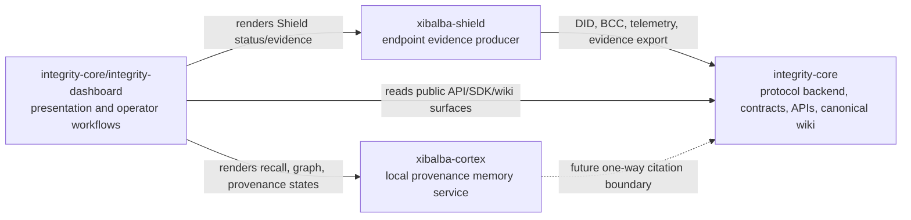

# Repository Implementation Plans

**Corrected 2026-08-12:** the "Integrity MVP" section below documents the standalone
`integrity-mvp` repository's implementation history, from when it was the active presentation
layer. That repository is now stale/superseded — `integrity-dashboard/` (inside `integrity-core`)
is the actively developed presentation layer today. The section is left as recorded history, not
rewritten; treat any status claim in it as historical, not current.

This page is the cross-repository implementation and specification ledger for the Integrity Protocol product stack. It summarizes the root `IMPLEMENTATION_PLAN.md` and `SPECIFICATION.md` files that now exist in each project root:

- `integrity-core/IMPLEMENTATION_PLAN.md` and `integrity-core/SPECIFICATION.md`
- `integrity-core/integrity-dashboard/IMPLEMENTATION_PLAN.md` and `integrity-core/integrity-dashboard/SPECIFICATION.md` (formerly tracked in the now-superseded standalone `integrity-mvp` repository, see note above)
- `xibalba-shield/IMPLEMENTATION_PLAN.md` and `xibalba-shield/SPECIFICATION.md`
- `xibalba-cortex/IMPLEMENTATION_PLAN.md` and `xibalba-cortex/SPECIFICATION.md`

The root implementation plans and root specifications are the repo-local implementation/specification source of truth. The permanent audit ledger at `/home/xibalba/Documents/INTEGRITY — Cross-Repository Audit and Implementation Plan.md` and the repo-local `docs/audits/2026-08-06*.md` files provide the current verification evidence. This wiki page is the canonical cross-repo map used to see dependency direction, closed work, open work, and blockers in one place.

## Table of contents

- [Dependency order](#dependency-order)
- [Audit evidence boundary](#audit-evidence-boundary)
- [integrity-core](#integrity-core)
- [Integrity MVP](#integrity-mvp)
- [Xibalba Shield](#xibalba-shield)
- [Xibalba Cortex](#xibalba-cortex)
- [Cross-repository task list](#cross-repository-task-list)
- [Update rule](#update-rule)

## Dependency order

integrity-core remains the protocol authority. Shield and graph memory do not become dependencies of integrity-core unless a public interface explicitly adds that boundary. The MVP is a consumer and presentation layer.

## Audit evidence boundary

- `DONE` means implemented and verified by the audit's cited command, direct read, or deployment evidence.
- `PARTIAL` means some implementation exists, but the required scope or control is incomplete.
- `PLANNED` means specified or designed with no verified implementation found.
- `BLOCKED` means required work exists but depends on a documented environment, dependency, or decision.
- `UNVERIFIED` and `REQUIRES REVIEW` claims must not be promoted to production status.
- Dirty worktree evidence and clean default-branch evidence stay labeled separately until reviewed.

## integrity-core

**Role:** Protocol trust backend: contracts, SDK, CLI, BCC middleware, Oracle/AIS, user API, dashboard, ZKP, canonical wiki, and protocol specs.

**Specification authority:** `spec/integrity-protocol-v0.4.md` is accepted normative authority. `spec/integrity-protocol-v0.5-proposed.md` is a proposed, non-authoritative delta. `spec/integrity-protocol-v3.2.md` is explanatory/non-normative. Current implementation evidence is maintained by `README.md`, `SPECIFICATION.md`, `PRODUCTION_GAPS.md`, `docs/INTERFACE_CONTRACT.md`, `docs/MAINNET_READINESS.md`, `HANDOFF.md`, and `docs/wiki/`.

**Audit checkpoint (2026-08-17):** Phase 0 is locally complete. The Foundry suite passes 209/209; `IntegrityIdentityReadV1` passes its 10 focused tests; the local generated verifier has real-proof negative-control coverage; and package Continuous Integration includes dashboard build/lint rather than a nonexistent unit-test script. Base Sepolia still lacks the identity facade and retains the older fail-closed verifier, so source capability is not deployed capability.

**Session evidence checkpoint (2026-08-19, partial):** The queued Hermes session made material progress but did not close the next security-sensitive phase. Main Continuous Integration was reported green across all eight package jobs, but the local Phase I contract slice remained incomplete: constructor-call updates and post-change contract verification were still outstanding, compilation was expected to remain red, and no deployment was performed. The session also restored a healthy Open Policy Agent (OPA) service, then isolated the remaining Behavioral Commitment Chain (BCC) boundary failure as a missing `intent_rationale` in the Hermes dispatch envelope; policy reachability is therefore distinct from host-tool dispatch evidence. The external-runtime review adapter passed local validation, while its real provider-to-provider smoke run was blocked by the BCC gate. These are session observations, not proof of current branch or deployment state.

**Closed:**

- [x] Solidity primitive suite, factory, and per-agent primitive contracts exist.
- [x] Integrity Health, SmartBAA, ComplianceGate, Oracle/AIS, telemetry, BCC, SDK, CLI, user API, and ZKP packages exist.
- [x] Canonical wiki exists and feeds downstream MVP/GitHub wiki projections.
- [x] Protocol spec v0.4 is version-controlled Markdown and supersedes the archived v0.3 PDF.
- [x] Phase 0 `IntegrityIdentityReadV1` is implemented locally, fails inconsistent mappings closed, preserves registry/AIS authority separation, and requires no agent migration.
- [x] Whitepaper v3.2 and the proposed v0.5 delta are published with explicit explanatory/proposed authority labels.
- [x] Future genesis and incremental deployment serialization preserve the optional identity singleton.
- [x] Status vocabulary exists: VERIFIED, PARTIAL, PLANNED, BLOCKED, DEPRECATED, REMOVED.

**Planned / todo:**

- [ ] Close `docs/MAINNET_READINESS.md` blockers in consequence order.
- [ ] Enforce agent-only genesis anchoring at the contract level.
- [ ] Implement uniform minimum stake/tier elevation constraints.
- [ ] Generalize Delegation instrument and authority resolution.
- [ ] Apply identity-ceiling clamp consistently in scoring and public reads.
- [ ] Implement lineage attestation, silence-as-signal handling, and required counterparty symmetry.
- [ ] Add versioned BCC intent schema and conformance vectors.
- [ ] Complete evidence-export Phase B/C and report examples.
- [ ] Review and accept or reject v0.5 clause-by-clause; keep it non-authoritative until that gate closes.
- [ ] Reconcile the SDK prover with the canonical `integrity-zkp` circuit and add an on-chain proof-submission path.
- [ ] Deploy and verify the generated verifier and identity facade only through separately approved Base Sepolia migrations.
- [ ] Verify Base Sepolia deployment records against chain state, bytecode, roles, ownership, and configuration.
- [ ] Resolve or explicitly preserve the automatic-merge workflow after human-review policy review.
- [ ] Label clean-main, active-branch, and dirty-worktree evidence separately in docs.

**Blocked:**

- [ ] Shield evidence scoring is blocked until Oracle-side mapping is designed.
- [ ] Compliance evidence export polish is blocked until Phase B/C are built.
- [ ] Mainnet launch remains blocked by open readiness items.
- [ ] Hermes/BCC live dispatch and provider-to-provider review remain blocked until the supported `intent_rationale` envelope path is exercised and independently verified.

## Integrity MVP

**Role:** React/Vite presentation and operator-workflow layer for the Integrity Protocol product stack.

**Specification authority:** `README.md`, `SPECIFICATION.md`, `PRODUCTION_GAPS.md`, `docs/audits/2026-08-06-status.md`, archived historical plans under `docs/archive/2026-08-06/`, integrity-core interface/wiki docs, and Shield README/spec status.

**Audit checkpoint:** Clean-main production build passed, but `npm audit` reports 4 vulnerabilities, the documented ESLint command is broken, and hosted main E2E fails before tests when the private sibling checkout token is missing.

**Closed:**

- [x] React/Vite/TypeScript shell exists with routes for landing, dashboard, identity, intelligence, health, Shield, financials, memory, settings, legal docs, and wiki.
- [x] Service clients exist for Oracle, user API, and BCC middleware.
- [x] Generated `/wiki` renders the canonical integrity-core wiki snapshot.
- [x] Wiki renders Markdown tables, Mermaid diagrams, relative links, repo links, article TOC, and ordered protocol TOC.
- [x] Wiki header uses the Xibalba Solutions logo linked to `/`.
- [x] Focused Playwright wiki suite validates current wiki behavior.

**Planned / todo:**

- [ ] Replace remaining static panels with live reads where endpoints exist.
- [ ] Add visible unavailable/error states for backend-dependent panels.
- [ ] Align route labels with current Integrity vocabulary.
- [ ] Surface Shield evidence from stable backend/exporter data.
- [ ] Render graph-memory recall, traversal, provenance, contradiction, forgetting, and verification states.
- [ ] Add broader Playwright coverage for identity, Shield, memory, and financial workflows.
- [ ] Add or declare ESLint, or remove the broken `lint` script.
- [ ] Triage npm vulnerabilities without forced major upgrades.
- [ ] Fix private sibling checkout handling for `INTEGRITY_CORE_PAT` and archive a real local-stack Playwright run.
- [ ] Verify frontend hosting/release path instead of treating the Vite dev-server Dockerfile as production hosting.

**Blocked:**

- [ ] Live Shield evidence display is blocked until exporter readback/reporting paths are stable.
- [ ] Graph-memory parity is blocked until runtime controller/API contracts are stable.
- [ ] Production automation is blocked until backend availability and env contracts stabilize.

## Xibalba Shield

**Role:** Endpoint security agent for AI-agent discovery, local policy enforcement, guardrail hooks, and Integrity-backed evidence export.

**Specification authority:** `SPECIFICATION.md`, `README.md`, `SECURITY.md`, `docs/audits/2026-08-06-status.md`, `shield/sensors/ebpf/README.md`, and integrity-core protocol specs.

**Audit checkpoint:** Root-free tests pass at 103 passed and 7 skipped. Process-exec and file-write eBPF verification are historical documented evidence; the audit did not reproduce live eBPF/exporter verification. TCP-connect remains blocked.

**Closed:**

- [x] Event and policy schemas exist.
- [x] Policy engine is table-driven, local/offline, first-match, and tested.
- [x] Agent Core exists: DeviceContext, AgentRegistry, EventRouter, EventLog.
- [~] Integrity Exporter uses real `integrity-sdk` BCC signing and telemetry submission.
  **Regressed 2026-08-07 (uncommitted) — replaced with unconditional OTel spans that
  `bcc_middleware` doesn't ingest; not currently true. See xibalba-shield's
  `IMPLEMENTATION_PLAN.md` "Known gap — 2026-08-12".**
- [x] Exporter has historically documented live-stack proof against `bcc_middleware`; current audit did not reproduce the live exporter path.
- [x] Six guardrail hooks exist and are tested.
- [x] CLI supports status, events, validate, and run commands.
- [x] Process-exec and file-write Linux eBPF sensors are live-verified.
- [x] Root-free test suite passes: 103 passed, 7 skipped.

**Planned / todo:**

- [ ] Unblock TCP-connect eBPF verification.
- [ ] Design DNS observation via uprobe or packet parsing.
- [ ] Add config-loadable sensitive-path filtering.
- [ ] Register Shield exporter DID with Integrity Oracle.
- [ ] Verify Shield decisions through the intended evidence/audit surface.
- [ ] Design signed policy bundle format, managed service packaging, and pilot runbooks.
- [ ] Plan Windows ETW, macOS endpoint, and SIEM/SOAR integrations.
- [ ] Reconcile protocol-facing Shield spec status with the observed implementation map.
- [ ] Resolve the specification wording inconsistency between five and six guardrail hooks.
- [ ] Add free GitHub Actions CI and pin the `integrity-sdk` dependency to a reviewed release or commit.

**Blocked:**

- [ ] TCP-connect sensor is blocked by current BCC/kernel version skew.
- [ ] Windows/macOS sensors are blocked until target platforms are available.
- [ ] Tenant cloud policy API is blocked until a real server contract exists.

## Xibalba Cortex

**Role:** Local, provenance-aware graph memory MCP server and runtime-controller substrate for Xibalba agent memory.

**Specification authority:** `SPECIFICATION.md`, `spec/xibalba-cortex-v1.md`, `README.md`, `docs/audits/2026-08-06-status.md`, archived historical plans under `docs/archive/2026-08-06/`, `docs/architecture/runtime-controller-contract.md`, `docs/architecture/event-hash-chain.md`, and `docs/integrity/xibalba-cortex-crypto-profile-v1.md`.

**Audit checkpoint:** The suite passes with `uv sync --extra drive && uv run pytest -q`; plain default test collection fails because Drive tests import optional Google dependencies without the Drive extra. Runtime adapters, controller/session synchronization, tests, and viewer changes are present in the dirty worktree and require separate review.

**Session evidence checkpoint (2026-08-19, partial):** The Hermes/Cortex integration work was locally validated at the adapter and command-surface level, but the real cross-provider review smoke path was not attempted because the BCC gate blocked uncommitted external execution. The session explicitly preserved the distinction between usable configuration, local adapter evidence, and production readiness; no live provider parity claim was promoted.

**Closed:**

- [x] SQLite is specified as the canonical local store.
- [x] Provenance-first memory model is specified.
- [x] Event hash chain, entity/relation graph, contradiction/supersession, and forgetting lifecycle are specified.
- [x] Integrity DAG citation boundary is specified as one-way/read-only.
- [x] Runtime adapter checklist exists for Claude, agy, and Codex.
- [x] Viewer scaffold and tests exist in the current worktree.
- [x] Core package test suite passes when installed with the Drive extra.

**Planned / todo:**

- [ ] Confirm schema version and migrations against the implementation.
- [ ] Finish tests for bootstrap, WAL, FTS5, idempotency, and profile isolation.
- [ ] Finalize lexical recall, optional vector path, bounded traversal, and contradiction visibility.
- [ ] Expose MCP tools for store, recall, link, neighbors, path, contradict, forget, verify, status, and backup.
- [ ] Finalize runtime controller contract and adapter boundaries.
- [ ] Finish viewer integration for recall, graph traversal, provenance, contradiction, forgetting, and verification.
- [ ] Decide whether Drive ingestion dependencies are supported by default, optional test extras, or skipped cleanly when absent.
- [ ] Review and commit or discard runtime adapter, controller, session synchronization, test, and viewer work as a separate change set.
- [ ] Expand README with installation, current status, privacy, retention, backup/restore, profile isolation, and MCP operations.
- [ ] Verify MCP discovery and direct tool calls through an isolated Hermes profile.

**Blocked:**

- [ ] Full runtime parity is blocked by Codex and agy hook-surface limits until wrappers are verified.
- [ ] Integrity DAG anchoring is blocked on consuming the Integrity Memory DAG once available.
- [ ] Viewer production readiness is blocked until API contract stabilizes.

## Cross-repository task list

- [x] Add root `IMPLEMENTATION_PLAN.md` to integrity-core.
- [x] Add root `SPECIFICATION.md` to integrity-core.
- [x] Add root `IMPLEMENTATION_PLAN.md` to integrity-mvp.
- [x] Add root `SPECIFICATION.md` to integrity-mvp.
- [x] Add root `IMPLEMENTATION_PLAN.md` to xibalba-shield.
- [x] Update root `SPECIFICATION.md` in xibalba-shield.
- [x] Add root `IMPLEMENTATION_PLAN.md` to xibalba-cortex.
- [x] Add root `SPECIFICATION.md` to xibalba-cortex.
- [x] Add this canonical wiki rollup page.
- [x] Sync canonical wiki into integrity-mvp after this page is accepted.
- [x] Merge permanent audit docs into implementation plans without duplicate task entries.
- [x] Archive superseded historical plan/handoff files under dated `docs/archive/2026-08-06/` folders.
- [ ] Push each root implementation plan to its owning remote branch.
- [ ] Add CI/documentation checks that fail when WIKI_INDEX page counts drift.

## Update rule

Update the owning repo root `IMPLEMENTATION_PLAN.md` first, then update this wiki page when a closed/planned/blocked status changes, a public interface changes, or a cross-repo dependency changes.
