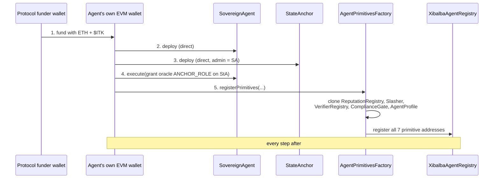

> **Not to be confused with the four foundational primitives — or the kernel's three.** This
> page is about the seven **contracts** an agent owns (the `PrimitiveSet`). The four
> *foundational* primitives — memory, agent-owned contracts, authority, reputation — are
> **concepts**, documented in [The Four Foundational Primitives](foundational-primitives.md).
> This page is one of them (#2, Agent-Owned Contracts) expressed in Solidity; the other
> three are not contracts at all. A third, unrelated sense also exists: the **kernel
> primitives** (spec v3.2 §4.4) — value conservation, metered-rights depletion, and
> replay-domain monotonicity — are invariants `IntegrityKernel` enforces for adapters, live
> in `contracts/src/kernel/`, and are not part of this page's `PrimitiveSet` at all (see the
> naming box in [The Four Foundational Primitives](foundational-primitives.md)).

The defining architecture of the Integrity Protocol: **an agent owns and
deploys its own on-chain contracts.** There is no privileged factory that
registers agents into shared global state on their behalf. On registration, an
agent comes to own **7 primitive contracts** — and because the agent's own EVM
wallet signs the deploy transactions for two of them, the chain itself is
cryptographic proof of who controls the identity.

## Table of contents

- [The 7 primitives](#the-7-primitives)
- [Call-routing convention (load-bearing)](#call-routing-convention-load-bearing)
- [Registration sequence](#registration-sequence)
- [Implications](#implications)
- [Sovereign vs. Centralized Deployment Topologies](#sovereign-vs-centralized-deployment-topologies)
  - [1. Sovereign Mode (Agent-Owned Clones)](#1-sovereign-mode-agent-owned-clones)
  - [2. Centralized Mode (EOA-Owned / DAO-Governed Singletons)](#2-centralized-mode-eoa-owned-dao-governed-singletons)

## The 7 primitives

| # | Primitive | Deploy | Role |
|---|---|---|---|
| 1 | `SovereignAgent` | direct (agent's wallet) | Account contract: DID, cached AIS, `execute`, controller rotation |
| 2 | `StateAnchor` | direct (agent's wallet) | Per-agent tamper-evident Merkle-root anchor |
| 3 | `ReputationRegistry` | EIP-1167 clone | Per-agent [AIS](ais.md) ledger + ZK-boost bookkeeping |
| 4 | `Slasher` | EIP-1167 clone | Per-agent $ITK stake / dispute-gated slashing |
| 5 | `VerifierRegistry` | EIP-1167 clone | Per-agent versioned [ZK verifier](zkp.md) pointer |
| 6 | `ComplianceGate` | EIP-1167 clone | Per-agent [regulated-industry gate](compliance-gate.md) |
| 7 | `AgentProfile` | EIP-1167 clone | Per-agent domain membership + metadata |

**2 direct + 5 clones.** The two direct deploys are what make the identity
self-sovereign — signed by the agent's own key. The five clones are cheap
EIP-1167 minimal proxies of shared implementation contracts (~50k gas each vs. a
full deploy), yet each clone is still uniquely owned and controlled by that one
agent.

## Call-routing convention (load-bearing)

Every clone's `DEFAULT_ADMIN_ROLE` is granted to the agent's `SovereignAgent`
**contract** address — never its raw EOA. All post-registration state changes
route through `SovereignAgent.execute(cloneAddr, 0, calldata)`. The single
bootstrap exception is the `AgentPrimitivesFactory.registerPrimitives` call
itself (the SovereignAgent cannot route the call that registers it), which is
EOA-signed and gated by `SovereignAgent.hasRole(DEFAULT_ADMIN_ROLE, msg.sender)`.

`Slasher`'s admin/arbiter is protocol **governance**, never the agent — an agent
cannot be trusted to arbitrate its own slashing dispute.

## Registration sequence

Performed by the [Integrity SDK](../entities/integrity-sdk.md) /
[integrity-cli](../entities/integrity-cli.md), each step signed by the agent's
own wallet (except the initial funding):

1. Fund the agent wallet with ETH + $ITK from the protocol funder wallet.
2. Deploy `SovereignAgent` (direct).
3. Deploy `StateAnchor` (direct), admin = the SovereignAgent contract.
4. Grant the oracle `ANCHOR_ROLE` on the StateAnchor, via `SovereignAgent.execute`.
5. `AgentPrimitivesFactory.registerPrimitives` — clones the 5, registers all 7
   in [`XibalbaAgentRegistry`](../entities/contracts.md).

## Implications

- **Genuinely the operator's identity** — no central party can rotate its
  controller, mint into its reputation, or deregister it.
- **Real cost & irreversibility** — registration spends real gas across ~6
  transactions; the contracts persist on-chain.
- **Resolution, not storage** — per-agent addresses are never in a static
  deployments file; consumers resolve them live from `XibalbaAgentRegistry`
  (the [oracle](../entities/integrity-oracle.md) caches them). See
  [Interface Contract §6](../../INTERFACE_CONTRACT.md).

## Sovereign vs. Centralized Deployment Topologies

When developers extend the protocol or deploy new contracts, they must explicitly choose between two deployment topologies depending on the application context:

### 1. Sovereign Mode (Agent-Owned Clones)
* **Design**: Deploying contracts as EIP-1167 minimal-proxy clones unique to each agent.
* **Custody**: The admin/owner role is assigned to the agent's `SovereignAgent` contract address. 
* **Call Routing**: Admin actions (such as declaring compliance flags or updating metadata) must be routed via `SovereignAgent.execute(target, value, data)`.
* **Use Cases**:
  * Individual prediction clones (e.g., [IntegrityMarket](integrity-market.md)).
  * Bespoke agent-to-agent task and service escrows.
  * Private, agent-specific data attestation vaults.
* **Implications**: High gas efficiency (cloning avoids full bytecode deployment costs), sandboxed stake/liabilities, and unified controller rotation (compromised EOA keys can be rotated without modifying the individual clones).

### 2. Centralized Mode (EOA-Owned / DAO-Governed Singletons)
* **Design**: Monolithic global contracts shared across all participating agents on the network.
* **Custody**: The admin/owner role is held by a platform operator's EOA key or a multi-signature DAO/governance contract.
* **Call Routing**: Standard direct EOA transactions with the contract.
* **Use Cases**:
  * Global allocation and capital venues (e.g., `A2ACapitalPool`).
  * Identity, name resolvers, and lookup indices (e.g., `XibalbaAgentRegistry`, `DomainRegistry`).
  * Shared liquidity pools/AMMs.
  * Regulatory whitelists (e.g., `CoveredEntityRegistry` for verified healthcare institutions).
* **Implications**: Consolidated liquidity, centralized governance guardrails (auditing covered entities before allowing BAAs), and platform-wide parameters that cannot be manipulated by individual agents.

Related: [contracts](../entities/contracts.md),
[ComplianceGate](compliance-gate.md), [AIS](ais.md).
