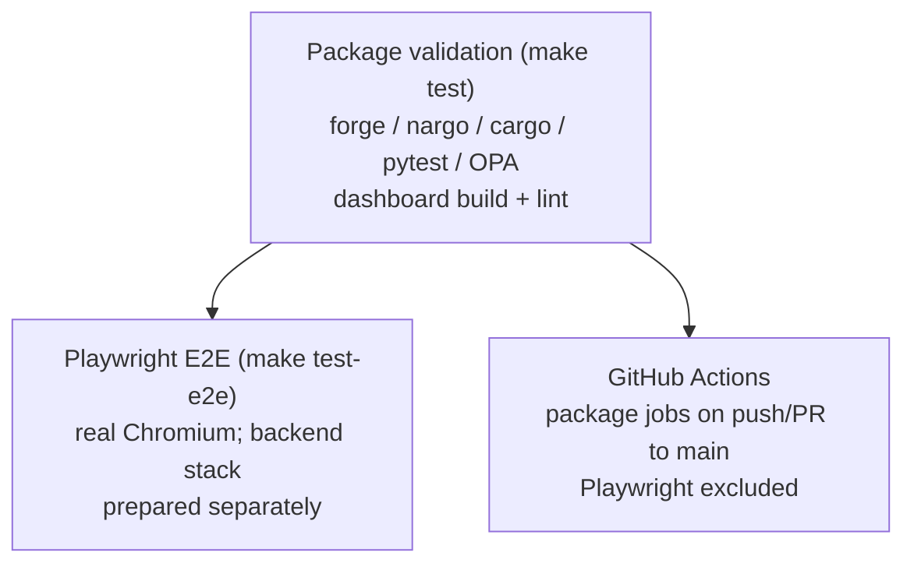

The full package, browser, and hosted Continuous Integration (CI) boundaries
live in [`docs/TESTING.md`](../../TESTING.md). This page is the canonical wiki
summary.

## Table of contents

- [Validation layers](#validation-layers)
- [Dashboard boundary](#dashboard-boundary)
- [Ground rule](#ground-rule)
- [Convention going forward](#convention-going-forward)

## Validation layers

1. **Package validation** (`make test`) runs the Solidity, Noir, Rust, Python,
   and Open Policy Agent (OPA) suites, then validates the dashboard with
   `npm run build && npm run lint`. The contracts suite returned 209 passing
   tests on 2026-08-17; other package counts are intentionally not frozen in
   this page because they drift.
2. **Playwright end-to-end** (`make test-e2e`) drives the real Vite application
   in Chromium. `playwright.config.ts` starts only the frontend. Chain, Oracle,
   middleware, databases, and optional Cortex memory Application Programming
   Interface (API) must be started separately as documented in
   [`docs/TESTING.md`](../../TESTING.md).
3. **Hosted CI** (`.github/workflows/ci.yml`) runs package jobs on pushes and
   pull requests to `main`. It excludes Playwright, opt-in full-stack Oracle
   coverage, and live Base Sepolia demo activity.

## Dashboard boundary

The dashboard currently has no `npm test` script, Vitest dependency, or
component-test suite. Its static gate is production build + ESLint; its
behavioral gate is Playwright. Documentation must not invent a mocked
component-test layer or claim Playwright starts its own backend stack.

## Ground rule

No silent mocks. A test either exercises a real dependency or identifies an
intentionally isolated seam. Source capability, local test evidence, hosted-CI
coverage, and deployed behavior are separate claims.

## Convention going forward

Every changed dashboard route should receive Playwright coverage for honest
empty/unavailable states and reachable real-data states. Browser verification
requires direct visual inspection as well as passing assertions. If a future
component-test layer is added, add the manifest script and dependencies first,
then update `Makefile`, CI, `docs/TESTING.md`, and this page in the same change.
