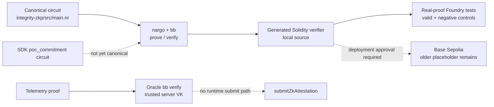

**Current boundary (2026-08-17):** the local pipeline now has a real generated
Solidity verifier, real-proof Foundry coverage, and real Oracle-side
Barretenberg verification during telemetry ingestion. It is still not wired
end to end: the SDK prover targets its older proof-of-concept circuit, no
runtime client submits proofs to `ReputationRegistry.submitZkAttestation`, and
the existing Base Sepolia deployment still points at the older fail-closed
placeholder. Local implementation and deployed behavior must not be conflated.

## Table of contents

- [1. What Noir/Barretenberg are (context, not the point)](#1-what-noir-barretenberg-are-context-not-the-point)
- [2. What this repo's circuit actually proves](#2-what-this-repo-s-circuit-actually-proves)
- [3. The real build/prove/verify pipeline, as it exists in integrity-zkp/](#3-the-real-build-prove-verify-pipeline-as-it-exists-in-integrity-zkp)
- [4. How the pieces are (and are not yet) wired together](#4-how-the-pieces-are-and-are-not-yet-wired-together)
- [5. Local verifier versus Base Sepolia deployment](#5-local-verifier-versus-base-sepolia-deployment)
- [6. Regenerating and adopting a verifier](#6-regenerating-and-adopting-a-verifier)
- [Pipeline, visually: current state](#pipeline-visually-current-state)
- [Summary: pipeline stage → current status](#summary-pipeline-stage-current-status)

## 1. What Noir/Barretenberg are (context, not the point)

[Noir](https://noir-lang.org/) is a Rust-like DSL for writing zero-knowledge
circuits: you write a `fn main(...)` whose `assert`s become the circuit's
constraints, `nargo` compiles it to ACIR (an intermediate arithmetic-circuit
representation), and a separate proving backend turns a satisfying
assignment ("witness") into a succinct proof that the constraints hold,
without revealing the private inputs. This repo uses
[Barretenberg](https://github.com/AztecProtocol/barretenberg) (`bb`) as that
backend, on the UltraHonk proving system (see §3 for why the generated
contract is still named "UltraPlonk"). Pinned versions: `nargo`
1.0.0-beta.22, `bb` 5.0.0-nightly.20260522 (`docs/INTERFACE_CONTRACT.md`).

## 2. What this repo's circuit actually proves

The one real circuit is `integrity-zkp/src/main.nr` — a **key/intent binding
proof**, not a proof about AIS computation or any behavioral-metric
arithmetic. Full formula and domain-tag detail lives on
[integrity-zkp](../entities/integrity-zkp.md); summarized here only for
pipeline context: given a private `secret_key` (KDF'd off-circuit from the
agent's real Ed25519 seed) and a private `intent_payload_hash` (the BCC
object's SHA-256 `intended_state_hash`, reduced to a `Field`), the circuit
asserts two Pedersen-hash equalities against public inputs
(`agent_id_commitment`, `nonce`, `intent_commitment`):

1. `pedersen_hash([DOMAIN_IDENTITY, secret_key]) == agent_id_commitment` —
   the prover holds the exact secret behind the agent's published identity,
   not just anyone who observed the public commitment.
2. `pedersen_hash([DOMAIN_INTENT, secret_key, intent_payload_hash, nonce]) == intent_commitment` —
   the prover actually knows the payload locked in for *this* nonce/action,
   binding the proof to one specific action and blocking replay as a
   different action.

Both are real constraints on real Pedersen gates, exercised by 4 `nargo
test` cases (1 valid, 3 `should_fail` negative controls: wrong secret,
substituted payload, zero nonce — all 4 pass). **Explicit scope limit**:
this is proof-of-possession of a KDF-derived secret, not a full in-circuit
Ed25519 signature check (that would need a non-native Curve25519
bignum/foreign-field gadget library — a separate undertaking, documented
rather than silently skipped).

## 3. The real build/prove/verify pipeline, as it exists in `integrity-zkp/`

Exact commands, all actually run (full transcripts in
`integrity-zkp/README.md`):

```
nargo test                                              # 4/4 constraint unit tests pass
nargo compile                                           # -> target/integrity_zkp.json (ACIR)
nargo execute witness                                   # -> target/witness.gz, using Prover.toml
bb write_vk   -b target/integrity_zkp.json -o target/vk -t evm
bb prove      -b target/integrity_zkp.json -w target/witness.gz -k target/vk/vk -o target/proof -t evm
bb verify     -k target/vk/vk -p target/proof/proof -i target/proof/public_inputs -t evm   # exit 0
bb write_solidity_verifier -k target/vk/vk -o generated/UltraPlonkVerifier.sol -t evm       # 2465 lines
```

`bb verify` was confirmed to actually check the proof (not hardcode
success): flipping one byte of `public_inputs` and re-running produces
`UltraVerifier: verification failed at reduction step`, exit 1.

Two naming/shape traps for anyone consuming the output:
- `bb`'s printed scheme is `ultra_honk` (Barretenberg 5.0.0-nightly's
  current default), not classic UltraPlonk. The generated contract is a
  real **Honk** verifier; `UltraPlonkVerifier.sol` is only the filename
  `contracts/` expects, not a claim about the proving system.
- The generated contract declares `NUMBER_OF_PUBLIC_INPUTS = 11`, not the
  circuit's logical 3 (`agent_id_commitment`, `nonce`, `intent_commitment`)
  — Honk appends internal accumulator/pairing-point public inputs. Callers
  must pass `bb`'s `public_inputs` output through verbatim, not assume a
  3-element array.

Makefile targets (`integrity-zkp/Makefile`): `make test` (nargo only, fast,
CI-safe), `make compile`, `make execute`, `make vk`, `make prove`, `make
verify`, `make solidity-verifier`, `make build` (= test + verify +
solidity-verifier, the full sequence above), `make clean`.

## 4. How the pieces are (and are not yet) wired together

**Local on-chain verifier:** `contracts/src/oracle/UltraPlonkVerifier.sol` is
now the generated UltraHonk verifier. `contracts/test/UltraPlonkVerifier.t.sol`
uses a checked-in 8,000-byte proof fixture: the valid proof passes, while a
tampered proof, tampered public input, and malformed proof are rejected.
`ReputationRegistry.submitZkAttestation` retains its versioned-verifier and
Merkle-anchor checks.

**Oracle verification:** telemetry ingestion decodes the submitted proof and
public inputs, then calls `state.zk.verify(...)`. `backend/src/zk.rs` shells out
to the pinned `bb verify` binary using only server-configured verification-key
paths (`ZK_VK_PATHS`); the request cannot choose its own key. The persisted
`zk_verified` flag and resulting AIS boost therefore represent an actual
Barretenberg verification result, not a self-reported boolean.

**Still open:**

- `integrity-sdk/integrity_sdk/prover.py` still targets
  `integrity-sdk/circuits/poc_commitment`, not the canonical
  `integrity-zkp/src/main.nr` circuit, and uses a different field derivation.
- No SDK, CLI, or Oracle runtime path currently submits a proof on chain through
  `ReputationRegistry.submitZkAttestation`.
- Off-chain Oracle verification and on-chain proof submission are separate
  evidence paths; one must not be described as proving the other occurred.

## 5. Local verifier versus Base Sepolia deployment

The repository source now contains the generated verifier and local tests prove
that it accepts the canonical fixture and rejects negative controls. However,
`deployments.baseSepolia.json` still records the verifier address created by the
older deployment, when `UltraPlonkVerifier.sol` was the fail-closed placeholder.
No verifier replacement was broadcast during Phase 0.

Consequently:

- **local source/build:** generated verifier, real-proof tests passing;
- **existing Base Sepolia address:** older fail-closed placeholder;
- **future genesis deployment from current source:** would deploy the generated
  verifier, but only after a separately approved broadcast;
- **production assurance:** not established until deployed bytecode,
  verification key, roles, and a real proof transaction are independently
  verified.

## 6. Regenerating and adopting a verifier

`integrity-zkp/Makefile` provides `make solidity-verifier` and `make build` to
regenerate `integrity-zkp/generated/UltraPlonkVerifier.sol`. Adopting a new
circuit version still requires an explicit reviewed handoff into
`contracts/src/oracle/UltraPlonkVerifier.sol`, fixture regeneration, Foundry
negative controls, deployment approval, and deployed-bytecode verification.
There is no root `make generate-verifier` target; documentation and source
comments must not imply that command exists.

## Pipeline, visually: current state



## Summary: pipeline stage → current status

| Stage | Status |
|---|---|
| Canonical Noir circuit and `nargo test` | Implemented and tested |
| `bb prove` / `bb verify` pipeline | Implemented with real positive and negative controls |
| Generated Solidity verifier in contract source | Implemented locally |
| Solidity verifier real-proof Foundry coverage | Implemented: valid, tampered-proof, tampered-input, malformed-proof cases |
| Oracle telemetry proof verification | Implemented with real `bb verify` and server-controlled verification keys |
| SDK canonical-circuit integration | **Open** — SDK still targets `poc_commitment` |
| Runtime on-chain proof submission | **Open** — no caller invokes `submitZkAttestation` |
| Base Sepolia verifier | **Older fail-closed placeholder remains deployed** |
| Verifier regeneration | Circuit-side Makefile targets exist; adoption/deployment remains reviewed and manual |

See [Interface Contract §5](../../INTERFACE_CONTRACT.md#5-zero-knowledge-proving-pipeline-must-be-real-end-to-end)
for the normative pipeline boundary and
[integrity-zkp](../entities/integrity-zkp.md) for the circuit's concrete field,
hash, and domain-separation conventions.
