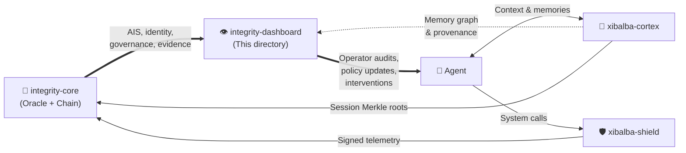

# Integrity Dashboard

**Corrected 2026-08-12:** this component was previously developed as a separate `integrity-mvp`
repository. That standalone repository is now stale/superseded (still references this repo's
pre-rename name, `INTEGRITY-LATEST`, and hasn't been touched since 2026-08-07) — this
`integrity-dashboard/` directory, inside `integrity-core`, is the actively developed presentation
layer going forward. Historical references to "Integrity MVP" below describe that superseded
repository's identity and are left as recorded history where they document completed work, not
current architecture.

For the full local Oracle, BCC middleware, and graph-memory workflow, see
[`docs/local-stack.md`](docs/local-stack.md) and run `./scripts/dev-stack.sh`.

Integrity Dashboard is the React/Vite presentation and operator-workflow layer for the Integrity Protocol product stack. It is not a standalone trust backend. It renders protocol state from integrity-core, surfaces Xibalba Shield endpoint-security evidence, and publishes the canonical Integrity wiki as a generated read-only browser experience.

## Source-of-truth contract

This README is the repo-level source of truth for what this application is, what it owns, what it consumes, and what is currently built. Deeper product intent lives in [SPECIFICATION.md](SPECIFICATION.md), [IMPLEMENTATION_PLAN.md](IMPLEMENTATION_PLAN.md), and archived historical plans under [docs/archive/2026-08-06](docs/archive/2026-08-06). Protocol schemas, ports, contracts, and backend behavior remain owned by integrity-core, especially [docs/INTERFACE_CONTRACT.md](https://github.com/XibalbaTechSol/integrity-core/blob/main/docs/INTERFACE_CONTRACT.md) and the canonical wiki under [integrity-core/docs/wiki](https://github.com/XibalbaTechSol/integrity-core/tree/main/docs/wiki).

If this README conflicts with code, fix the README or the code in the same change. Do not document mock behavior as production behavior.

## 2026-08-06 audit status

See [`docs/audits/2026-08-06-status.md`](docs/audits/2026-08-06-status.md), the current [`docs/audits/2026-08-07-gap-closure.md`](docs/audits/2026-08-07-gap-closure.md), and the consolidated cross-repository plan at `/home/xibalba/Documents/INTEGRITY — Cross-Repository Audit and Implementation Plan.md`. The current worktree build, lint gate, and 26-test Playwright suite pass locally. `npm audit` still reports 4 vulnerabilities (1 moderate, 3 high). This repository is a presentation proof of concept, not a standalone production trust backend.

## Ecosystem Role: 👁️ The Human Control Center

This component is the **conscious observer** in a three-repository ecosystem designed as a living organism (this directory is a component of `integrity-core`, not a fourth repository):

| Repository | Analogy | Role |
|---|---|---|
| `xibalba-cortex` | 🧠 The Brain | Local cognitive store — memories, context, reasoning provenance, session Merkle roots |
| `xibalba-shield` | 🛡️ The Immune System | Endpoint enforcement, kernel sensing, policy gating, semantic guardrails |
| `integrity-core` | 🦴 The Unifying Backend + 👁️ The Human Control Center | Protocol backbone — on-chain identity, BCC, Oracle scoring, smart contracts — plus this `integrity-dashboard/` component: operator dashboard, visualizes health, surfaces evidence, enables human intervention |

**How the Control Center connects:**
- **Inbound (from Backbone):** Reads Oracle APIs for live AIS scores, telemetry, Shield event logs, and audit trails. Reads on-chain state for identity, governance, staking, BAA/compliance, and market data.
- **Inbound (from Brain):** Reads graph-memory local API for memory graph, provenance, session timelines, and integrity verification.
- **Outbound (closes the loop):** Human operators audit agent behavior, update Shield policies, resolve disputes, and direct agent actions — completing the trust cycle.



See [`../docs/architecture/ecosystem-dependencies.md`](../docs/architecture/ecosystem-dependencies.md) for the canonical ownership boundaries.

## System relationship

`integrity-dashboard/` sits at the top of a three-repository operator stack:

`integrity-core/integrity-dashboard -> xibalba-cortex -> integrity-core`

`integrity-core/integrity-dashboard -> xibalba-shield -> integrity-core`

It also consumes integrity-core's own APIs and contracts directly.

| Project | Role | Boundary |
|---|---|---|
| `integrity-core` | Protocol trust backend: SDK, BCC middleware, Oracle/AIS, user API, contracts, canonical wiki | This dashboard component must not own protocol scoring, anchoring, Merkle conventions, or chain schemas |
| `xibalba-cortex` | Local cognitive store: memories, provenance, session roots, graph traversal | May be surfaced as memory workflows and evidence; recalled memory remains untrusted content, not protocol truth |
| `xibalba-shield` | Endpoint sensor/enforcer and signed security-evidence producer | May be surfaced as Shield workflows and evidence; Shield remains its own repo/product |
| `integrity-dashboard/` (this directory) | Web presentation, operator workflows, generated wiki browser | No independent trust backend; no direct wiki authoring database; no privilege over any other integrity-core consumer |

The cross-repository dependency boundary is documented in the generated wiki page **Ecosystem Dependencies** and in [`../docs/architecture/ecosystem-dependencies.md`](../docs/architecture/ecosystem-dependencies.md).

## Definitions

| Term | Meaning in this repo |
|---|---|
| AIS | Agent Integrity Score, computed by integrity-core's Oracle/scoring core and rendered here |
| BCC | Behavioral Commitment Chain pre-execution policy and signed-intent gate exposed through integrity-core middleware |
| XNS | Xibalba Name Service, the human-readable agent-domain surface rendered by identity flows |
| Integrity Health | HIPAA/healthcare vertical in integrity-core; not the same product as Xibalba Shield |
| Xibalba Shield | Separate endpoint-security product whose evidence can be displayed by this app |
| Canonical wiki | `integrity-core/docs/wiki`; this app only renders a generated snapshot |
| Protocol TOC | Ordered left-rail wiki navigation implemented in `src/pages/WikiPage.tsx` |

## Current status

Built and verified in this repo:

- React/Vite/TypeScript application shell with landing, dashboard, identity, intelligence, health, Shield, financials, developer/docs, memory, settings, privacy, terms, and wiki routes.
- Real service clients for integrity-core Oracle, user API, and BCC middleware in `src/services/`.
- Generated wiki browser at `/wiki` backed by `src/generated/wiki-data.json`.
- Wiki renderer support for canonical Markdown tables, Mermaid diagrams, relative wiki navigation, repository-source links, right-rail article TOC, and ordered left-rail Protocol TOC.
- Xibalba Solutions logo in the wiki header linked to `/`.
- Playwright regression coverage for wiki table rendering, ordered TOC behavior, logo navigation, and mobile search placement.

Still dependent on running backend services:

- Live agent fleet, AIS, markets, wallet, XNS, BAA, governance, and Shield evidence depend on integrity-core services/contracts and, for Shield-specific telemetry, a running xibalba-shield deployment exporting evidence into that stack.
- When those services are not running, the frontend must fail visibly and safely rather than inventing live data.

## Application surface

| Area | Primary files | Status |
|---|---|---|
| App shell/routing | `src/App.tsx`, `src/layouts/*`, `src/components/Sidebar.tsx` | Built |
| Landing page | `src/LandingPage.tsx`, `SPECIFICATION.md`, `docs/archive/2026-08-06/landing_page_strategy.md` | Built; strategy doc remains narrative/product guidance |
| Dashboard context | `src/context/DashboardContext.tsx`, `src/services/oracle.ts`, `src/services/userapi.ts` | Built against real backend URLs |
| Identity/XNS | `src/pages/IdentityPage.tsx`, `src/chain/xns.ts`, `src/components/ui/*XNS*` | Built UI/service integration surface |
| Intelligence/telemetry | `src/pages/IntelligencePage.tsx`, `src/components/observability/*`, `src/components/ui/Telemetry*` | Built UI surface |
| Memory graph | `src/pages/MemoryPage.tsx`, `src/components/GraphMemoryView.tsx`, `src/services/graphMemory.ts` | Built UI/service surface |
| Integrity Health | `src/pages/HealthPage.tsx` | Built presentation surface; protocol truth lives in integrity-core |
| Xibalba Shield | `src/pages/ShieldPage.tsx`, `src/chain/shield.ts` | Built presentation surface; Shield truth lives in xibalba-shield README/spec |
| Financials/markets | `src/pages/FinancialsPage.tsx`, `src/chain/markets.ts` | Built UI/service surface |
| Wiki | `src/pages/WikiPage.tsx`, `src/pages/WikiPage.css`, `scripts/sync-wiki.mjs`, `src/generated/wiki-data.json` | Built and regression-tested |

## Wiki synchronization

`integrity-core/docs/wiki/` is the sole authoring source of truth. The MVP `/wiki` route is a read-only generated projection, and the GitHub Wiki is another downstream mirror. Direct edits to either rendered surface are not reconciled upstream and may be overwritten.

Run:

```bash
npm run sync-wiki
```

The generator reads canonical concepts, entities, architecture pages, guides, queries, and `docs/wiki/index.md`; writes `src/generated/wiki-data.json`; preserves canonical Git commit metadata when available; and prefers polished labels from `WIKI_INDEX.md` for navigation.

## Development

```bash
npm install
npm run dev -- --port 5189
npm run build
npm run test-e2e -- e2e/wiki.spec.ts
```

The dev server defaults to Vite. Backend URLs are configured through `src/config.ts` and environment variables documented by integrity-core. A complete local stack requires the integrity-core Oracle, user API, BCC middleware, database/Redis/OPA dependencies, and optionally xibalba-shield for endpoint-security evidence.

## Testing and validation

| Command | Purpose |
|---|---|
| `npm run build` | TypeScript build plus Vite production bundle |
| `npm run test-e2e -- e2e/wiki.spec.ts` | Focused browser regression for the wiki route |
| `npm run sync-wiki` | Regenerate the read-only wiki snapshot from canonical Markdown |
| `git diff --check` | Whitespace sanity check before handoff |

Known build warning: Vite reports large chunks because the app includes Mermaid, KaTeX, graph, and dashboard dependencies. This is a performance optimization target, not a build failure.

## Current plan

Near-term:

- Keep `/wiki` synchronized with canonical integrity-core Markdown and regression-tested on desktop/mobile.
- Keep UI labels and product boundaries aligned with the three-repo dependency map.
- Continue replacing static demonstration panels with explicit real-service reads where backend endpoints are available.
- Add broader E2E coverage for Shield, identity, memory, and financial workflows as their backend contracts stabilize.

Longer-term:

- Make the MVP a production operator console for protocol users, Shield security teams, healthcare/Integrity Health buyers, and investor demos.
- Add deployment automation only after backend service availability and environment contracts are stable.
- Split large Vite chunks where it materially improves user-perceived page load.

## Documentation map

| Document | Owner | Purpose |
|---|---|---|
| [README.md](README.md) | This repo | Current application truth, status, commands, boundaries |
| [SPECIFICATION.md](SPECIFICATION.md) | This repo | Current UI/product behavior specification |
| [docs/archive/2026-08-06/landing_page_strategy.md](docs/archive/2026-08-06/landing_page_strategy.md) | This repo | Historical landing narrative |
| [integrity-core docs/INTERFACE_CONTRACT.md](https://github.com/XibalbaTechSol/integrity-core/blob/main/docs/INTERFACE_CONTRACT.md) | integrity-core | Backend schemas, ports, env vars, chain conventions |
| [integrity-core docs/wiki](https://github.com/XibalbaTechSol/integrity-core/tree/main/docs/wiki) | integrity-core | Canonical compiled protocol knowledge |
| [xibalba-shield README.md](https://github.com/XibalbaTechSol/xibalba-shield/blob/main/README.md) | xibalba-shield | Shield implementation status and plan |
