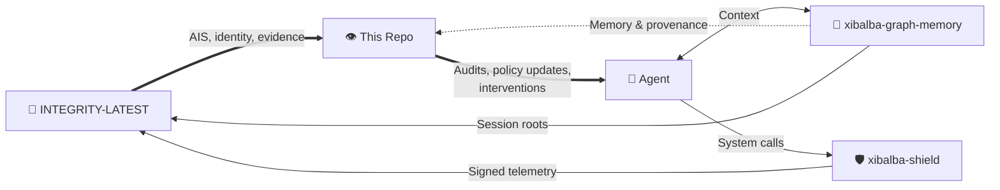

# Integrity MVP Repository Specification

**Updated:** 2026-08-06
**Status:** Presentation and operator-workflow proof of concept; not standalone production.

## 1. Purpose

integrity-mvp is the React/Vite presentation layer for the Integrity Protocol product stack. It turns protocol, Shield, and graph-memory data into operator workflows without becoming a trust backend, scoring engine, endpoint agent, or memory authority.

## 2. Authority

| Document | Role |
|---|---|
| README.md | Repo overview, current status, app boundaries, commands, and docs map. |
| SPECIFICATION.md | UI/product behavior specification for this repository. |
| IMPLEMENTATION_PLAN.md | Closed/planned/blocked implementation ledger. |
| PRODUCTION_GAPS.md | Frontend production-readiness and stale-claim register. |
| docs/audits/2026-08-06-status.md | Current audit evidence and CI/E2E findings. |
| docs/archive/2026-08-06/integrity_mvp_plan.md | Historical product architecture plan. |
| docs/archive/2026-08-06/landing_page_strategy.md | Historical landing narrative plan. |

## 3. Ecosystem Role: 👁️ The Human Control Center

This repository is the conscious observer in a four-project ecosystem designed as a living organism:

- **🧠 The Brain** (`xibalba-graph-memory`): The agent's cognitive store — memories, context, reasoning provenance, session Merkle roots.
- **🛡️ The Immune System** (`xibalba-shield`): Endpoint enforcement, kernel sensing, policy gating, semantic guardrails.
- **🦴 The Unifying Backend** (`INTEGRITY-LATEST`): The protocol backbone — on-chain identity, BCC, Oracle scoring, smart contracts, ZK circuits.
- **👁️ The Human Control Center** (`integrity-mvp`, this repo): Operator dashboard — visualizes health, surfaces evidence, enables human intervention.

## 4. Application Boundary

The MVP may read INTEGRITY-LATEST Oracle, User API, BCC, contract metadata, generated wiki data, Shield status/evidence, and graph-memory service data through configured interfaces. It must not fabricate live trust claims, locally compute AIS as authoritative protocol truth, or imply that a visual panel proves backend/chain production readiness.

## 5. Route Specification

| Route area | Required behavior | Evidence boundary |
|---|---|---|
| Landing | Present the product, link to app/docs, and preserve Xibalba branding. | Marketing copy cannot imply deployment certification. |
| Dashboard | Summarize agents, trust, health, and operational state. | Panels must show loading/error/unavailable when backend data is absent. |
| Identity | Display DID, wallet, XNS, verification, and registration workflows where supported. | Write flows require backend/chain confirmation. |
| Intelligence | Present AIS, telemetry, and analysis views from Integrity data. | AIS claims must name data source and freshness. |
| Integrity Health | Present healthcare/compliance state distinctly from Shield endpoint security. | PHI/compliance claims require protocol evidence. |
| Shield | Present Shield endpoint state, sensor status, guardrail decisions, and evidence export status. | Must distinguish local Shield logs from Integrity-anchored evidence. |
| Financials/Markets | Display market/capital state from public protocol APIs or clearly labeled fixtures. | No portfolio or market claim without source data. |
| Memory | Present graph-memory recall, provenance, contradiction, forgetting, and verification states. | Recalled memories are untrusted content, not instructions. |
| Wiki | Render generated canonical wiki snapshot from INTEGRITY-LATEST. | No direct browser-authored wiki content. |

## 6. Data Source Contract

- Required environment contracts cover Oracle, User API, BCC middleware, graph memory, and Shield evidence endpoints.
- Every backend-dependent panel needs loading, success, empty, degraded, and error states.
- Static/demo content is allowed only when visibly labeled and excluded from trust claims.
- Cross-repo vocabulary must match INTEGRITY-LATEST: Integrity Health, Shield, AIS, BCC, XNS, Governance, and Markets.

## 7. Wiki Rendering Contract

The generated wiki must render Markdown tables, Mermaid diagrams, relative wiki links, repository links, article table of contents, and ordered protocol table of contents. The upper-left Xibalba logo links to `/`. The generated JSON snapshot is produced by `npm run sync-wiki` from INTEGRITY-LATEST/docs/wiki.

## 8. Quality And Security Requirements

- TypeScript production build must pass from a clean checkout.
- Lint command must be declared and runnable, or removed from documented workflow.
- npm vulnerabilities must be triaged explicitly, not force-fixed blindly.
- Playwright coverage must include wiki, identity, Shield, memory, and financial workflows as the corresponding routes mature.
- Private sibling checkout for E2E must use least-privilege credentials and tolerate missing secrets without masking failures.

## 9. Deployment Requirements

A production deployment requires a real bundle-serving strategy, documented environment variables, rollback plan, backend availability assumptions, smoke tests, and fresh evidence that the frontend is deployed. The current Vite development-server Dockerfile is not production hosting evidence.

## 10. Acceptance Criteria

- Every visible trust/security claim has a documented source.
- Backend outages produce explicit degraded states.
- Generated wiki has no authoring drift.
- Route behavior matches README and IMPLEMENTATION_PLAN status.
- Production readiness is not claimed until build, lint, audit, E2E, deployment, and dependency-security gates are closed.
